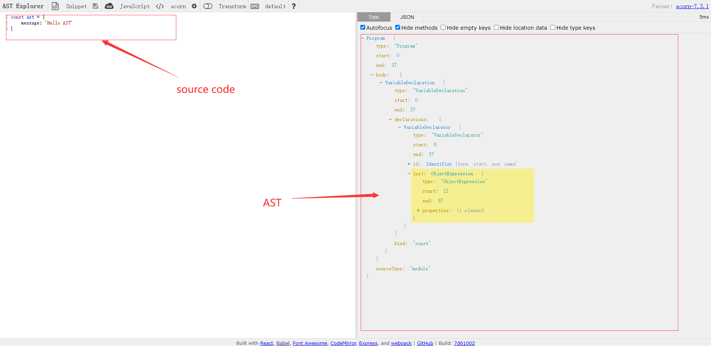
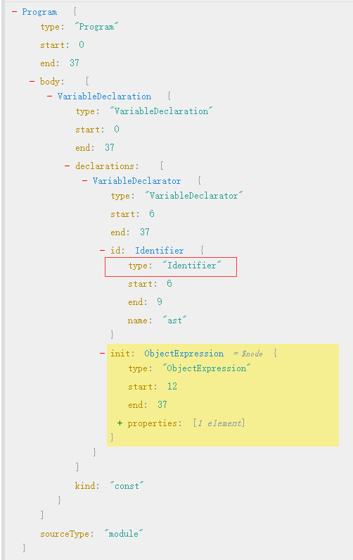
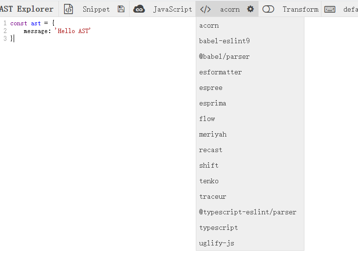

# AST

AST: 全称Abstract Syntax Tree（抽象语法树），是源代码语法结构的一种抽象表示，对于熟悉使用JavaScript的开发者来说，可以简单的认为是一个JavaScript的树形对象(Tree Object)。

# AST Explorer

大家可以借助[AST Explorer](https://astexplorer.net/)这个平台直观的体验一下AST。

如下图所示：

# 节点--Node

节点是AST的基本组成对位，每个节点对象存储着一些信息，重要的属性如“types”，如下图：

那么这个type是如何定义的，目前根据社区的不同的实现，节点的type名称可能会有差别。[AST Explorer](https://astexplorer.net/)顶部可以选择不同的ast-parser，如下图：

## https://rajasegar.github.io/ast-builder/