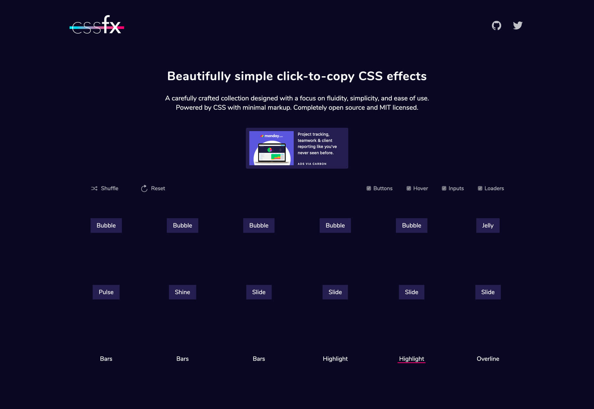
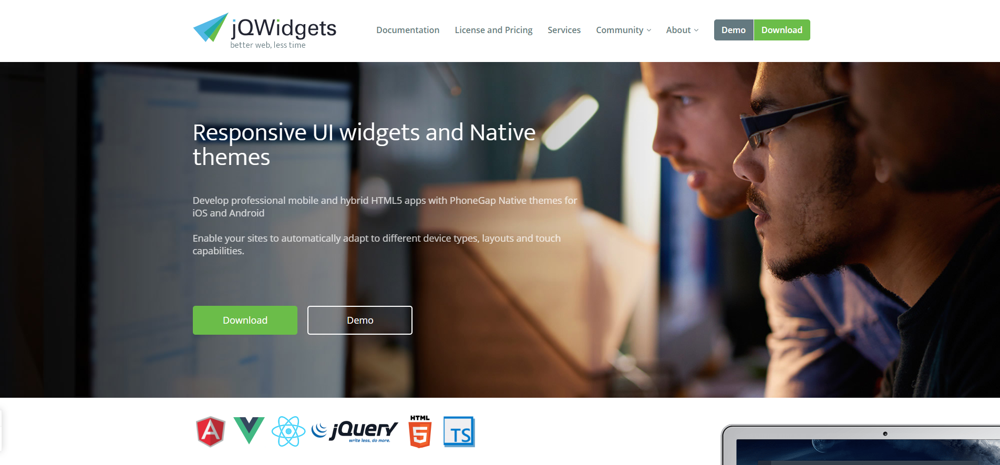
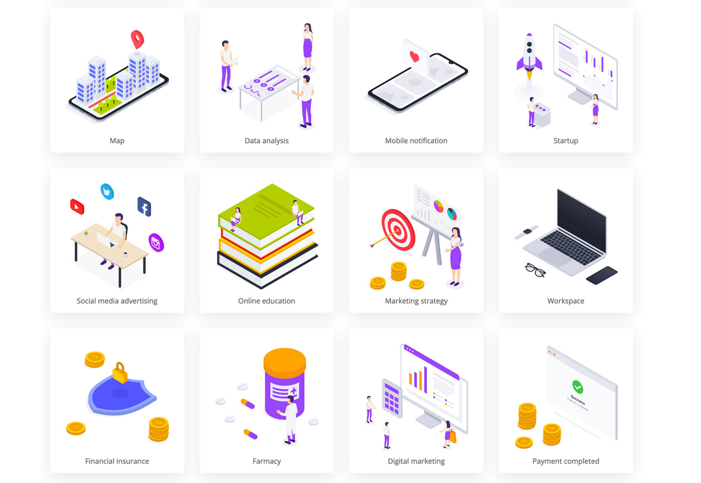
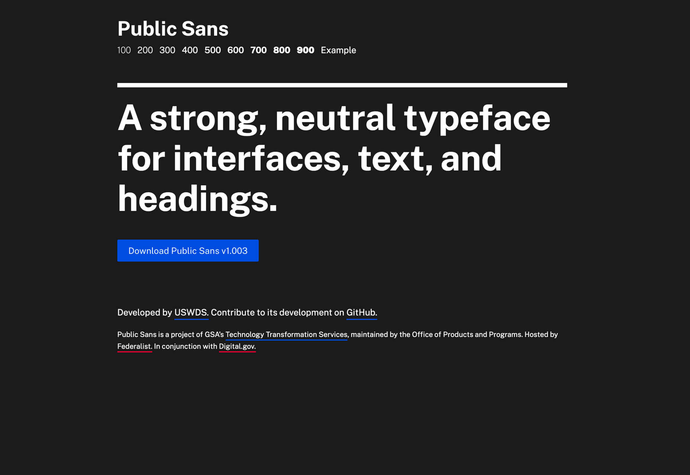

# Awesome UI && Tools

*收藏平常工作，学习中发现和接触的不错的库和工具，方便以后使用提高效率*

# JavaScript

* [stickyBit](https://github.com/dollarshaveclub/stickybits) Stickybits is a lightweight alternative to `position: sticky` polyfills
* [clipbord.js](https://clipboardjs.com)  Modern copy to clipboard.
* [SelectionJS](https://simonwep.github.io/selection/) Selection - A simple and lightweight library to realize visual DOM Selections, like on your Desktop. No jQuery. Supports any CSS library, e.g. Bootstrap. Including vertical & horizontal scroll support. 
* [Scroll Hint](https://appleple.github.io/scroll-hint/) A JS library to suggest that the elements are scrollable horizontally, with the pointer icon. 
* [reveal.js](https://github.com/hakimel/reveal.js) The HTML Presentation Framework, just like [eagle.js](https://github.com/Zulko/eagle.js)
* [Animista](http://animista.net/play/basic/shadow-drop) css animation on demand
* [lumin.js](https://github.com/pshihn/lumin) A JavaScript library to progressively highlight any text on a page.
* [lazy-image](https://meowni.ca/lazy-image/) loaded only on-demand
* [ms](https://github.com/zeit/ms) Tiny milisecond conversion utility
* [smoothscroll](http://iamdustan.com/smoothscroll/) Scroll Behavior polyfill 
* [smooth-scroll](https://github.com/cferdinandi/smooth-scroll#readme) 平滑滚动库
* [Stickybits](https://github.com/dollarshaveclub/stickybits#readme)Stickybits is a lightweight alternative to position: sticky polyfills. It works perfectly for things like sticky headers.
* [bounce.js](https://github.com/tictail/bounce.js) Create beautiful CSS3 powered animations in no time.
* [move.js](https://github.com/visionmedia/move.js) CSS3 backed JavaScript animation framework
* [mojs](https://github.com/mojs/mojs) The motion graphics toolbelt for the web
* [noty](https://github.com/needim/noty) Dependency-free notification library that makes it easy to create alert - success - error - warning - information - confirmation messages as an alternative the standard alert dialog. 
* [img-2](https://github.com/RevillWeb/img-2) Replace  elements with  to automatically pre-cache images and improve page performance.
* [popmotion](https://popmotion.io/) Simple libraries for delightful interfaces 
* [dirver.js](https://github.com/kamranahmedse/driver.js) A light-weight, no-dependency, vanilla JavaScript engine to drive the user's focus across the page 
* [tippyjs](https://github.com/atomiks/tippyjs) Highly customizable tooltip and popover library 
* [billboard.js](https://naver.github.io/billboard.js/) e-usable, easy interface JavaScript chart library, based on D3 v4+.
* [dom-testing-library](https://github.com/kentcdodds/dom-testing-library)  Simple and complete DOM testing utilities that encourage good testing practices
* [Dinero.js](https://sarahdayan.github.io/dinero.js/) Dinero.js is a library for working with monetary values in JavaScript.
* [wiredjs](https://wiredjs.com/showcase.html) A set of common UI elements with a hand-drawn, sketchy look. These can be used for wireframes, mockups, or just the fun hand-drawn look.
* [faker](https://github.com/Marak/faker.js) generate massive amounts of realistic fake data in Node.js and the browser
* [pwa-starter-kit](https://github.com/Polymer/pwa-starter-kit) Starter templates for building full-featured Progressive Web Apps from web components.
* [OverlayScrollbars](https://github.com/KingSora/OverlayScrollbars) A javascript scrollbar plugin which hides native scrollbars, provides custom styleable overlay scrollbars and keeps the native functionality and feeling. 
* [simplebar](https://github.com/Grsmto/simplebar) Custom scrollbars vanilla javascript library with native scroll, done simple, lightweight, easy to use and cross-browser.
* [pax](https://github.com/nathan/pax) The fastest JavaScript bundler in the galaxy. 
* [microbundle](https://github.com/developit/microbundle) Zero-configuration bundler for tiny modules. 
* [tilt](https://github.com/gijsroge/tilt.js) A tiny requestAnimationFrame powered 60+fps lightweight parallax tilt effect for jQuery.
* [anijs](https://github.com/anijs/anijs/) A Library to Raise your Web Design without Coding. 
* [css-loaders](https://github.com/lukehaas/css-loaders) A collection of loading spinners animated with CSS
* [Hover](https://github.com/IanLunn/Hover/) A collection of CSS3 powered hover effects to be applied to links, buttons, logos, SVG, featured images and so on. Easily apply to your own elements, modify or just use for inspiration. Available in CSS, Sass, and LESS. 
* [odometer](https://github.com/HubSpot/odometer) Smoothly transitions numbers with ease. 
* [snabbt.js](https://github.com/daniel-lundin/snabbt.js) Fast animations with javascript and CSS transforms 
* [xtermjs](https://xtermjs.org/) 网页中运行的终端
* [https://github.com/sindresorhus/capture-website](https://github.com/sindresorhus/capture-website) Capture-Website 是一款截图工具，为你提供另外一种网站截图的体验。借助它，你可以使用几行代码就轻松获得页面的完整截图。
* [https://lunar.atomui.com/](https://lunar.atomui.com/) Lunar Popup 是一个基于 HTML/CSS的动画弹出窗口构建器，它是免费的，所生成的窗口是响应式的，可以自定义的，并且易于构建和部署。你可以控制它使用动画或者不使用动画，安装则只需要三个步骤：添加库、选择你想使用的模型，然后初始化就可以了。
* [https://github.com/glinford/ellipsis.js](https://github.com/glinford/ellipsis.js)纯js实现的多行省略库
* [https://github.com/FrDH/dotdotdot-js](https://github.com/FrDH/dotdotdot-js)js多行省略插件
* [Shave一个javascript插件实现用max-height属性对文本进行截断以适合一个html元素 ✁](https://github.com/dollarshaveclub/shave)
* [Js 拦截全局ajax请求](https://github.com/wendux/Ajax-hook)
* [Lining.js 让浏览器实现类似::nth-line(), ::nth-last-line()的效果](https://github.com/zmmbreeze/lining.js)
* [Moveable 实现↔️ ↕️ 🔄可拖动，可调整大小，可扩展，可旋转](https://github.com/daybrush/moveable)
* [数据结构和算法解释并用JavaScript实现]()
* [现代 Web 开发，现代 Web 开发导论 | 基础篇 | 进阶篇 | 架构优化篇 | React 篇 | Vue 篇](https://ngte-web.gitbook.io/i/)

# Vue

* [vue-infinite-loading](https://github.com/PeachScript/vue-infinite-loading) An infinite scroll plugin for Vue.js.
* [eagle.js](https://github.com/Zulko/eagle.js) A hackable slideshow framework built with Vue.js
* [vue-select](https://github.com/sagalbot/vue-select) A Vue.js component that provides similar functionality to Select2 without the overhead of jQuery.
* [vuido](https://github.com/mimecorg/vuido) Native desktop applications using Vue.js. 
* [saber](https://github.com/egoist/saber) Saber.js is a simple yet powerful framework for building modern static websites.

# React

* [react-flight](https://github.com/jondot/react-flight) The best way to build animation compositions for React. 
* [mdx](https://github.com/mdx-js/mdx) JSX in Markdown for ambitious projects 
* [cuttlebelle](https://cuttlebelle.com/) The react static site generator that separates editing and code concerns
* [react-bits](https://github.com/vasanthk/react-bits)  React patterns, techniques, tips and tricks 
* [react-move](https://github.com/react-tools/react-move) React Move 🌀 Beautiful, data-driven animations for React 
* [mdx-deck](https://github.com/jxnblk/mdx-deck) MDX-based presentation decks 

# Node

* [cheerio](https://cheerio.js.org/) Fast, flexible, and lean implementation of core jQuery designed specifically for the server
* * [prompts](https://github.com/terkelg/prompts) Lightweight, beautiful and user-friendly interactive prompts.

#　tools

* [https://keyframes.app/](https://keyframes.app/) An insanely simple way to create CSS animations
* [https://reactive.how/](https://reactive.how/) Learn RxJS operators and Reactive Programming principles
* [k6](https://docs.k6.io/docs/running-k6) Like unit testing, for performance
* [monaco-editor](https://github.com/Microsoft/monaco-editor) A browser based code editor
* [etcher](https://www.balena.io/etcher/) Flash OS images to SD cards & USB drives, safely and easily.
* [devhints](https://devhints.io/) cheatsheets
* [pure-bash-bible](https://github.com/dylanaraps/pure-bash-bible)  A collection of pure bash alternatives to external processes.
* [zerossl](https://zerossl.com/) Free SSL Certificates and Free SSL Tools for your website.
* [Surfingkeys ：另一个Chrome扩展,提供了基于键盘的导航和Web控制](https://github.com/brookhong/Surfingkeys)
* [Chrome插件开发完整demo](https://github.com/sxei/chrome-plugin-demo)

# icon

* [Feather Icons](https://github.com/feathericons/feather) Simply beautiful open source icons

## css

* [Bojler](https://github.com/Slicejack/bojler) Bojler is an email framework
* [https://kazzkiq.github.io/balloon.css/](https://kazzkiq.github.io/balloon.css/) add tooltip without javaScript
* [animate.css](https://github.com/daneden/animate.css) A cross-browser library of CSS animations. As easy to use as an easy thing.
* [Purgecss](https://www.purgecss.com/) Purgecss is a tool to remove unused CSS. It can be used as part of your development workflow. Purgecss comes with a JavaScript API, a CLI, and plugins for popular build tools.
* [rfs](https://github.com/twbs/rfs) Automated responsive font sizes
* [cssanimate](http://cssanimate.com/) 
* [magic_animations](https://www.minimamente.com/example/magic_animations/)
* [sprite-generator](https://www.toptal.com/developers/css/sprite-generator)
* [https://cssfx.dev/](https://cssfx.dev/) 这是一套实用性超高的 CSS 效果合集，这个系列的效果注重流动性、易用性和便捷性，让你尽可能少地标记，尽可能好的使用。每个效果都是开源的，请尽情使用。

* [https://cssgrid-generator.netlify.com/](https://cssgrid-generator.netlify.com/) grid布局代码工具

* [https://cssanimation.rocks/animating-links/](https://cssanimation.rocks/animating-links/) 这个来自 Learn CSS Animation 的教程教你如何制作带有动态效果的链接，包括如何生成动态下划线效果、过渡动画以及如何制作关键帧等等，甚至还为你详细分析了各种动画效果的优缺点。

# UI Component
* [https://www.jqwidgets.com/](https://www.jqwidgets.com/)



* [https://isometric.online/](https://isometric.online/) Isometric 是一组可以在数字项目中可以使用的免费的矢量等轴测插画，这些插画风格一致且都使用的是 SVG 格式，内容丰富多样。


* [https://stubborn.fun/](https://stubborn.fun/) 这是一个免费的插画生成工具，能够帮你的项目创建一个独特的、富有故事性的插画。这套工具包含 25 个角色和 50 种不同的背景，可以使用 Sketch 和 Figma 进行自定义设计。

* [https://hamok.io/](https://hamok.io/) 这是一款非常易于使用的视觉稿工具，可以使用 URL 或者图片来创建视觉稿。它提供了一整套模板，并且生成响应式视觉稿，展示出各种不同的效果。

* [https://www.uibot.app/](https://www.uibot.app/) 随机生成布局的网站，提供灵感

* [https://www.manypixels.co/gallery/](https://www.manypixels.co/gallery/) 免费插画
* [https://delesign.com/free-designs/graphics/](https://delesign.com/free-designs/graphics/) 免费插画
* [https://isoflat.com/](https://isoflat.com/) 免费插画

* [https://www.transparenttextures.com/](https://www.transparenttextures.com/) 自由DIY纹理背景的网站

* [https://www.uisdc.com/zt/photoshop-skills](https://www.uisdc.com/zt/photoshop-skills) ps技巧 

* [https://www.uisdc.com/meizu-10-resume-design-principles](https://www.uisdc.com/meizu-10-resume-design-principles) 有哪些看上去很高大上，但实际很简单的PS技巧？

# Nginx

* [https://github.com/trimstray/nginx-admins-handbook](https://github.com/trimstray/nginx-admins-handbook) 想要充分利用 Nginx ，这份指南文档能够帮你。你能够在其中找到绝大多数的关于 Nginx 的主题，包括安全性控制、调试以及各种核心的基础知识。

# Docker

* [Dockerlabs](https://dockerlabs.collabnix.com/) Dockerlabs 是一个教你使用 Docker 和 Kubernetes 的系列教程合集，它提供的教程主要是文本教程，并且你可以直接在浏览器中测试。你无需在计算机上安装任何东西就可以直接体验 Docker，比如 Docker Engine、Docker Compose 和 Docker Machine。

# Bash 

*[https://github.com/dylanaraps/pure-bash-bible](https://github.com/dylanaraps/pure-bash-bible) 想要掌握 Bash，这份涵盖了各种提示、代码范例、最佳实践的学习素材包，能够帮到你。

# 字体

* [https://www.colorsandfonts.com/](https://www.colorsandfonts.com/)不错的颜色字体选择

* [https://www.dafont.com/ohio.font](https://www.dafont.com/ohio.font)


* [https://www.dafont.com/pondspell.font](https://www.dafont.com/pondspell.font)


* [https://public-sans.digital.gov/](https://public-sans.digital.gov/)



* [https://www.ctolib.com](https://www.ctolib.com) 一个集成多种库的网站

* [https://github.com/liriliri/eruda](https://github.com/liriliri/eruda)移动端调试工具
* [https://www.ctolib.com/wiredjs-wired-elements.html](https://www.ctolib.com/wiredjs-wired-elements.html)手绘风格库

* [Fiddle - 🚀 入门使用Electron的最简单方法](https://github.com/electron/fiddle)
* [一些可供第三方调用公共 JSON API 列表](https://github.com/davemachado/public-api)
* [https://github.com/gothinkster/realworld](https://github.com/gothinkster/realworld) realworld的各种示例

* [hotcss移动端布局终极解决方案 --- 让移动端布局开发更加容易](https://github.com/imochen/hotcss)
* [Magic Grid一个简单，轻量级的Javascript库，用于动态网格布局](https://github.com/e-oj/Magic-Grid)
* [Muuri 能够创建响应式，可排序，可过滤和可拖动的网格布局。](https://github.com/haltu/muuri)
* [https://popmotion.io/](https://popmotion.io/)js动画 库
* [https://github.com/JacksonTian/fks](https://github.com/JacksonTian/fks)这本 Book of Modern Frontend Tooling 是免费开源的，其中详细介绍了现代网络应用开发所需要的各类工具，它目前已经比较翔实，并且逐步完善。

* [https://svgjs.com/docs/3.0/](https://svgjs.com/docs/3.0/)
* [http://lukyvj.github.io/family.scss/](http://lukyvj.github.io/family.scss/) CSS伪类 :Nth-Child 的用法

* [https://easings.net/](https://easings.net/) css 动画曲线
* [https://github.com/zhangxinxu/Tween](https://github.com/zhangxinxu/Tween)js曲线

# Chrome 插件

#### JSON格式化

JSONView

#### github

Octotree 侧边栏

OctoLiker github内包 文件跳转

Octohint github文件语法高亮

##### oneTab

tab页管理

#### Vimium

#### 沙拉查词-聚合词典划词翻译

#### 谷歌上网助手

#### Wappalyzer what's run

#### 网页截图:注释&录屏

#### 书签侧边栏

#### Axure RP Extension for Chrome

#### The Great Suspender

#### Codelf-Best 

#### Gliffy Diagrams 流程图

#### WEB前端助手(FeHelper)

#### Window Resizer

* [https://github.com/CJex/regulex](https://github.com/CJex/regulex)正则可视化工具


* 下载工具 motrix
* 看/截图工具 jietu
* brew cask tools list
* 快速查看工具 Nicer plugins for QuickLook
* szrz插件

#### 调试工具1)
* 1)perf代理工具，支持内存，cpu，堆栈查看，并支持火焰图.perf 工具和 go-torch 工具快捷定位程序问题.https://github.com/uber-archive/go-torchhttps://github.com/google/gops
* 2)dlv 远程调试基于 goland+dlv 可以实现远程调式的能力.https://github.com/go-delve/delve提供了对 golang 原生的支持，相比 gdb 调试，简单太多。
* 3)网络代理工具goproxy 代理，支持多种协议，支持 ssh 穿透和 kcp 协议.https://github.com/snail007/goproxy
* 4)抓包工具go-sniffer 工具，可扩展的抓包工具，可以开发自定义协议的工具包. 现在只支持了 http，mysql，redis，mongodb.基于这个工具，我们开发了 qapp 协议的抓包。https://github.com/40t/go-sniffer
* 5)反向代理工具，快捷开放内网端口供外部使用。ngrok 可以让内网服务外部调用https://ngrok.com/https://github.com/inconshreveable/ngrok
* 6)配置化生成证书从根证书，到业务侧证书一键生成.https://github.com/cloudflare/cfssl
* 7)免费的证书获取工具基于 acme 协议，从 letsencrypt 生成免费的证书，有效期 1 年，可自动续期。https://github.com/Neilpang/acme.sh
* 8)开发环境管理工具，单机搭建可移植工具的利器。支持多种虚拟机后端。vagrant常被拿来同 docker 相比，值得拥有。https://github.com/hashicorp/vagrant
* 9)轻量级容器调度工具nomad 可以非常方便的管理容器和传统应用，相比 k8s 来说，简单不要太多.https://github.com/hashicorp/nomad
* 10)敏感信息和密钥管理工具https://github.com/hashicorp/vault
* 11)高度可配置化的 http 转发工具，基于 etcd 配置。https://github.com/gojek/weaver
* 12)进程监控工具 supervisorhttps://www.jianshu.com/p/39b476e808d8
* 13)基于procFile进程管理工具. 相比 supervisor 更加简单。https://github.com/ddollar/foreman
* 14)基于 http，https，websocket 的调试代理工具，配置功能丰富。在线教育的 nohost web 调试工具，基于此开发.https://github.com/avwo/whistle
* 15)分布式调度工具https://github.com/shunfei/cronsun/blob/master/README_ZH.mdhttps://github.com/ouqiang/gocron
* 16)自动化运维平台 Gaiahttps://github.com/gaia-pipeline/gaia

* go 百科全书: https://awesome-go.com/
* json 解析: https://www.json.cn/
* 出口 IP: https://ipinfo.io/
* redis 命令: http://doc.redisfans.com/
* ES 命令首页: https://www.elastic.co/guide/cn/elasticsearch/guide/current/index.html
* UrlEncode: http://tool.chinaz.com/Tools/urlencode.aspx
* Base64: https://tool.oschina.net/encrypt?type=3
* Guid: https://www.guidgen.com/
* 常用工具: http://www.ofmonkey.com/

#### 打字速度练习

* https://typing.io/
* https://www.keybr.com/
* http://www.speedcoder.net/

#### 前端业务代码工具库

https://github.com/proYang/outils

#### 1.Rufus：可能是最小的装系统神器 仅900KB

#### 各种语言在线调试工具 https://tool.lu/

#### 各种在线工具 https://www.toolnb.com/

#### 菜鸟在线工具 https://c.runoob.com/

#### vscode sublime-text atom代码片段生成工具 https://snippet-generator.app/

#### gitignore 生成 http://gitignore.io/

#### 免费节点 https://lncn.org/  http://ss.pythonic.life/ 

### https://www.youneed.win/free-ssr

```js
const ssr = [];document.querySelectorAll('[data*=ssr]').forEach(item => ssr.push(item.getAttribute('data')));console.log(ssr.join('\r\n'));
```

#### 免费节点 https://ssrtool.github.io/p/domain/#more

主域名 (需要代理访问，但是永不变更，请牢记):
论坛
https://www.ssrshare.us
https://www.ssrshare.com

小工具主域名
https://www.ssrtool.us
https://www.ssrtool.com

#### 分享一个前端开发者的必备工具——whistle https://github.com/avwo/whistle

#### GitHub不错的项目榜单 https://www.v2fy.com/stars-and-clown/

#### 网盘直链下载助手 https://www.baiduyun.wiki/install.html

#### 视频下载 https://coverr.co/

#### cloc 代码行数统计

#### git 中文开发手册 https://www.php.cn/manual/view/34942.html

#### 猴子都能懂的git https://backlog.com/git-tutorial/cn/

### 电子书 https://b-ok.cc  https://www.letmeread.net http://libgen.lc