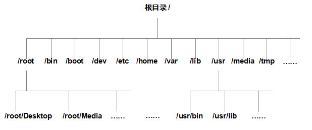
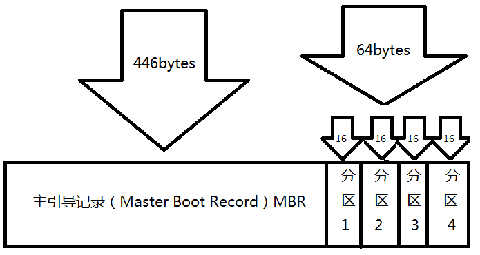
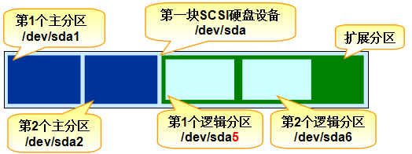
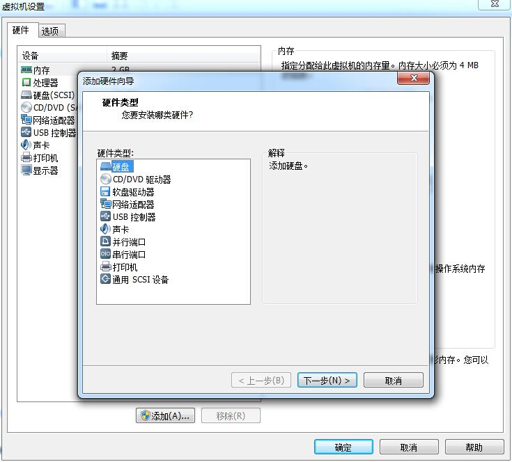
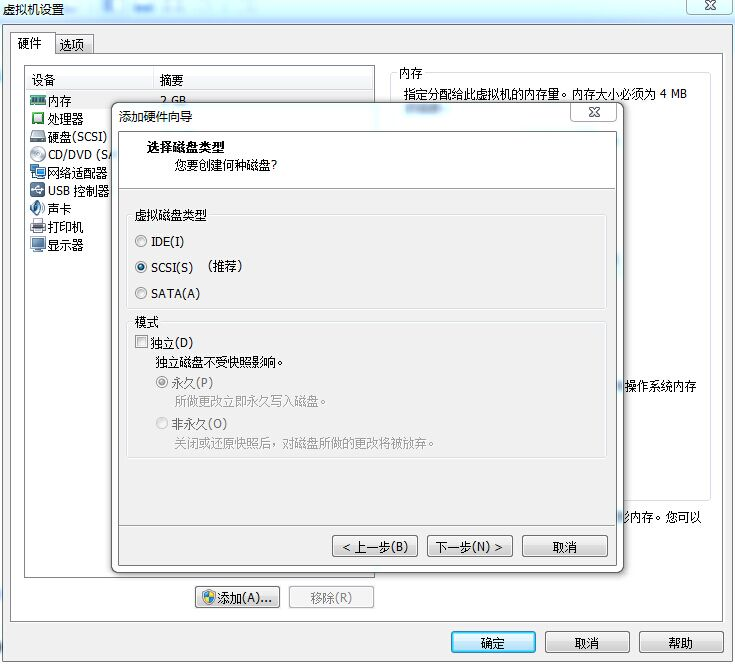
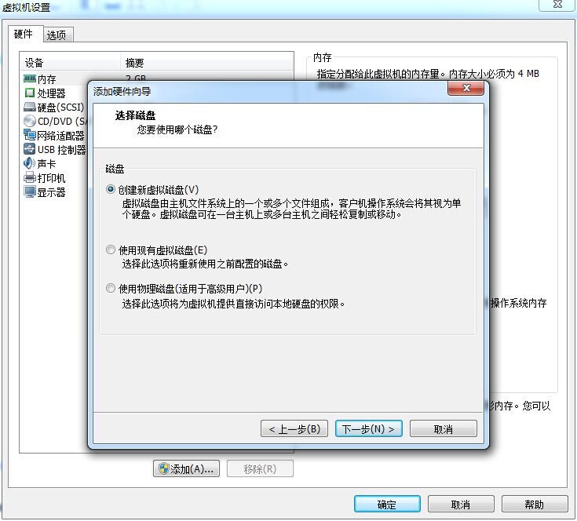
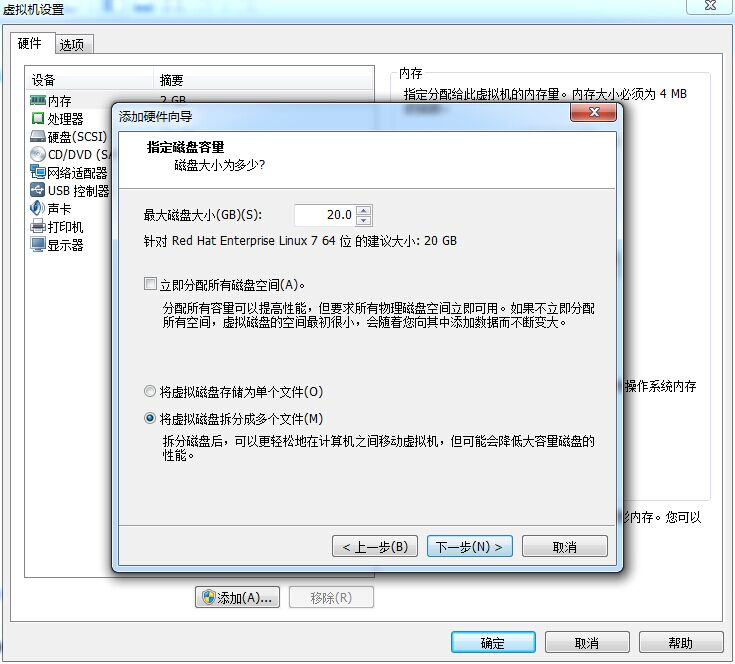
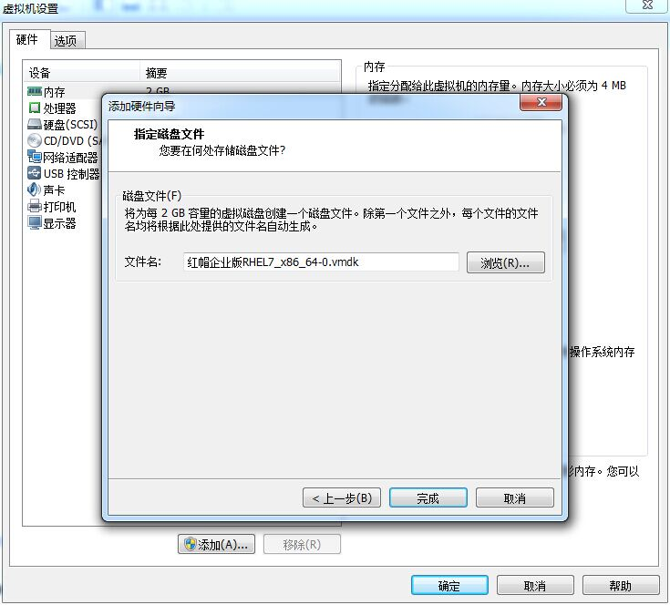
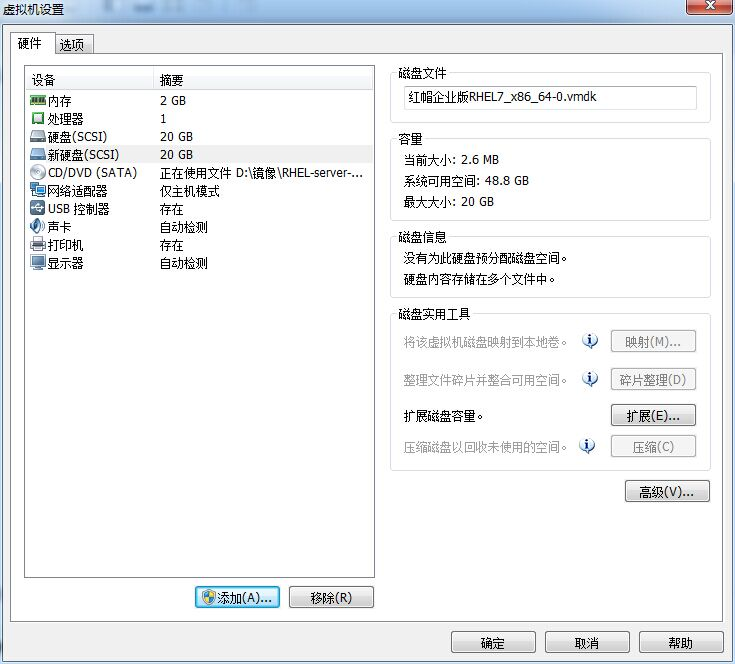

# 安装RedHatLinux

内容比较简单，跳过

# 重置root密码

进入系统之后可以通过 `cat /etc/reahat-release` 来查看系统的版本信息。

重启虚拟机进入引导页面，按下`e键`进入内核编辑页面

找到linux16这一行的末尾加上`\rd.break`，使用`ctrl+x`运行

大约过三30秒进行紧急救援模式

输入`mount`命令查看，发现跟为`/sysroot`，并且为只读

以读写权限重新挂载`/sysroot`

    mount -o remount,rw /sysroot

输入`mount`命令查看`/sysroot`已经有读写权限

将跟改为`/sysroot`, 并在根下创建.autorelabel文件

    chroot /sysroot
    touch /.autorelabel

输入 `passwd`，然后输出新密码，确认密码并以`exit`退出，之后重启`reboot`

# RPM红帽软件包

在RPM（红帽软件包管理器）公布之前，要想在Linux系统中安装软件只能采取源码包的方式安装。早期在Linux系统中安装程序是一件非常困难、耗费耐心的事情，而且大多数的服务程序仅仅提供源代码，需要运维人员自行编译代码并解决许多的软件依赖关系，因此要安装好一个服务程序，运维人员需要具备丰富知识、高超的技能，甚至良好的耐心。而且在安装、升级、卸载服务程序时还要考虑到其他程序、库的依赖关系，所以在进行校验、安装、卸载、查询、升级等管理软件操作时难度都非常大。

RPM机制则为解决这些问题而设计的。RPM有点像Windows系统中的控制面板，会建立统一的数据库文件，详细记录软件信息并能够自动分析依赖关系。目前RPM的优势已经被公众所认可，使用范围也已不局限在红帽系统中了。

<table id="tablepress-191" class="tablepress tablepress-id-191">
<tbody class="row-hover">
<tr class="row-1 odd">
<td class="column-1">安装软件的命令格式</td>
<td class="column-2">rpm -ivh filename.rpm</td>
</tr>
<tr class="row-2 even">
<td class="column-1">升级软件的命令格式</td>
<td class="column-2">rpm -Uvh filename.rpm</td>
</tr>
<tr class="row-3 odd">
<td class="column-1">卸载软件的命令格式</td>
<td class="column-2">rpm -e filename.rpm</td>
</tr>
<tr class="row-4 even">
<td class="column-1">查询软件描述信息的命令格式</td>
<td class="column-2">rpm -qpi filename.rpm</td>
</tr>
<tr class="row-5 odd">
<td class="column-1">列出软件文件信息的命令格式</td>
<td class="column-2">rpm -qpl filename.rpm</td>
</tr>
<tr class="row-6 even">
<td class="column-1">查询文件属于哪个RPM的命令格式</td>
<td class="column-2">rpm -qf filename</td>
</tr>
</tbody>
</table>

# Yum软件仓库

尽管RPM能够帮助用户查询软件相关的依赖关系，但问题还是要运维人员自己来解决，而有些大型软件可能与数十个程序都有依赖关系，在这种情况下安装软件会是非常痛苦的。Yum软件仓库便是为了进一步降低软件安装难度和复杂度而设计的技术。Yum软件仓库可以根据用户的要求分析出所需软件包及其相关的依赖关系，然后自动从服务器下载软件包并安装到系统。

Yum软件仓库中的RPM软件包可以是由红帽官方发布的，也可以是第三方发布的，当然也可以是自己编写的。

<table id="tablepress-76" class="tablepress tablepress-id-76">
<tbody class="row-hover">
<tr class="row-1 odd">
<td class="column-1">命令</td>
<td class="column-2">作用</td>
</tr>
<tr class="row-2 even">
<td class="column-1">yum repolist all</td>
<td class="column-2">列出所有仓库</td>
</tr>
<tr class="row-3 odd">
<td class="column-1">yum list all</td>
<td class="column-2">列出仓库中所有软件包</td>
</tr>
<tr class="row-4 even">
<td class="column-1">yum info 软件包名称</td>
<td class="column-2">查看软件包信息</td>
</tr>
<tr class="row-5 odd">
<td class="column-1">yum install 软件包名称</td>
<td class="column-2">安装软件包</td>
</tr>
<tr class="row-6 even">
<td class="column-1">yum reinstall 软件包名称</td>
<td class="column-2">重新安装软件包</td>
</tr>
<tr class="row-7 odd">
<td class="column-1">yum update 软件包名称</td>
<td class="column-2">升级软件包</td>
</tr>
<tr class="row-8 even">
<td class="column-1">yum remove 软件包名称</td>
<td class="column-2">移除软件包</td>
</tr>
<tr class="row-9 odd">
<td class="column-1">yum clean all</td>
<td class="column-2">清除所有仓库缓存</td>
</tr>
<tr class="row-10 even">
<td class="column-1">yum check-update</td>
<td class="column-2">检查可更新的软件包</td>
</tr>
<tr class="row-11 odd">
<td class="column-1">yum grouplist</td>
<td class="column-2">查看系统中已经安装的软件包组</td>
</tr>
<tr class="row-12 even">
<td class="column-1">yum groupinstall 软件包组</td>
<td class="column-2">安装指定的软件包组</td>
</tr>
<tr class="row-13 odd">
<td class="column-1">yum groupremove 软件包组</td>
<td class="column-2">移除指定的软件包组</td>
</tr>
<tr class="row-14 even">
<td class="column-1">yum groupinfo 软件包组</td>
<td class="column-2">查询指定的软件包组信息</td>
</tr>
</tbody>
</table>


Linux操作系统的开机过程是这样的，即从BIOS开始，然后进入Boot Loader，再加载系统内核，然后内核进行初始化，最后启动初始化进程。初始化进程作为Linux系统的第一个进程，它需要完成Linux系统中相关的初始化工作，为用户提供合适的工作环境。红帽RHEL 7系统已经替换掉了熟悉的初始化进程服务System V init，正式采用全新的systemd初始化进程服务。

systemd初始化进程服务采用了并发启动机制，开机速度得到了不小的提升。

<table id="tablepress-45" class="tablepress tablepress-id-45">
<tbody class="row-hover">
<tr class="row-1 odd">
<td class="column-1">System V init命令（RHEL 6系统）</td>
<td class="column-2">systemctl命令（RHEL 7系统）</td>
<td class="column-3">作用</td>
</tr>
<tr class="row-2 even">
<td class="column-1">service foo start</td>
<td class="column-2">systemctl start foo.service</td>
<td class="column-3">启动服务</td>
</tr>
<tr class="row-3 odd">
<td class="column-1">service foo restart</td>
<td class="column-2">systemctl restart foo.service</td>
<td class="column-3">重启服务</td>
</tr>
<tr class="row-4 even">
<td class="column-1">service foo stop</td>
<td class="column-2">systemctl stop foo.service</td>
<td class="column-3">停止服务</td>
</tr>
<tr class="row-5 odd">
<td class="column-1">service foo reload</td>
<td class="column-2">systemctl reload foo.service</td>
<td class="column-3">重新加载配置文件（不终止服务）</td>
</tr>
<tr class="row-6 even">
<td class="column-1">service foo status</td>
<td class="column-2">systemctl status foo.service</td>
<td class="column-3">查看服务状态</td>
</tr>
</tbody>
</table>

# 常用的命令

* echo
  
  用于输出字符串或者变量值

  ```shell
  echo $USER
  root
  ```
* date 

  用于输出日期时间

  ```shell
  date "+%Y-%m-%d %H:%M:%S"
  2019-05-14 11:06:23
  ```

  date命令中的参数%j可用来查看今天是当年中的第几天

  ```shell
  date "+%j"
  134
  ```

* reboot 重启系统
* poweroff 关闭系统

* wget

  该命令常用在终端下载文件。

  <table id="tablepress-109" class="tablepress tablepress-id-109">
  <tbody class="row-hover">
  <tr class="row-1 odd">
  <td class="column-1">参数</td>
  <td class="column-2">作用</td>
  </tr>
  <tr class="row-2 even">
  <td class="column-1">-b</td>
  <td class="column-2">后台下载模式</td>
  </tr>
  <tr class="row-3 odd">
  <td class="column-1">-P</td>
  <td class="column-2">下载到指定目录</td>
  </tr>
  <tr class="row-4 even">
  <td class="column-1">-t</td>
  <td class="column-2">最大尝试次数</td>
  </tr>
  <tr class="row-5 odd">
  <td class="column-1">-c</td>
  <td class="column-2">断点续传</td>
  </tr>
  <tr class="row-6 even">
  <td class="column-1">-p</td>
  <td class="column-2">下载页面内所有资源，包括图片、视频等</td>
  </tr>
  <tr class="row-7 odd">
  <td class="column-1">-r</td>
  <td class="column-2">递归下载</td>
  </tr>
  </tbody>
  </table>


* ps
  
  该命令用于查看系统中进程状态。

  <table id="tablepress-42" class="tablepress tablepress-id-42">
  <tbody class="row-hover">
  <tr class="row-1 odd">
  <td class="column-1">参数</td>
  <td class="column-2">作用</td>
  </tr>
  <tr class="row-2 even">
  <td class="column-1">-a</td>
  <td class="column-2">显示所有进程（包括其他用户的进程）</td>
  </tr>
  <tr class="row-3 odd">
  <td class="column-1">-u</td>
  <td class="column-2">用户以及其他详细信息</td>
  </tr>
  <tr class="row-4 even">
  <td class="column-1">-x</td>
  <td class="column-2">显示没有控制终端的进程</td>
  </tr>
  </tbody>
  </table>

在Linux系统中常见的五种进程状态：

1. R（运行）：进程正在运行或在运行队列中等待。

2. S（中断）：进程处于休眠中，当某个条件形成后或者接收到信号时，则脱离该   状态。

3. D（不可中断）：进程不响应系统异步信号，即便用kill命令也不能将其中断。

4. Z（僵死）：进程已经终止，但进程描述符依然存在, 直到父进程调用wait4()系统函数后将进程释放。

5. T（停止）：进程收到停止信号后停止运行。

当执行ps aux命令后通常会看到如表2-7所示的进程状态：

<table id="tablepress-43" class="tablepress tablepress-id-43">
<tbody class="row-hover">
<tr class="row-1 odd">
<td class="column-1">USER</td>
<td class="column-2">PID</td>
<td class="column-3">%CPU</td>
<td class="column-4">%MEM</td>
<td class="column-5">VSZ</td>
<td class="column-6">RSS</td>
<td class="column-7">TTY</td>
<td class="column-8">STAT</td>
<td class="column-9">START</td>
<td class="column-10">TIME</td>
<td class="column-11">COMMAND</td>
</tr>
<tr class="row-2 even">
<td class="column-1">进程的所有者</td>
<td class="column-2">进程ID号</td>
<td class="column-3">运算器占用率</td>
<td class="column-4">内存占用率</td>
<td class="column-5">虚拟内存使用量(单位是KB)</td>
<td class="column-6">占用的固定内存量(单位是KB)</td>
<td class="column-7">所在终端</td>
<td class="column-8">进程状态</td>
<td class="column-9">被启动的时间</td>
<td class="column-10">实际使用CPU的时间</td>
<td class="column-11">命令名称与参数</td>
</tr>
<tr class="row-3 odd">
<td class="column-1">root</td>
<td class="column-2">1</td>
<td class="column-3">0.0</td>
<td class="column-4">0.4</td>
<td class="column-5">53684  </td>
<td class="column-6">7628</td>
<td class="column-7">?</td>
<td class="column-8">Ss</td>
<td class="column-9">07:22</td>
<td class="column-10">0:02</td>
<td class="column-11">/usr/lib/systemd/systemd</td>
</tr>
<tr class="row-4 even">
<td class="column-1">root</td>
<td class="column-2">2</td>
<td class="column-3">0.0</td>
<td class="column-4">0.0</td>
<td class="column-5">0</td>
<td class="column-6">0</td>
<td class="column-7">?</td>
<td class="column-8">S</td>
<td class="column-9">07:22</td>
<td class="column-10">0:00</td>
<td class="column-11">[kthreadd]</td>
</tr>
<tr class="row-5 odd">
<td class="column-1">root</td>
<td class="column-2">3</td>
<td class="column-3">0.0</td>
<td class="column-4">0.0</td>
<td class="column-5">0</td>
<td class="column-6">0</td>
<td class="column-7">?</td>
<td class="column-8">S</td>
<td class="column-9">07:22</td>
<td class="column-10">0:00</td>
<td class="column-11">[ksoftirqd/0]</td>
</tr>
<tr class="row-6 even">
<td class="column-1">root</td>
<td class="column-2">5</td>
<td class="column-3">0.0</td>
<td class="column-4">0.0</td>
<td class="column-5">0</td>
<td class="column-6">0</td>
<td class="column-7">?</td>
<td class="column-8">S&lt;</td>
<td class="column-9">07:22</td>
<td class="column-10">0:00</td>
<td class="column-11">[kworker/0:0H]</td>
</tr>
<tr class="row-7 odd">
<td class="column-1">root</td>
<td class="column-2">7</td>
<td class="column-3">0.0</td>
<td class="column-4">0.0</td>
<td class="column-5">0</td>
<td class="column-6">0</td>
<td class="column-7">?</td>
<td class="column-8">S</td>
<td class="column-9">07:22</td>
<td class="column-10">0:00</td>
<td class="column-11">[migration/0]</td>
</tr>
</tbody>
</table>

* top命令

top命令用于动态地监视进程活动与系统负载等信息，其格式为top。

top命令相当强大，能够动态地查看系统运维状态，完全将它看作Linux中的“强化版的Windows任务管理器”。

```shell
top - 11:19:58 up 17:19,  0 users,  load average: 0.52, 0.58, 0.59
Tasks:   5 total,   1 running,   4 sleeping,   0 stopped,   0 zombie
%Cpu(s):  9.4 us,  3.6 sy,  0.0 ni, 87.0 id,  0.0 wa,  0.0 hi,  0.0 si,  0.0 st
KiB Mem : 16644812 total,  6930660 free,  9484800 used,   229352 buff/cache
KiB Swap: 17040672 total, 17004424 free,    36248 used.  7026280 avail Mem

  PID USER      PR  NI    VIRT    RES    SHR S  %CPU %MEM     TIME+ COMMAND                                                                                                                       
 1561 root      20   0   19384   2028   1504 R   0.3  0.0   0:00.01 top                                                                                                                           
    1 root      20   0    8304    104     76 S   0.0  0.0   0:00.06 init
    3 root      20   0    8304     56     20 S   0.0  0.0   0:00.00 init
    4 root      20   0   16788   2232   2136 S   0.0  0.0   0:00.11 bash
  366 root      20   0   19464    896    828 S   0.0  0.0   0:00.01 sshd

```

top命令执行结果的前5行为系统整体的统计信息:

1. 第1行：系统时间、运行时间、登录终端数、系统负载（三个数值分别为1分钟、5分钟、15分钟内的平均值，数值越小意味着负载越低）。

2. 第2行：进程总数、运行中的进程数、睡眠中的进程数、停止的进程数、僵死的进程数。

3. 第3行：用户占用资源百分比、系统内核占用资源百分比、改变过优先级的进程资源百分比、空闲的资源百分比等。其中数据均为CPU数据并以百分比格式显示，例如“97.1 id”意味着有97.1%的CPU处理器资源处于空闲。

4. 第4行：物理内存总量、内存使用量、内存空闲量、作为内核缓存的内存量。

6. 第5行：虚拟内存总量、虚拟内存使用量、虚拟内存空闲量、已被提前加载的内存量。

推荐使用 `htop`

* pidof

  pidof命令用于查询某个指定服务进程的PID值

  ```shell
  pidof sshd
  366
  ```

* killall

  killall命令用于终止某个指定名称的服务所对应的全部进程

  * ifconfig

  ifconfig命令用于获取网卡配置与网络状态等信息

  使用ifconfig命令来查看本机当前的网卡配置与网络状态等信息时，其实主要查看的就是网卡名称、inet参数后面的IP地址、ether参数后面的网卡物理地址（又称为MAC地址），以及RX、TX的接收数据包与发送数据包的个数及累计流量（即下面加粗的信息内容）

  ```shell
    ens33: flags=4163<UP,BROADCAST,RUNNING,MULTICAST>  mtu 1500
        ether 00:0c:29:41:d0:3c  txqueuelen 1000  (Ethernet)
        RX packets 0  bytes 0 (0.0 B)
        RX errors 0  dropped 0  overruns 0  frame 0
        TX packets 0  bytes 0 (0.0 B)
        TX errors 0  dropped 0 overruns 0  carrier 0  collisions 0

    lo: flags=73<UP,LOOPBACK,RUNNING>  mtu 65536
        inet 127.0.0.1  netmask 255.0.0.0
        inet6 ::1  prefixlen 128  scopeid 0x10<host>
        loop  txqueuelen 1000  (Local Loopback)
        RX packets 464  bytes 39408 (38.4 KiB)
        RX errors 0  dropped 0  overruns 0  frame 0
        TX packets 464  bytes 39408 (38.4 KiB)
        TX errors 0  dropped 0 overruns 0  carrier 0  collisions 0

    virbr0: flags=4099<UP,BROADCAST,MULTICAST>  mtu 1500
        inet 192.168.122.1  netmask 255.255.255.0  broadcast 192.168.122.255
        ether 52:54:00:7f:7f:0a  txqueuelen 1000  (Ethernet)
        RX packets 0  bytes 0 (0.0 B)
        RX errors 0  dropped 0  overruns 0  frame 0
        TX packets 0  bytes 0 (0.0 B)
        TX errors 0  dropped 0 overruns 0  carrier 0  collisions 0

  ```

* uname

  uname命令用于查看系统内核与系统版本等信息

* uptime

  uptime用于查看系统的负载信息，格式为uptime。

  uptime命令真的很棒，它可以显示当前系统时间、系统已运行时间、启用终端数量以及平均负载值等信息。平均负载值指的是系统在最近1分钟、5分钟、15分钟内的压力情况（下面加粗的信息部分）；负载值越低越好，尽量不要长期超过1，在生产环境中不要超过5。

* free

  free用于显示当前系统中内存的使用量信息
  ```shell
  free -h
  ```
  <table id="tablepress-113" class="tablepress tablepress-id-113">
  <tbody class="row-hover">
  <tr class="row-1 odd">
  <td class="column-1"></td>
  <td class="column-2">内存总量</td>
  <td class="column-3">已用量</td>
  <td class="column-4">可用量</td>
  <td class="column-5">进程共享的内存量</td>
  <td class="column-6">磁盘缓存的内存量</td>
  <td class="column-7">缓存的内存量</td>
  </tr>
  <tr class="row-2 even">
  <td class="column-1"></td>
  <td class="column-2">total</td>
  <td class="column-3">used</td>
  <td class="column-4">free</td>
  <td class="column-5">shared</td>
  <td class="column-6">buffers</td>
  <td class="column-7">cached</td>
  </tr>
  <tr class="row-3 odd">
  <td class="column-1">Mem:</td>
  <td class="column-2">1.8G </td>
  <td class="column-3">1.3G</td>
  <td class="column-4">542M</td>
  <td class="column-5">9.8M</td>
  <td class="column-6">1.6M</td>
  <td class="column-7">413M</td>
  </tr>
  <tr class="row-4 even">
  <td class="column-1">-/+ buffers/cache:</td>
  <td class="column-2"></td>
  <td class="column-3">869M</td>
  <td class="column-4">957M</td>
  <td class="column-5"></td>
  <td class="column-6"></td>
  <td class="column-7"></td>
  </tr>
  <tr class="row-5 odd">
  <td class="column-1">Swap:</td>
  <td class="column-2">2.0G</td>
  <td class="column-3">0B</td>
  <td class="column-4">2.0G</td>
  <td class="column-5"></td>
  <td class="column-6"></td>
  <td class="column-7"></td>
  </tr>
  </tbody>
  </table>

* who
  
  who用于查看当前登入主机的用户终端信息

* last

  last命令用于查看所有系统的登录记录

* history
  
  history命令用于显示历史执行过的命令

  历史命令会被保存到用户家目录中的.bash_history文件中。Linux系统中以点（.）开头的文件均代表隐藏文件，这些文件大多数为系统服务文件，可以用cat命令查看其文件内容

  `history -c` # 可以清空历史记录

* pwd 

  pwd命令用于显示用户当前所处的工作目录

* cd
* ls
* cat 命令用于查看纯文本文件（内容较少的）
* more 命令用于查看纯文本文件（内容较多的）
* less
* head 命令用于查看纯文本文档的前N行，格式为“head [选项] [文件]”

* tail

  tail命令用于查看纯文本文档的后N行或持续刷新内容
  
  tail命令的操作方法与head命令非常相似，只需要执行“tail -n 20 文件名”命令就可以达到这样的效果。tail命令最强悍的功能是可以持续刷新一个文件的内容，当想要实时查看最新日志文件时，这特别有用，此时的命令格式为“tail -f 文件名”

* tr

  tr命令用于替换文本文件中的字符，格式为“tr [原始字符] [目标字符]”。

  在很多时候，我们想要快速地替换文本中的一些词汇，又或者把整个文本内容都进行替换，如果进行手工替换，难免工作量太大，尤其是需要处理大批量的内容时，进行手工替换更是不现实。这时，就可以先使用cat命令读取待处理的文本，然后通过管道符（详见第3章）把这些文本内容传递给tr命令进行替换操作即可

  例如，把某个文本内容中的英文全部替换为大写：

  ```shell
  cat anaconda-ks.cfg | tr [a-z] [A-Z]
  ```

* wc 

  wc命令用于统计指定文本的行数、字数、字节数

  <table id="tablepress-108" class="tablepress tablepress-id-108">
  <tbody class="row-hover">
  <tr class="row-1 odd">
  <td class="column-1">参数</td>
  <td class="column-2">作用</td>
  </tr>
  <tr class="row-2 even">
  <td class="column-1">-l</td>
  <td class="column-2">只显示行数</td>
  </tr>
  <tr class="row-3 odd">
  <td class="column-1">-w</td>
  <td class="column-2">只显示单词数</td>
  </tr>
  <tr class="row-4 even">
  <td class="column-1">-c</td>
  <td class="column-2">只显示字节数</td>
  </tr>
  </tbody>
  </table>

* stat

  stat命令用于查看文件的具体存储信息和时间等信息

  ```shell
  stat package.json

    File: package.json
    Size: 96              Blocks: 0          IO Block: 4096   regular file
  Device: 10h/16d Inode: 1125899906870021  Links: 1
  Access: (0777/-rwxrwxrwx)  Uid: (    0/    root)   Gid: (    0/    root)
  Access: 2019-03-27 10:25:47.009255200 +0800
  Modify: 2019-03-27 10:25:47.009255200 +0800
  Change: 2019-03-27 10:25:47.046146200 +0800
  Birth: -
  ```

* diff

  diff命令用于比较多个文本文件的差异，格式为“diff [参数] 文件”。

  在使用diff命令时，不仅可以使用--brief参数来确认两个文件是否不同，还可以使用-c参数来详细比较出多个文件的差异之处，这绝对是判断文件是否被篡改的有力神器。

* touch
  
  touch命令用于创建空白文件或设置文件的时间
  <table id="tablepress-17" class="tablepress tablepress-id-17">
  <tbody class="row-hover">
  <tr class="row-1 odd">
  <td class="column-1">参数</td>
  <td class="column-2">作用</td>
  </tr>
  <tr class="row-2 even">
  <td class="column-1">-a</td>
  <td class="column-2">仅修改“读取时间”（atime）</td>
  </tr>
  <tr class="row-3 odd">
  <td class="column-1">-m</td>
  <td class="column-2">仅修改“修改时间”（mtime）</td>
  </tr>
  <tr class="row-4 even">
  <td class="column-1">-d</td>
  <td class="column-2">同时修改atime与mtime</td>
  </tr>
  </tbody>
  </table>

* mkdir

  mkdir命令用于创建空白的目录，格式为“mkdir [选项] 目录”。

  在Linux系统中，文件夹是最常见的文件类型之一。除了能创建单个空白目录外，mkdir命令还可以结合-p参数来递归创建出具有嵌套叠层关系的文件目录

* cp

  cp命令用于复制文件或目录，格式为“cp [选项] 源文件 目标文件”。大家对文件复制操作应该不陌生，在Linux系统中，复制操作具体分为3种情况：
  1. 如果目标文件是目录，则会把源文件复制到该目录中；

  2. 如果目标文件也是普通文件，则会询问是否要覆盖它；

  3. 如果目标文件不存在，则执行正常的复制操作。

<table id="tablepress-10" class="tablepress tablepress-id-10">
<tbody class="row-hover">
<tr class="row-1 odd">
<td class="column-1">参数</td>
<td class="column-2">作用</td>
</tr>
<tr class="row-2 even">
<td class="column-1">-p</td>
<td class="column-2">保留原始文件的属性</td>
</tr>
<tr class="row-3 odd">
<td class="column-1">-d</td>
<td class="column-2">若对象为“链接文件”，则保留该“链接文件”的属性</td>
</tr>
<tr class="row-4 even">
<td class="column-1">-r</td>
<td class="column-2">递归持续复制（用于目录）</td>
</tr>
<tr class="row-5 odd">
<td class="column-1">-i</td>
<td class="column-2">若目标文件存在则询问是否覆盖</td>
</tr>
<tr class="row-6 even">
<td class="column-1">-a</td>
<td class="column-2">相当于-pdr（p、d、r为上述参数）</td>
</tr>
</tbody>
</table>

* mv

  mv命令用于剪切文件或将文件重命名，格式为“mv [选项] 源文件 [目标路径|目标文件名]”

* rm
* dd

  dd命令用于按照指定大小和个数的数据块来复制文件或转换文件

  dd命令是一个比较重要而且比较有特色的一个命令，它能够让用户按照指定大小和个数的数据块来复制文件的内容。当然如果愿意的话，还可以在复制过程中转换其中的数据。Linux系统中有一个名为/dev/zero的设备文件，每次在课堂上解释它时都充满哲学理论的色彩。因为这个文件不会占用系统存储空间，但却可以提供无穷无尽的数据，因此可以使用它作为dd命令的输入文件，来生成一个指定大小的文件。

  <table id="tablepress-117" class="tablepress tablepress-id-117">
  <tbody class="row-hover">
  <tr class="row-1 odd">
  <td class="column-1">参数</td>
  <td class="column-2">作用</td>
  </tr>
  <tr class="row-2 even">
  <td class="column-1">if</td>
  <td class="column-2">输入的文件名称</td>
  </tr>
  <tr class="row-3 odd">
  <td class="column-1">of</td>
  <td class="column-2">输出的文件名称</td>
  </tr>
  <tr class="row-4 even">
  <td class="column-1">bs</td>
  <td class="column-2">设置每个“块”的大小</td>
  </tr>
  <tr class="row-5 odd">
  <td class="column-1">count</td>
  <td class="column-2">设置要复制“块”的个数</td>
  </tr>
  </tbody>
  </table>

dd命令的功能也绝不仅限于复制文件这么简单。如果您想把光驱设备中的光盘制作成iso格式的镜像文件，在Windows系统中需要借助于第三方软件才能做到，但在Linux系统中可以直接使用dd命令来压制出光盘镜像文件，将它变成一个可立即使用的iso镜像

```shell
[root@linuxprobe ~]# dd if=/dev/cdrom of=RHEL-server-7.0-x86_64-LinuxProbe.Com.iso
7311360+0 records in
7311360+0 records out
3743416320 bytes (3.7 GB) copied, 370.758 s, 10.1 MB/s
```

* file 命令用于查看文件的类型

* tar命令

  tar命令用于对文件进行打包压缩或解压，格式为“tar [选项] [文件]”。

  在Linux系统中，常见的文件格式比较多，其中主要使用的是.tar或.tar.gz或.tar.bz2格式，我们不用担心格式太多而记不住，其实这些格式大部分都是由tar命令来生成的。

<table id="tablepress-32" class="tablepress tablepress-id-32">
<tbody class="row-hover">
<tr class="row-1 odd">
<td class="column-1">参数</td>
<td class="column-2">作用</td>
</tr>
<tr class="row-2 even">
<td class="column-1">-c</td>
<td class="column-2">创建压缩文件</td>
</tr>
<tr class="row-3 odd">
<td class="column-1">-x</td>
<td class="column-2">解开压缩文件</td>
</tr>
<tr class="row-4 even">
<td class="column-1">-t</td>
<td class="column-2">查看压缩包内有哪些文件</td>
</tr>
<tr class="row-5 odd">
<td class="column-1">-z</td>
<td class="column-2">用Gzip压缩或解压</td>
</tr>
<tr class="row-6 even">
<td class="column-1">-j</td>
<td class="column-2">用bzip2压缩或解压</td>
</tr>
<tr class="row-7 odd">
<td class="column-1">-v</td>
<td class="column-2">显示压缩或解压的过程</td>
</tr>
<tr class="row-8 even">
<td class="column-1">-f</td>
<td class="column-2">目标文件名</td>
</tr>
<tr class="row-9 odd">
<td class="column-1">-p</td>
<td class="column-2">保留原始的权限与属性</td>
</tr>
<tr class="row-10 even">
<td class="column-1">-P</td>
<td class="column-2">使用绝对路径来压缩</td>
</tr>
<tr class="row-11 odd">
<td class="column-1">-C</td>
<td class="column-2">指定解压到的目录</td>
</tr>
</tbody>
</table>

首先，-c参数用于创建压缩文件，-x参数用于解压文件，因此这两个参数不能同时使用。其次，-z参数指定使用Gzip格式来压缩或解压文件，-j参数指定使用bzip2格式来压缩或解压文件。用户使用时则是根据文件的后缀来决定应使用何种格式参数进行解压。在执行某些压缩或解压操作时，可能需要花费数个小时，如果屏幕一直没有输出，您一方面不好判断打包的进度情况，另一方面也会怀疑电脑死机了，因此非常推荐使用-v参数向用户不断显示压缩或解压的过程。-C参数用于指定要解压到哪个指定的目录。-f参数特别重要，它必须放到参数的最后一位，代表要压缩或解压的软件包名称。

一般使用“tar -czvf 压缩包名称.tar.gz 要打包的目录”命令把指定的文件进行打包压缩；相应的解压命令为“tar -xzvf 压缩包名称.tar.gz”

* grep

  grep命令用于在文本中执行关键词搜索，并显示匹配的结果，格式为“grep [选项] [文件]”

<table id="tablepress-23" class="tablepress tablepress-id-23">
<tbody class="row-hover">
<tr class="row-1 odd">
<td class="column-1">参数</td>
<td class="column-2">作用</td>
</tr>
<tr class="row-2 even">
<td class="column-1">-b</td>
<td class="column-2">将可执行文件(binary)当作文本文件（text）来搜索</td>
</tr>
<tr class="row-3 odd">
<td class="column-1">-c</td>
<td class="column-2">仅显示找到的行数</td>
</tr>
<tr class="row-4 even">
<td class="column-1">-i</td>
<td class="column-2">忽略大小写</td>
</tr>
<tr class="row-5 odd">
<td class="column-1">-n</td>
<td class="column-2">显示行号</td>
</tr>
<tr class="row-6 even">
<td class="column-1">-v</td>
<td class="column-2">反向选择——仅列出没有“关键词”的行。</td>
</tr>
</tbody>
</table>

* find

  find命令用于按照指定条件来查找文件，格式为“find [查找路径] 寻找条件 操作”。

<table id="tablepress-22" class="tablepress tablepress-id-22">
<tbody class="row-hover">
<tr class="row-1 odd">
<td class="column-1">参数</td>
<td class="column-2">作用</td>
</tr>
<tr class="row-2 even">
<td class="column-1">-name</td>
<td class="column-2">匹配名称</td>
</tr>
<tr class="row-3 odd">
<td class="column-1">-perm</td>
<td class="column-2">匹配权限（mode为完全匹配，-mode为包含即可）</td>
</tr>
<tr class="row-4 even">
<td class="column-1">-user </td>
<td class="column-2">匹配所有者</td>
</tr>
<tr class="row-5 odd">
<td class="column-1">-group</td>
<td class="column-2">匹配所有组</td>
</tr>
<tr class="row-6 even">
<td class="column-1">-mtime -n +n</td>
<td class="column-2">匹配修改内容的时间（-n指n天以内，+n指n天以前）</td>
</tr>
<tr class="row-7 odd">
<td class="column-1">-atime -n +n</td>
<td class="column-2">匹配访问文件的时间（-n指n天以内，+n指n天以前）</td>
</tr>
<tr class="row-8 even">
<td class="column-1">-ctime -n +n</td>
<td class="column-2">匹配修改文件权限的时间（-n指n天以内，+n指n天以前）</td>
</tr>
<tr class="row-9 odd">
<td class="column-1">-nouser</td>
<td class="column-2">匹配无所有者的文件</td>
</tr>
<tr class="row-10 even">
<td class="column-1">-nogroup</td>
<td class="column-2">匹配无所有组的文件</td>
</tr>
<tr class="row-11 odd">
<td class="column-1">-newer f1 !f2</td>
<td class="column-2">匹配比文件f1新但比f2旧的文件</td>
</tr>
<tr class="row-12 even">
<td class="column-1">--type b/d/c/p/l/f</td>
<td class="column-2">匹配文件类型（后面的字幕字母依次表示块设备、目录、字符设备、管道、链接文件、文本文件）</td>
</tr>
<tr class="row-13 odd">
<td class="column-1">-size</td>
<td class="column-2">匹配文件的大小（+50KB为查找超过50KB的文件，而-50KB为查找小于50KB的文件）</td>
</tr>
<tr class="row-14 even">
<td class="column-1">-prune</td>
<td class="column-2">忽略某个目录</td>
</tr>
<tr class="row-15 odd">
<td class="column-1">-exec …… {}\;</td>
<td class="column-2">后面可跟用于进一步处理搜索结果的命令（下文会有演示）</td>
</tr>
</tbody>
</table>

*在整个文件系统中找出所有归属于linuxprobe用户的文件并复制到/root/findresults目录*

> 该实验的重点是“-exec {}   \;”参数，其中的{}表示find命令搜索出的每一个文件，并且命令的结尾必须是“\;”。完成该实验的具体命令如下

```shell
find / -user linuxprobe -exec cp -a {} /root/findresults/ \;
```

# 第三章 管道符号、重定向、与环境变量

### 输入输出重定向

简而言之，输入重定向是指把文件导入到命令中，而输出重定向则是指把原本要输出到屏幕的数据信息写入到指定文件中。在日常的学习和工作中，相较于输入重定向，我们使用输出重定向的频率更高，所以又将输出重定向分为了标准输出重定向和错误输出重定向两种不同的技术，以及清空写入与追加写入两种模式。

1. 标准输入重定向（STDIN，文件描述符为0）：默认从键盘输入，也可从其他文件或命令中输入。

2. 标准输出重定向（STDOUT，文件描述符为1）：默认输出到屏幕。

3. 错误输出重定向（STDERR，文件描述符为2）：默认输出到屏幕。
   

**输入重定向中用到的符号及其作用**

<table id="tablepress-25" class="tablepress tablepress-id-25">
<tbody class="row-hover">
<tr class="row-1 odd">
<td class="column-1">符号</td>
<td class="column-2">作用</td>
</tr>
<tr class="row-2 even">
<td class="column-1">命令 &lt; 文件</td>
<td class="column-2">将文件作为命令的标准输入</td>
</tr>
<tr class="row-3 odd">
<td class="column-1">命令 &lt;&lt; 分界符</td>
<td class="column-2">从标准输入中读入，直到遇见分界符才停止</td>
</tr>
<tr class="row-4 even">
<td class="column-1">命令 &lt; 文件1 &gt; 文件2</td>
<td class="column-2">将文件1作为命令的标准输入并将标准输出到文件2</td>
</tr>
</tbody>
</table>

**输出重定向中用到的符号及其作用**

<table id="tablepress-24" class="tablepress tablepress-id-24">
<tbody class="row-hover">
<tr class="row-1 odd">
<td class="column-1">符号</td>
<td class="column-2">作用</td>
</tr>
<tr class="row-2 even">
<td class="column-1">命令 &gt; 文件</td>
<td class="column-2">将标准输出重定向到一个文件中（清空原有文件的数据）</td>
</tr>
<tr class="row-3 odd">
<td class="column-1">命令 2&gt; 文件</td>
<td class="column-2">将错误输出重定向到一个文件中（清空原有文件的数据）</td>
</tr>
<tr class="row-4 even">
<td class="column-1">命令 &gt;&gt; 文件</td>
<td class="column-2">将标准输出重定向到一个文件中（追加到原有内容的后面）</td>
</tr>
<tr class="row-5 odd">
<td class="column-1">命令 2&gt;&gt; 文件</td>
<td class="column-2">将错误输出重定向到一个文件中（追加到原有内容的后面）</td>
</tr>
<tr class="row-6 even">
<td class="column-1">命令 &gt;&gt; 文件 2&gt;&amp;1 <br>
或<br>
命令 &amp;&gt;&gt; 文件
</td>
<td class="column-2">将标准输出与错误输出共同写入到文件中（追加到原有内容的后面）</td>
</tr>
</tbody>
</table>

### 管道符命令

同时按下键盘上的Shift+\键即可输入管道符，其执行格式为“命令A | 命令B”。管道命令符的作用也可以用一句话来概括“把前一个命令原本要输出到屏幕的标准正常数据当作是后一个命令的标准输入”。

```shell
ls -l /etc/ | more

total 292
drwxr-xr-x 1 root root       4096 Jul 25  2018 NetworkManager
drwxr-xr-x 1 root root       4096 Jul 25  2018 X11
drwxr-xr-x 1 root root       4096 Jul 25  2018 acpi
-rw-r--r-- 1 root root       3028 Jul 25  2018 adduser.conf
drwxr-xr-x 1 root root       4096 May 13 11:42 alternatives
drwxr-xr-x 1 root root       4096 Jul 25  2018 apm
drwxr-xr-x 1 root root       4096 Jul 25  2018 apparmor
drwxr-xr-x 1 root root       4096 May 13 11:42 apparmor.d
drwxr-xr-x 1 root root       4096 Jul 25  2018 apport
drwxr-xr-x 1 root root       4096 May 14 10:43 apt
-rw-r----- 1 root daemon      144 Feb 20  2018 at.deny
-rw-r--r-- 1 root root       2319 Apr  5  2018 bash.bashrc
-rw-r--r-- 1 root root         45 Apr  2  2018 bash_completion
drwxr-xr-x 1 root root       4096 Jul 25  2018 bash_completion.d
-rw-r--r-- 1 root root        367 Jan 27  2016 bindresvport.blacklist
drwxr-xr-x 1 root root       4096 Apr 21  2018 binfmt.d
--more--
```

在修改用户密码时，通常都需要输入两次密码以进行确认，这在编写自动化脚本时将成为一个非常致命的缺陷。通过把管道符和passwd命令的--stdin参数相结合，我们可以用一条命令来完成密码重置操作：

```shell
echo "root" | passwd --stdin root
Changing password for user root.
passwd: all authentication tokens updated successfully.
```

### 命令行通配符

（*）代表匹配零个或多个字符，问号（?）代表匹配单个字符

```shell
ls -l /dev/sda*
brw-rw----. 1 root disk 8, 0 May 4 15:55 /dev/sda
brw-rw----. 1 root disk 8, 1 May 4 15:55 /dev/sda1
brw-rw----. 1 root disk 8, 2 May 4 15:55 /dev/sda2

ls -l /dev/sda?
brw-rw----. 1 root disk 8, 1 May 4 15:55 /dev/sda1
brw-rw----. 1 root disk 8, 2 May 4 15:55 /dev/sda2
```
除了使用[0-9]来匹配0~9之间的单个数字，也可以用[135]这样的方式仅匹配这三个指定数字中的一个，若没有匹配到，则不会显示出来:

```shell
ls -l /dev/sda[0-9]
brw-rw----. 1 root disk 8, 1 May 4 15:55 /dev/sda1
brw-rw----. 1 root disk 8, 2 May 4 15:55 /dev/sda2

ls -l /dev/sda[135]
brw-rw----. 1 root disk 8, 1 May 4 15:55 /dev/sda1
```

### 常用的转移字符

1. 反斜杠（\）：使反斜杠后面的一个变量变为单纯的字符串。

2. 单引号（''）：转义其中所有的变量为单纯的字符串。

3. 双引号（""）：保留其中的变量属性，不进行转义处理。

4. 反引号（``）：把其中的命令执行后返回结果。

```shell
PRICE=5
echo "Price is $PRICE"
Price is 5
```

接下来，我们希望能够输出“Price is $5”，即价格是5美元的字符串内容，但碰巧美元符号与变量提取符号合并后的$$作用是显示当前程序的进程ID号码，于是命令执行后输出的内容并不是我们所预期的：

```shell
echo "Price is $$PRICE" 
Price is 3767PRICE

# 使用转移字符(\)
echo "Price is \$$PRICE"
Price is $5
```

而如果只需要某个命令的输出值时，可以像`命令`这样，将命令用反引号括起来，达到预期的效果

```shell
echo `uname -a`
Linux DESKTOP-74KAEQ3 4.4.0-17134-Microsoft #706-Microsoft Mon Apr 01 18:13:00 PST 2019 x86_64 x86_64 x86_64 GNU/Linux
```

### 重要的环节变量

在Linux系统中，变量名称一般都是大写的，这是一种约定俗成的规范。

在Linux系统中一切都是文件，Linux命令也不例外。那么，在用户执行了一条命令之后，Linux系统中到底发生了什么事情呢？简单来说，命令在Linux中的执行分为4个步骤。

第1步：判断用户是否以绝对路径或相对路径的方式输入命令（如/bin/ls），如果是的话则直接执行。

第2步：Linux系统检查用户输入的命令是否为“别名命令”，即用一个自定义的命令名称来替换原本的命令名称。可以用alias命令来创建一个属于自己的命令别名，格式为“alias 别名=命令”。若要取消一个命令别名，则是用unalias命令，格式为“unalias 别名”。

第3步：Bash解释器判断用户输入的是内部命令还是外部命令。内部命令是解释器内部的指令，会被直接执行；而用户在绝大部分时间输入的是外部命令，这些命令交由步骤4继续处理。可以使用“type命令名称”来判断用户输入的命令是内部命令还是外部命令。

第4步：系统在多个路径中查找用户输入的命令文件，而定义这些路径的变量叫作PATH，可以简单地把它理解成是“解释器的小助手”，作用是告诉Bash解释器待执行的命令可能存放的位置，然后Bash解释器就会乖乖地在这些位置中逐个查找。PATH是由多个路径值组成的变量，每个路径值之间用冒号间隔，对这些路径的增加和删除操作将影响到Bash解释器对Linux命令的查找。

```shell
echo $PATH
/usr/local/bin:/usr/local/sbin:/usr/bin:/usr/sbin:/bin:/sbin
PATH=$PATH:/root/bin
echo $PATH
/usr/local/bin:/usr/local/sbin:/usr/bin:/usr/sbin:/bin:/sbin:/root/bin
```

可以通过env命令来查看到Linux系统中所有的环境变量

**Linux系统中最重要的10个环境变量**

<table id="tablepress-33" class="tablepress tablepress-id-33">
<tbody class="row-hover">
<tr class="row-1 odd">
<td class="column-1">变量名称</td>
<td class="column-2">作用</td>
</tr>
<tr class="row-2 even">
<td class="column-1">HOME</td>
<td class="column-2">用户的主目录（即家目录）</td>
</tr>
<tr class="row-3 odd">
<td class="column-1">SHELL</td>
<td class="column-2">用户在使用的Shell解释器名称</td>
</tr>
<tr class="row-4 even">
<td class="column-1">HISTSIZE</td>
<td class="column-2">输出的历史命令记录条数</td>
</tr>
<tr class="row-5 odd">
<td class="column-1">HISTFILESIZE</td>
<td class="column-2">保存的历史命令记录条数</td>
</tr>
<tr class="row-6 even">
<td class="column-1">MAIL</td>
<td class="column-2">邮件保存路径</td>
</tr>
<tr class="row-7 odd">
<td class="column-1">LANG</td>
<td class="column-2">系统语言、语系名称</td>
</tr>
<tr class="row-8 even">
<td class="column-1">RANDOM</td>
<td class="column-2">生成一个随机数字</td>
</tr>
<tr class="row-9 odd">
<td class="column-1">PS1</td>
<td class="column-2">Bash解释器的提示符</td>
</tr>
<tr class="row-10 even">
<td class="column-1">PATH</td>
<td class="column-2">定义解释器搜索用户执行命令的路径</td>
</tr>
<tr class="row-11 odd">
<td class="column-1">EDITOR</td>
<td class="column-2">用户默认的文本编辑器</td>
</tr>
</tbody>
</table>

# 第四章 vim编辑器与shell命令脚本

### vim编辑器

vim模式

1. 命令模式：控制光标移动，可对文本进行复制、粘贴、删除和查找等工作。

2. 输入模式：正常的文本录入。

3. 末行模式：保存或退出文档，以及设置编辑环境。

**vim常用命令**

<table id="tablepress-36" class="tablepress tablepress-id-36">
<tbody class="row-hover">
<tr class="row-1 odd">
<td class="column-1">命令</td>
<td class="column-2">作用</td>
</tr>
<tr class="row-2 even">
<td class="column-1">dd</td>
<td class="column-2">删除（剪切）光标所在整行</td>
</tr>
<tr class="row-3 odd">
<td class="column-1">5dd</td>
<td class="column-2">删除（剪切）从光标处开始的5行</td>
</tr>
<tr class="row-4 even">
<td class="column-1">yy</td>
<td class="column-2">复制光标所在整行</td>
</tr>
<tr class="row-5 odd">
<td class="column-1">5yy</td>
<td class="column-2">复制从光标处开始的5行</td>
</tr>
<tr class="row-6 even">
<td class="column-1">n</td>
<td class="column-2">显示搜索命令定位到的下一个字符串</td>
</tr>
<tr class="row-7 odd">
<td class="column-1">N</td>
<td class="column-2">显示搜索命令定位到的上一个字符串</td>
</tr>
<tr class="row-8 even">
<td class="column-1">u</td>
<td class="column-2">撤销上一步的操作</td>
</tr>
<tr class="row-9 odd">
<td class="column-1">p</td>
<td class="column-2">将之前删除（dd）或复制（yy）过的数据粘贴到光标后面</td>
</tr>
</tbody>
</table>

**末行模式中可用的命令**

<table id="tablepress-37" class="tablepress tablepress-id-37">
<tbody class="row-hover">
<tr class="row-1 odd">
<td class="column-1">命令</td>
<td class="column-2">作用</td>
</tr>
<tr class="row-2 even">
<td class="column-1">:w</td>
<td class="column-2">保存</td>
</tr>
<tr class="row-3 odd">
<td class="column-1">:q</td>
<td class="column-2">退出</td>
</tr>
<tr class="row-4 even">
<td class="column-1">:q!</td>
<td class="column-2">强制退出（放弃对文档的修改内容）</td>
</tr>
<tr class="row-5 odd">
<td class="column-1">:wq!</td>
<td class="column-2">强制保存退出</td>
</tr>
<tr class="row-6 even">
<td class="column-1">:set nu</td>
<td class="column-2">显示行号</td>
</tr>
<tr class="row-7 odd">
<td class="column-1">:set nonu</td>
<td class="column-2">不显示行号</td>
</tr>
<tr class="row-8 even">
<td class="column-1">:命令</td>
<td class="column-2">执行该命令</td>
</tr>
<tr class="row-9 odd">
<td class="column-1">:整数</td>
<td class="column-2">跳转到该行</td>
</tr>
<tr class="row-10 even">
<td class="column-1">:s/one/two</td>
<td class="column-2">将当前光标所在行的第一个one替换成two</td>
</tr>
<tr class="row-11 odd">
<td class="column-1">:s/one/two/g</td>
<td class="column-2">将当前光标所在行的所有one替换成two</td>
</tr>
<tr class="row-12 even">
<td class="column-1">:%s/one/two/g</td>
<td class="column-2">将全文中的所有one替换成two</td>
</tr>
<tr class="row-13 odd">
<td class="column-1">?字符串</td>
<td class="column-2">在文本中从下至上搜索该字符串</td>
</tr>
<tr class="row-14 even">
<td class="column-1">/字符串</td>
<td class="column-2">在文本中从上至下搜索该字符串</td>
</tr>
</tbody>
</table>

### 配置主机名称

vim /etc/hostname

### 配置网卡信息

1. 首先切换到/etc/sysconfig/network-scripts目录中（存放着网卡的配置文件）
2. 使用Vim编辑器修改网卡文件ifcfg-eno16777736，逐项写入下面的配置参数并保存退出。由于每台设备的硬件及架构是不一样的，因此请读者使用ifconfig命令自行确认各自网卡的默认名称。

    ```
    设备类型：TYPE=Ethernet

    地址分配模式：BOOTPROTO=static

    网卡名称：NAME=eno16777736

    是否启动：ONBOOT=yes

    IP地址：IPADDR=192.168.10.10

    子网掩码：NETMASK=255.255.255.0

    网关地址：GATEWAY=192.168.10.1

    DNS地址：DNS1=192.168.10.1
    ```

    ```shell
    cd /etc/sysconfig/network-scripts/
    vim ifcfg-eno16777736

    TYPE=Ethernet
    BOOTPROTO=static
    NAME=eno16777736
    ONBOOT=yes
    IPADDR=192.168.10.10
    NETMASK=255.255.255.0
    GATEWAY=192.168.10.1
    DNS1=192.168.10.1
    ```
3. 重启网络服务并测试网络是否联通。
    ```shell
    systemctl restart network
    ping 192.168.10.10
    64 bytes from 192.168.10.10: icmp_seq=1 ttl=64 time=0.081 ms
    64 bytes from 192.168.10.10: icmp_seq=2 ttl=64 time=0.083 ms
    64 bytes from 192.168.10.10: icmp_seq=3 ttl=64 time=0.059 ms
    64 bytes from 192.168.10.10: icmp_seq=4 ttl=64 time=0.097 ms
    ```

### 配置yum仓库

1. 进入到/etc/yum.repos.d/目录中（因为该目录存放着Yum软件仓库的配置文件）。
2. 使用Vim编辑器创建一个名为rhel7.repo的新配置文件（文件名称可随意，但后缀必须为.repo），逐项写入下面加粗的配置参数并保存退出（不要写后面的中文注释）。

```shell
[rhel-media] ：Yum软件仓库唯一标识符，避免与其他仓库冲突。

name=linuxprobe：Yum软件仓库的名称描述，易于识别仓库用处。

baseurl=file:///media/cdrom：提供的方式包括FTP（ftp://..）、HTTP（http://..）、本地（file:///..）。

enabled=1：设置此源是否可用；1为可用，0为禁用。

gpgcheck=1：设置此源是否校验文件；1为校验，0为不校验。

gpgkey=file:///media/cdrom/RPM-GPG-KEY-redhat-release：若上面参数开启校验，那么请指定公钥文件地址。
```

3. 按配置参数的路径挂载光盘，并把光盘挂载信息写入到/etc/fstab文件中。

### 编写shell脚本

demo.sh

```sh
#!/bin/bash 
#For Example BY linuxprobe.com 
pwd 
ls -al
```

Shell脚本文件的名称可以任意，但为了避免被误以为是普通文件，建议将.sh后缀加上，以表示是一个脚本文件。在上面的这个example.sh脚本中实际上出现了三种不同的元素：第一行的脚本声明（#!）用来告诉系统使用哪种Shell解释器来执行该脚本；第二行的注释信息（#）是对脚本功能和某些命令的介绍信息，使得自己或他人在日后看到这个脚本内容时，可以快速知道该脚本的作用或一些警告信息；第三、四行的可执行语句也就是我们平时执行的Linux命令了。

通常有两种方式执行这个脚本，一种是使用bash解释器命令直接运行Shell脚本，另一种是通过输入完整路径的方式来执行。

```shell
bash demo.sh

./demo.sh
```
通常第二种方式会因为权限不足无法执行，需要增加权限`chmod u+x demo.sh`

#### 接受参数

`./demo.sh one two three four five` 

```sh
#!/bin/bash
echo "当前脚本名称为$0"
echo "总共有$#个参数，分别是$*。"
echo "第1个参数为$1，第5个为$5。"
```

linux中的shell语言已经内设了用于接收参数的变量，变量之间可以使用空格间隔。例如$0对应的是当前Shell脚本程序的名称，$#对应的是总共有几个参数，$*对应的是所有位置的参数值，$?对应的是显示上一次命令的执行返回值，而$1、$2、$3……则分别对应着第N个位置的参数值。

#### 判断用户参数

shell脚本中的条件测试语法可以判断表达式是否成立，若条件成立则返回0，否则返回其他的随机数字。语法为`[ expression ]`，**注意：表达式两边均有一个空格**。

按照测试对象来划分，条件测试语句可以分为4种：

1. 文件测试语句；

2. 逻辑测试语句；

3. 整数值比较语句；

4. 字符串比较语句。

**文件测试所用的参数**

<table id="tablepress-90" class="tablepress tablepress-id-90">
<tbody class="row-hover">
<tr class="row-1 odd">
<td class="column-1">操作符</td>
<td class="column-2">作用</td>
</tr>
<tr class="row-2 even">
<td class="column-1">-d</td>
<td class="column-2">测试文件是否为目录类型</td>
</tr>
<tr class="row-3 odd">
<td class="column-1">-e</td>
<td class="column-2">测试文件是否存在</td>
</tr>
<tr class="row-4 even">
<td class="column-1">-f</td>
<td class="column-2">判断是否为一般文件</td>
</tr>
<tr class="row-5 odd">
<td class="column-1">-r</td>
<td class="column-2">测试当前用户是否有权限读取</td>
</tr>
<tr class="row-6 even">
<td class="column-1">-w</td>
<td class="column-2">测试当前用户是否有权限写入</td>
</tr>
<tr class="row-7 odd">
<td class="column-1">-x</td>
<td class="column-2">测试当前用户是否有权限执行</td>
</tr>
</tbody>
</table>

下面使用文件测试语句来判断/etc/fstab是否为一个目录类型的文件，然后通过Shell解释器的内设$?变量显示上一条命令执行后的返回值。如果返回值为0，则目录存在；如果返回值为非零的值，则意味着目录不存在：

```shell
[ -d /etc/fstab ]
echo $?
1
```

逻辑语句：
```shell
[ -e /dev/cdrom ] && echo "Exist"

[ $USER = root ] || echo "user"

[ $USER != root ] || echo "administrator"
```

整数比较运算符仅是对数字的操作，不能将数字与字符串、文件等内容一起操作，而且不能想当然地使用日常生活中的等号、大于号、小于号等来判断。因为等号与赋值命令符冲突，大于号和小于号分别与输出重定向命令符和输入重定向命令符冲突。因此一定要使用规范的整数比较运算符来进行操作。

**可用的整数比较运算符**

<table id="tablepress-91" class="tablepress tablepress-id-91">
<tbody class="row-hover">
<tr class="row-1 odd">
<td class="column-1">操作符</td>
<td class="column-2">作用</td>
</tr>
<tr class="row-2 even">
<td class="column-1">-eq</td>
<td class="column-2">是否等于</td>
</tr>
<tr class="row-3 odd">
<td class="column-1">-ne</td>
<td class="column-2">是否不等于</td>
</tr>
<tr class="row-4 even">
<td class="column-1">-gt</td>
<td class="column-2">是否大于</td>
</tr>
<tr class="row-5 odd">
<td class="column-1">-lt</td>
<td class="column-2">是否小于</td>
</tr>
<tr class="row-6 even">
<td class="column-1">-le</td>
<td class="column-2">是否等于或小于</td>
</tr>
<tr class="row-7 odd">
<td class="column-1">-ge</td>
<td class="column-2">是否大于或等于</td>
</tr>
</tbody>
</table>

**常见的字符串比较运算符**

<table id="tablepress-92" class="tablepress tablepress-id-92">
<tbody class="row-hover">
<tr class="row-1 odd">
<td class="column-1">操作符</td>
<td class="column-2">作用</td>
</tr>
<tr class="row-2 even">
<td class="column-1">=</td>
<td class="column-2">比较字符串内容是否相同</td>
</tr>
<tr class="row-3 odd">
<td class="column-1">!=</td>
<td class="column-2">比较字符串内容是否不同</td>
</tr>
<tr class="row-4 even">
<td class="column-1">-z</td>
<td class="column-2">判断字符串内容是否为空</td>
</tr>
</tbody>
</table>

### 流程控制语句

if, for, while, case

#### if

```sh
if # 条件测试
    then 命令
fi

if # 条件测试
    then 命令
    else 命令
fi

if # 条件测试
    then 命令
elif # 条件测试
    then 命令
else 
    命令
fi

在Linux系统中，read是用来读取用户输入信息的命令，能够把接收到的用户输入信息赋值给后面的指定变量，-p参数用于向用户显示一定的提示信息。在下面的脚本示例中，只有当用户输入的分数大于等于85分且小于等于100分，才输出Excellent字样；若分数不满足该条件（即匹配不成功），则继续判断分数是否大于等于70分且小于等于84分，如果是，则输出Pass字样；若两次都落空（即两次的匹配操作都失败了），则输出Fail字样：

```sh
#!/bin/bash

read -p "Enter your score（0-100）：" GRADE
if [ $GRADE -ge 85 ] && [ $GRADE -le 100 ] ; then
echo "$GRADE is Excellent"
elif [ $GRADE -ge 70 ] && [ $GRADE -le 84 ] ; then
echo "$GRADE is Pass"
else
echo "$GRADE is Fail" 
fi
```

#### for

```sh
for 变量名 in 取值列表
do 
    命令
done
```
/dev/null是一个被称作Linux黑洞的文件，把输出信息重定向到这个文件等同于删除数据（类似于没有回收功能的垃圾箱），可以让用户的屏幕窗口保持简洁。


#### while

```sh
while 条件测试
do
    命令
done
```

#### case 

```sh
case 变量 in 
模式1)
    命令
    ;;
模式2)
    命令
    ;;
*)
    默认命令
easc
```

#### 计划任务程序

计划任务分为**一次性计划任务**与**长期性计划任务**。

顾名思义，一次性计划任务只执行一次，一般用于满足临时的工作需求。我们可以用at命令实现这种功能，只需要写成“at 时间”的形式就可以。如果想要查看已设置好但还未执行的一次性计划任务，可以使用“at -l”命令；要想将其删除，可以用“atrm 任务序号”。

```shell
at 23:30
at > systemctl restart httpd
at > 此处请同时按下Ctrl+d来结束编写计划任务
job 3 at Mon Apr 27 23:30:00 2015
```

如果读者想挑战一下难度更大但简捷性更高的方式，可以把前面学习的管道符（任意门）放到两条命令之间，让at命令接收前面echo命令的输出信息，以达到通过非交互式的方式创建计划一次性任务的目的。

```shell
echo "systemctl restart httpd" | at 23:30
job 4 at Mon Apr 27 23:30:00 2015
```

如果我们不小心设置了两个一次性计划任务，可以使用下面的命令轻松删除其中一个：

```shell
atrm 3
```

如果我们希望Linux系统能够周期性地、有规律地执行某些具体的任务，那么Linux系统中默认启用的crond服务简直再适合不过了。创建、编辑计划任务的命令为“crontab -e”，查看当前计划任务的命令为“crontab -l”，删除某条计划任务的命令为“crontab -r”。另外，如果您是以管理员的身份登录的系统，还可以在crontab命令中加上-u参数来编辑他人的计划任务。


<table id="tablepress-57" class="tablepress tablepress-id-57">
<tbody class="row-hover">
<tr class="row-1 odd">
<td class="column-1">字段</td>
<td class="column-2">说明</td>
</tr>
<tr class="row-2 even">
<td class="column-1">分钟</td>
<td class="column-2">取值为0～59的整数</td>
</tr>
<tr class="row-3 odd">
<td class="column-1">小时</td>
<td class="column-2">取值为0～23的任意整数</td>
</tr>
<tr class="row-4 even">
<td class="column-1">日期</td>
<td class="column-2">取值为1～31的任意整数</td>
</tr>
<tr class="row-5 odd">
<td class="column-1">月份</td>
<td class="column-2">取值为1～12的任意整数</td>
</tr>
<tr class="row-6 even">
<td class="column-1">星期</td>
<td class="column-2">取值为0～7的任意整数，其中0与7均为星期日</td>
</tr>
<tr class="row-7 odd">
<td class="column-1">命令</td>
<td class="column-2">要执行的命令或程序脚本</td>
</tr>
</tbody>
</table>

假设在每周一、三、五的凌晨3点25分，都需要使用tar命令把某个网站的数据目录进行打包处理，使其作为一个备份文件。我们可以使用crontab -e命令来创建计划任务。为自己创建计划任务无需使用-u参数，具体的实现效果的参数如crontab -l命令结果所示：

```shell
crontab -e
no crontab for root - using an empty one
crontab: installing new crontab

crontab -l
25 3 * * 1,3,5 /usr/bin/tar -czvf backup.tar.gz /home/wwwroot
```

需要说明的是，除了用逗号（,）来分别表示多个时间段，例如“8,9,12”表示8月、9月和12月。还可以用减号（-）来表示一段连续的时间周期（例如字段“日”的取值为“12-15”，则表示每月的12～15日）。以及用除号（/）表示执行任务的间隔时间（例如“*/2”表示每隔2分钟执行一次任务）。

如果在crond服务中需要同时包含多条计划任务的命令语句，应每行仅写一条。例如我们再添加一条计划任务，它的功能是每周一至周五的凌晨1点钟自动清空/tmp目录内的所有文件。尤其需要注意的是，在crond服务的计划任务参数中，所有命令一定要用绝对路径的方式来写，如果不知道绝对路径，请用whereis命令进行查询，rm命令路径为下面输出信息中加粗部分。

`whereis rm`

rm: **/bin/rm** /usr/share/man/man1/rm.1.gz

# 第五章 用户身份与权限

很多图书或培训机构的老师会讲到，Linux系统中的管理员就是root。这其实是错误的，Linux系统的管理员之所以是root，并不是因为它的名字叫root，而是因为该用户的身份号码即UID（User IDentification）的数值为0。在Linux系统中，UID就相当于我们的身份证号码一样具有唯一性，因此可通过用户的UID值来判断用户身份。在RHEL 7系统中，用户身份有下面这些。

1. 管理员UID为0：系统的管理员用户。

2. 系统用户UID为1～999： Linux系统为了避免因某个服务程序出现漏洞而被黑客提权至整台服务器，默认服务程序会有独立的系统用户负责运行，进而有效控制被破坏范围。

3. 普通用户UID从1000开始：是由管理员创建的用于日常工作的用户。

为了方便管理属于同一组的用户，Linux系统中还引入了用户组的概念。通过使用用户组号码（GID，Group IDentification），我们可以把多个用户加入到同一个组中，从而方便为组中的用户统一规划权限或指定任务。假设有一个公司中有多个部门，每个部门中又有很多员工。如果只想让员工访问本部门内的资源，则可以针对部门而非具体的员工来设置权限。例如，可以通过对技术部门设置权限，使得只有技术部门的员工可以访问公司的数据库信息等。

另外，在Linux系统中创建每个用户时，将自动创建一个与其同名的基本用户组，而且这个基本用户组只有该用户一个人。如果该用户以后被归纳入其他用户组，则这个其他用户组称之为扩展用户组。一个用户只有一个基本用户组，但是可以有多个扩展用户组，从而满足日常的工作需要。

### useradd 命令

useradd 命令用于创建新的用户， 格式为'useradd[选项]'用户名。

可以使用该命令创建用户账户。使用该命令创建用户时，默认的用户家目录存放在 /home 目录中，默认的 Shell 解释器为/bin/bash，而且默认会创建一个与该用户同名的基本用户组。

**useradd命令中的用户参数以及作用**

<table id="tablepress-18" class="tablepress tablepress-id-18">
<tbody class="row-hover">
<tr class="row-1 odd">
<td class="column-1">参数</td>
<td class="column-2">作用</td>
</tr>
<tr class="row-2 even">
<td class="column-1">-d</td>
<td class="column-2">指定用户的家目录（默认为/home/username）</td>
</tr>
<tr class="row-3 odd">
<td class="column-1">-e</td>
<td class="column-2">账户的到期时间，格式为YYYY-MM-DD.</td>
</tr>
<tr class="row-4 even">
<td class="column-1">-u</td>
<td class="column-2">指定该用户的默认UID</td>
</tr>
<tr class="row-5 odd">
<td class="column-1">-g</td>
<td class="column-2">指定一个初始的用户基本组（必须已存在）</td>
</tr>
<tr class="row-6 even">
<td class="column-1">-G</td>
<td class="column-2">指定一个或多个扩展用户组</td>
</tr>
<tr class="row-7 odd">
<td class="column-1">-N</td>
<td class="column-2">不创建与用户同名的基本用户组</td>
</tr>
<tr class="row-8 even">
<td class="column-1">-s</td>
<td class="column-2">指定该用户的默认<a href="https://www.linuxcool.com/" title="shell" target="_blank">Shell</a>解释器</td>
</tr>
</tbody>
</table>

### groupadd 命令

groupadd命令用于创建用户组，格式为“groupadd [选项] 群组名”。

为了能够更加高效地指派系统中各个用户的权限，在工作中常常会把几个用户加入到同一个组里面。

### usermod 命令

usermod命令用于修改用户的属性，格式为“usermod [选项] 用户名”。

前文曾反复强调，Linux系统中的一切都是文件，因此在系统中创建用户也就是修改配置文件的过程。用户的信息保存在/etc/passwd文件中，可以直接用文本编辑器来修改其中的用户参数项目，也可以用usermod命令修改已经创建的用户信息，诸如用户的UID、基本/扩展用户组、默认终端等。

**usermod命令中的参数及作用**

<table id="tablepress-20" class="tablepress tablepress-id-20">
<tbody class="row-hover">
<tr class="row-1 odd">
<td class="column-1">参数</td>
<td class="column-2">作用</td>
</tr>
<tr class="row-2 even">
<td class="column-1">-c</td>
<td class="column-2">填写用户账户的备注信息</td>
</tr>
<tr class="row-3 odd">
<td class="column-1">-d -m</td>
<td class="column-2">参数-m与参数-d连用，可重新指定用户的家目录并自动把旧的数据转移过去</td>
</tr>
<tr class="row-4 even">
<td class="column-1">-e</td>
<td class="column-2">账户的到期时间，格式为YYYY-MM-DD</td>
</tr>
<tr class="row-5 odd">
<td class="column-1">-g</td>
<td class="column-2">变更所属用户组</td>
</tr>
<tr class="row-6 even">
<td class="column-1">-G</td>
<td class="column-2">变更扩展用户组</td>
</tr>
<tr class="row-7 odd">
<td class="column-1">-L</td>
<td class="column-2">锁定用户禁止其登录系统</td>
</tr>
<tr class="row-8 even">
<td class="column-1">-U</td>
<td class="column-2">解锁用户，允许其登录系统</td>
</tr>
<tr class="row-9 odd">
<td class="column-1">-s</td>
<td class="column-2">变更默认终端</td>
</tr>
<tr class="row-10 even">
<td class="column-1">-u</td>
<td class="column-2">修改用户的UID</td>
</tr>
</tbody>
</table>

添加用户组：

```shell
id laizehai
uid=1000(laizehai) gid=1000(laizehai) groups=1000(laizehai)

usermod -G root laizehai
id laizehai
uid=1000(laizehai) gid=1000(laizehai) groups=1000(laizehai),0(root)
```

### passwd 命令

passwd命令用于修改用户密码、过期时间、认证信息等，格式为“passwd [选项] [用户名]”。

普通用户只能使用passwd命令修改自身的系统密码，而root管理员则有权限修改其他所有人的密码。更酷的是，root管理员在Linux系统中修改自己或他人的密码时不需要验证旧密码，这一点特别方便。既然root管理员可以修改其他用户的密码，就表示完全拥有该用户的管理权限。

<table id="tablepress-19" class="tablepress tablepress-id-19">
<tbody class="row-hover">
<tr class="row-1 odd">
<td class="column-1">参数</td>
<td class="column-2">作用</td>
</tr>
<tr class="row-2 even">
<td class="column-1">-l</td>
<td class="column-2">锁定用户，禁止其登录</td>
</tr>
<tr class="row-3 odd">
<td class="column-1">-u</td>
<td class="column-2">解除锁定，允许用户登录</td>
</tr>
<tr class="row-4 even">
<td class="column-1">--stdin</td>
<td class="column-2">允许通过标准输入修改用户密码，如echo "NewPassWord" | passwd --stdin Username</td>
</tr>
<tr class="row-5 odd">
<td class="column-1">-d</td>
<td class="column-2">使该用户可用空密码登录系统</td>
</tr>
<tr class="row-6 even">
<td class="column-1">-e</td>
<td class="column-2">强制用户在下次登录时修改密码</td>
</tr>
<tr class="row-7 odd">
<td class="column-1">-S</td>
<td class="column-2">显示用户的密码是否被锁定，以及密码所采用的加密算法名称</td>
</tr>
</tbody>
</table>

```shell
passwd

Changing password for laizehai.
(current) UNIX password:
Enter new UNIX password:
Retype new UNIX password:
passwd: password updated successfully
```
假设您有位同事正在度假，而且假期很长，那么可以使用passwd命令禁止该用户登录系统，等假期结束回归工作岗位时，再使用该命令允许用户登录系统，而不是将其删除。这样既保证了这段时间内系统的安全，也避免了频繁添加、删除用户带来的麻烦：

```shell
[root@linuxprobe ~]# passwd -l linuxprobe
Locking password for user linuxprobe.
passwd: Success
[root@linuxprobe ~]# passwd -S linuxprobe
linuxprobe LK 2017-12-26 0 99999 7 -1 (Password locked.)
[root@linuxprobe ~]# passwd -u linuxprobe
Unlocking password for user linuxprobe.
passwd: Success
[root@linuxprobe ~]# passwd -S linuxprobe
linuxprobe PS 2017-12-26 0 99999 7 -1 (Password set, SHA512 crypt.)
```

### userdel

userdel命令用于删除用户，格式为“userdel [选项] 用户名”。

<table id="tablepress-21" class="tablepress tablepress-id-21">
<tbody class="row-hover">
<tr class="row-1 odd">
<td class="column-1">参数</td>
<td class="column-2">作用</td>
</tr>
<tr class="row-2 even">
<td class="column-1">-f</td>
<td class="column-2">强制删除用户</td>
</tr>
<tr class="row-3 odd">
<td class="column-1">-r</td>
<td class="column-2">同时删除用户及用户家目录</td>
</tr>
</tbody>
</table>

### 文件的权限与归属

尽管在Linux系统中一切都是文件，但是每个文件的类型不尽相同，因此Linux系统使用了不同的字符来加以区分，常见的字符如下所示。

        -：普通文件。

        d：目录文件。

        l：链接文件。

        b：块设备文件。

        c：字符设备文件。

        p：管道文件。


在Linux系统中，每个文件都有所属的所有者和所有组，并且规定了文件的所有者、所有组以及其他人对文件所拥有的可读（r）、可写（w）、可执行（x）等权限。对于一般文件来说，权限比较容易理解：“可读”表示能够读取文件的实际内容；“可写”表示能够编辑、新增、修改、删除文件的实际内容；“可执行”则表示能够运行一个脚本程序。但是，对于目录文件来说，理解其权限设置来就不那么容易了。很多资深Linux用户其实也没有真正搞明白。

对目录文件来说，“可读”表示能够读取目录内的文件列表；“可写”表示能够在目录内新增、删除、重命名文件；而“可执行”则表示能够进入该目录。

文件的读、写、执行权限可以简写为rwx，亦可分别用数字4、2、1来表示，文件所有者，所属组及其他用户权限之间无关联


文件权限的数字法表示基于字符表示（rwx）的权限计算而来，其目的是简化权限的表示。例如，若某个文件的权限为7则代表可读、可写、可执行（4+2+1）；若权限为6则代表可读、可写（4+2）。

1[](./文件权限.png)

包含了文件的类型、访问权限、所有者（属主）、所属组（属组）、占用的磁盘大小、修改时间和文件名称等信息。通过分析可知，该文件的类型为普通文件，所有者权限为可读、可写（rw-），所属组权限为可读（r--），除此以外的其他人也只有可读权限（r--），文件的磁盘占用大小是34298字节，最近一次的修改时间为4月2日的凌晨23分，文件的名称为install.log。

### 文件的特殊权限

在复杂多变的生产环境中，单纯设置文件的rwx权限无法满足我们对安全和灵活性的需求，因此便有了SUID、SGID与SBIT的特殊权限位。这是一种对文件权限进行设置的特殊功能，可以与一般权限同时使用，以弥补一般权限不能实现的功能。

1. SUID

SUID是一种对二进制程序进行设置的特殊权限，可以让二进制程序的执行者临时拥有属主的权限（仅对拥有执行权限的二进制程序有效）。例如，所有用户都可以执行passwd命令来修改自己的用户密码，而用户密码保存在/etc/shadow文件中。仔细查看这个文件就会发现它的默认权限是000，也就是说除了root管理员以外，所有用户都没有查看或编辑该文件的权限。但是，在使用passwd命令时如果加上SUID特殊权限位，就可让普通用户临时获得程序所有者的身份，把变更的密码信息写入到shadow文件中。这很像我们在古装剧中见到的手持尚方宝剑的钦差大臣，他手持的尚方宝剑代表的是皇上的权威，因此可以惩戒贪官，但这并不意味着他永久成为了皇上。因此这只是一种有条件的、临时的特殊权限授权方法。

查看passwd命令属性时发现所有者的权限由rwx变成了rws，其中x改变成s就意味着该文件被赋予了SUID权限。另外有读者会好奇，那么如果原本的权限是rw-呢？如果原先权限位上没有x执行权限，那么被赋予特殊权限后将变成大写的S。

```shell
[root@linuxprobe ~]# ls -l /etc/shadow
----------. 1 root root 1004 Jan 3 06:23 /etc/shadow
[root@linuxprobe ~]# ls -l /bin/passwd
-rwsr-xr-x. 1 root root 27832 Jan 29 2017 /bin/passwd
```

2. SGID

SGID主要实现如下两种功能：

    让执行者临时拥有属组的权限（对拥有执行权限的二进制程序进行设置）；

    在某个目录中创建的文件自动继承该目录的用户组（只可以对目录进行设置）。


SGID的第一种功能是参考SUID而设计的，不同点在于执行程序的用户获取的不再是文件所有者的临时权限，而是获取到文件所属组的权限。

前文提到，每个文件都有其归属的所有者和所属组，当创建或传送一个文件后，这个文件就会自动归属于执行这个操作的用户（即该用户是文件的所有者）。如果现在需要在一个部门内设置共享目录，让部门内的所有人员都能够读取目录中的内容，那么就可以创建部门共享目录后，在该目录上设置SGID特殊权限位。这样，部门内的任何人员在里面创建的任何文件都会归属于该目录的所属组，而不再是自己的基本用户组。此时，我们用到的就是SGID的第二个功能，即在某个目录中创建的文件自动继承该目录的用户组（只可以对目录进行设置）。

```shell
[root@linuxprobe ~]# cd /tmp
[root@linuxprobe tmp]# mkdir testdir
[root@linuxprobe tmp]# ls -ald testdir/
drwxr-xr-x. 2 root root 6 Feb 11 11:50 testdir/
[root@linuxprobe tmp]# chmod -Rf 777 testdir/
[root@linuxprobe tmp]# chmod -Rf g+s testdir/
[root@linuxprobe tmp]# ls -ald testdir/
drwxrwsrwx. 2 root root 6 Feb 11 11:50 testdir/
```

在使用上述命令设置好目录的777权限（确保普通用户可以向其中写入文件），并为该目录设置了SGID特殊权限位后，就可以切换至一个普通用户，然后尝试在该目录中创建文件，并查看新创建的文件是否会继承新创建的文件所在的目录的所属组名称

```shell
[root@linuxprobe tmp]# su - linuxprobe
Last login: Wed Feb 11 11:49:16 CST 2017 on pts/0
[linuxprobe@linuxprobe ~]$ cd /tmp/testdir/
[linuxprobe@linuxprobe testdir]$ echo "linuxprobe.com" > test
[linuxprobe@linuxprobe testdir]$ ls -al test
-rw-rw-r--. 1 linuxprobe root 15 Feb 11 11:50 test
```

3. SBIT

现在，大学里的很多老师都要求学生将作业上传到服务器的特定共享目录中，但总是有几个“破坏分子”喜欢删除其他同学的作业，这时就要设置SBIT（Sticky Bit）特殊权限位了（也可以称之为特殊权限位之粘滞位）。SBIT特殊权限位可确保用户只能删除自己的文件，而不能删除其他用户的文件。换句话说，当对某个目录设置了SBIT粘滞位权限后，那么该目录中的文件就只能被其所有者执行删除操作了。

与前面所讲的SUID和SGID权限显示方法不同，当目录被设置SBIT特殊权限位后，文件的其他人权限部分的x执行权限就会被替换成t或者T，原本有x执行权限则会写成t，原本没有x执行权限则会被写成T。

```shell
root@linuxprobe tmp]# su - linuxprobe
Last login: Wed Feb 11 12:41:20 CST 2017 on pts/0
[linuxprobe@linuxprobe tmp]$ ls -ald /tmp
drwxrwxrwt. 17 root root 4096 Feb 11 13:03 /tmp
[linuxprobe@linuxprobe ~]$ cd /tmp
[linuxprobe@linuxprobe tmp]$ ls -ald
drwxrwxrwt. 17 root root 4096 Feb 11 13:03 .
[linuxprobe@linuxprobe tmp]$ echo "Welcome to linuxprobe.com" > test
[linuxprobe@linuxprobe tmp]$ chmod 777 test
[linuxprobe@linuxprobe tmp]$ ls -al test 
-rwxrwxrwx. 1 linuxprobe linuxprobe 10 Feb 11 12:59 test
```

实，文件能否被删除并不取决于自身的权限，而是看其所在目录是否有写入权限（其原理会在下个章节讲到）。为了避免现在很多读者不放心，所以上面的命令还是赋予了这个test文件最大的777权限（rwxrwxrwx）。我们切换到另外一个普通用户，然后尝试删除这个其他人创建的文件就会发现，即便读、写、执行权限全开，但是由于SBIT特殊权限位的缘故，依然无法删除该文件：

```shell
[root@linuxprobe tmp]# su - blackshield
Last login: Wed Feb 11 12:41:29 CST 2017 on pts/1
[blackshield@linuxprobe ~]$ cd /tmp
[blackshield@linuxprobe tmp]$ rm -f test
rm: cannot remove ‘test’: Operation not permitted
```

当然，要是也想对其他目录来设置SBIT特殊权限位，用chmod命令就可以了。对应的参数o+t代表设置SBIT粘滞位权限：

```shell
[blackshield@linuxprobe tmp]$ exit
Logout
[root@linuxprobe tmp]# cd ~
[root@linuxprobe ~]# mkdir linux
[root@linuxprobe ~]# chmod -R o+t linux/
[root@linuxprobe ~]# ls -ld linux/
drwxr-xr-t. 2 root root 6 Feb 11 19:34 linux/
```

### 文件的隐藏属性

Linux系统中的文件除了具备一般权限和特殊权限之外，还有一种隐藏权限，即被隐藏起来的权限，默认情况下不能直接被用户发觉。有用户曾经在生产环境和RHCE考试题目中碰到过明明权限充足但却无法删除某个文件的情况，或者仅能在日志文件中追加内容而不能修改或删除内容，这在一定程度上阻止了黑客篡改系统日志的图谋，因此这种“奇怪”的文件也保障了Linux系统的安全性。

1. chattr命令

chattr命令用于设置文件的隐藏权限，格式为“chattr [参数] 文件”。如果想要把某个隐藏功能添加到文件上，则需要在命令后面追加“+参数”，如果想要把某个隐藏功能移出文件，则需要追加“-参数”。

**chattr命令中用于隐藏权限的参数及其作用**

<table id="tablepress-120" class="tablepress tablepress-id-120">
<tbody class="row-hover">
<tr class="row-1 odd">
<td class="column-1">参数</td>
<td class="column-2">作用</td>
</tr>
<tr class="row-2 even">
<td class="column-1">i</td>
<td class="column-2">无法对文件进行修改；若对目录设置了该参数，则仅能修改其中的子文件内容而不能新建或删除文件</td>
</tr>
<tr class="row-3 odd">
<td class="column-1">a</td>
<td class="column-2">仅允许补充（追加）内容，无法覆盖/删除内容（Append Only）</td>
</tr>
<tr class="row-4 even">
<td class="column-1">S</td>
<td class="column-2">文件内容在变更后立即同步到硬盘（sync）</td>
</tr>
<tr class="row-5 odd">
<td class="column-1">s</td>
<td class="column-2">彻底从硬盘中删除，不可恢复（用0填充原文件所在硬盘区域）</td>
</tr>
<tr class="row-6 even">
<td class="column-1">A</td>
<td class="column-2">不再修改这个文件或目录的最后访问时间（atime）</td>
</tr>
<tr class="row-7 odd">
<td class="column-1">b</td>
<td class="column-2">不再修改文件或目录的存取时间</td>
</tr>
<tr class="row-8 even">
<td class="column-1">D</td>
<td class="column-2">检查压缩文件中的错误</td>
</tr>
<tr class="row-9 odd">
<td class="column-1">d</td>
<td class="column-2">使用dump命令备份时忽略本文件/目录</td>
</tr>
<tr class="row-10 even">
<td class="column-1">c</td>
<td class="column-2">默认将文件或目录进行压缩</td>
</tr>
<tr class="row-11 odd">
<td class="column-1">u</td>
<td class="column-2">当删除该文件后依然保留其在硬盘中的数据，方便日后恢复</td>
</tr>
<tr class="row-12 even">
<td class="column-1">t</td>
<td class="column-2">让文件系统支持尾部合并（tail-merging）</td>
</tr>
<tr class="row-13 odd">
<td class="column-1">x</td>
<td class="column-2">可以直接访问压缩文件中的内容</td>
</tr>
</tbody>
</table>

```shell
[root@linuxprobe ~]# echo "for Test" > linuxprobe
[root@linuxprobe ~]# chattr +a linuxprobe
[root@linuxprobe ~]# rm linuxprobe
rm: remove regular file ‘linuxprobe’? y
rm: cannot remove ‘linuxprobe’: Operation not permitted
```

2. lsattr命令

lsattr命令用于显示文件的隐藏权限，格式为“lsattr [参数] 文件”。一旦使用lsattr命令后，文件上被赋予的隐藏权限马上就会原形毕露。此时可以按照显示的隐藏权限的类型（字母），使用chattr命令将其去掉：

```shell
[root@linuxprobe ~]# lsattr linuxprobe
-----a---------- linuxprobe
[root@linuxprobe ~]# chattr -a linuxprobe
[root@linuxprobe ~]# lsattr linuxprobe 
---------------- linuxprobe
[root@linuxprobe ~]# rm linuxprobe 
rm: remove regular file ‘linuxprobe’? y
```

### 文件访问控制列表

一般权限、特殊权限、隐藏权限其实有一个共性—权限是针对某一类用户设置的。如果希望对某个指定的用户进行单独的权限控制，就需要用到文件的访问控制列表（ACL）了,基于普通文件或目录设置ACL其实就是针对指定的用户或用户组设置文件或目录的操作权限。另外，如果针对某个目录设置了ACL，则目录中的文件会继承其ACL；若针对文件设置了ACL，则文件不再继承其所在目录的ACL。

1. setfacl

setfacl命令用于管理文件的ACL规则，格式为“setfacl [参数] 文件名称”。文件的ACL提供的是在所有者、所属组、其他人的读/写/执行权限之外的特殊权限控制，使用setfacl命令可以针对单一用户或用户组、单一文件或目录来进行读/写/执行权限的控制。其中，针对目录文件需要使用-R递归参数；针对普通文件则使用-m参数；如果想要删除某个文件的ACL，则可以使用-b参数。下面来设置用户在/root目录上的权限：

```
[root@linuxprobe ~]# su - linuxprobe
Last login: Sat Mar 21 16:31:19 CST 2017 on pts/0
[linuxprobe@linuxprobe ~]$ cd /root
-bash: cd: /root: Permission denied
[linuxprobe@linuxprobe root]$ exit

root@linuxprobe ~]# setfacl -Rm u:linuxprobe:rwx /root
[root@linuxprobe ~]# su - linuxprobe
Last login: Sat Mar 21 15:45:03 CST 2017 on pts/1
[linuxprobe@linuxprobe ~]$ cd /root
[linuxprobe@linuxprobe root]$ ls
anaconda-ks.cfg Downloads Pictures Public
[linuxprobe@linuxprobe root]$ cat anaconda-ks.cfg
[linuxprobe@linuxprobe root]$ exit
```

2. getfacl

getfacl命令用于显示文件上设置的ACL信息，格式为“getfacl 文件名称”。

### su 与 sudo

```shell
su - laizehai
```
上面的su命令与用户名之间有一个减号（-），这意味着完全切换到新的用户，即把环境变量信息也变更为新用户的相应信息，而不是保留原始的信息。强烈建议在切换用户身份时添加这个减号（-）。

sudo命令用于给普通用户提供额外的权限来完成原本root管理员才能完成的任务，格式为“sudo [参数] 命令名称”。

**sudo服务中的可用参数以及作用**

<table id="tablepress-111" class="tablepress tablepress-id-111">
<tbody class="row-hover">
<tr class="row-1 odd">
<td class="column-1">参数</td>
<td class="column-2">作用</td>
</tr>
<tr class="row-2 even">
<td class="column-1">-h</td>
<td class="column-2">列出帮助信息</td>
</tr>
<tr class="row-3 odd">
<td class="column-1">-l</td>
<td class="column-2">列出当前用户可执行的命令</td>
</tr>
<tr class="row-4 even">
<td class="column-1">-u 用户名或UID值</td>
<td class="column-2">以指定的用户身份执行命令</td>
</tr>
<tr class="row-5 odd">
<td class="column-1">-k</td>
<td class="column-2">清空密码的有效时间，下次执行sudo时需要再次进行密码验证</td>
</tr>
<tr class="row-6 even">
<td class="column-1">-b</td>
<td class="column-2">在后台执行指定的命令</td>
</tr>
<tr class="row-7 odd">
<td class="column-1">-p</td>
<td class="column-2">更改询问密码的提示语</td>
</tr>
</tbody>
</table>

sudo命令具有如下的功能：

1. 限制用户执行指定的命令：

2. 记录用户执行的每一条命令；

3. 配置文件（/etc/sudoers）提供集中的用户管理、权限与主机等参数；

4. 验证密码的后5分钟内（默认值）无须再让用户再次验证密码。

如果担心直接修改配置文件会出现问题，则可以使用sudo命令提供的visudo命令来配置用户权限。这条命令在配置用户权限时将禁止多个用户同时修改sudoers配置文件，还可以对配置文件内的参数进行语法检查，并在发现参数错误时进行报错。只有root管理员才可以使用visudo命令编辑sudo服务的配置文件。

```shell
su

visudo

root  ALL=(ALL) ALL
zehai ALL=(ALL) ALL

su zehai

sudo -l
```
每次执行sudo命令后都会要求验证一下密码。虽然这个密码就是当前登录用户的密码，但是每次执行sudo命令都要输入一次密码其实也挺麻烦的，这时可以添加NOPASSWD参数，使得用户执行sudo命令时不再需要密码验证：

```shell
zehai ALL=NOPASSWD: /usr/sbin/poweroff
zehai ALL=NOPASSWD: ALL
```

# 存储结构与磁盘划分

### 一切从“/”开始

在Linux系统中并不存在C/D/E/F等盘符，Linux系统中的一切文件都是从“根（/）”目录开始的，并按照文件系统层次化标准（FHS）采用树形结构来存放文件，以及定义了常见目录的用途。另外，Linux系统中的文件和目录名称是严格区分大小写的。例如，root、rOOt、Root、rooT均代表不同的目录，并且文件名称中不得包含斜杠（/）



**Linux系统中常见的目录名称以及相应内容**

<table id="tablepress-1" class="tablepress tablepress-id-1">
<tbody class="row-hover">
<tr class="row-1 odd">
<td class="column-1">目录名称</td>
<td class="column-2">应放置文件的内容</td>
</tr>
<tr class="row-2 even">
<td class="column-1">/boot</td>
<td class="column-2">开机所需文件—内核、开机菜单以及所需配置文件等</td>
</tr>
<tr class="row-3 odd">
<td class="column-1">/dev</td>
<td class="column-2">以文件形式存放任何设备与接口</td>
</tr>
<tr class="row-4 even">
<td class="column-1">/etc</td>
<td class="column-2">配置文件</td>
</tr>
<tr class="row-5 odd">
<td class="column-1">/home</td>
<td class="column-2">用户主目录</td>
</tr>
<tr class="row-6 even">
<td class="column-1">/bin</td>
<td class="column-2">存放单用户模式下还可以操作的<a href="https://www.linuxcool.com/" title="命令" target="_blank">命令</a></td>
</tr>
<tr class="row-7 odd">
<td class="column-1">/lib</td>
<td class="column-2">开机时用到的函数库，以及/bin与/sbin下面的命令要调用的函数</td>
</tr>
<tr class="row-8 even">
<td class="column-1">/sbin</td>
<td class="column-2">开机过程中需要的命令</td>
</tr>
<tr class="row-9 odd">
<td class="column-1">/media</td>
<td class="column-2">用于挂载设备文件的目录</td>
</tr>
<tr class="row-10 even">
<td class="column-1">/opt</td>
<td class="column-2">放置第三方的软件</td>
</tr>
<tr class="row-11 odd">
<td class="column-1">/root</td>
<td class="column-2">系统管理员的家目录</td>
</tr>
<tr class="row-12 even">
<td class="column-1">/srv</td>
<td class="column-2">一些网络服务的数据文件目录</td>
</tr>
<tr class="row-13 odd">
<td class="column-1">/tmp</td>
<td class="column-2">任何人均可使用的“共享”临时目录</td>
</tr>
<tr class="row-14 even">
<td class="column-1">/proc</td>
<td class="column-2">虚拟文件系统，例如系统内核、进程、外部设备及网络状态等</td>
</tr>
<tr class="row-15 odd">
<td class="column-1">/usr/local</td>
<td class="column-2">用户自行安装的软件</td>
</tr>
<tr class="row-16 even">
<td class="column-1">/usr/sbin</td>
<td class="column-2">Linux系统开机时不会使用到的软件/命令/<a href="https://www.linuxcool.com/" title="脚本" target="_blank">脚本</a></td>
</tr>
<tr class="row-17 odd">
<td class="column-1">/usr/share</td>
<td class="column-2">帮助与说明文件，也可放置共享文件</td>
</tr>
<tr class="row-18 even">
<td class="column-1">/var</td>
<td class="column-2">主要存放经常变化的文件，如日志</td>
</tr>
<tr class="row-19 odd">
<td class="column-1">/lost+found</td>
<td class="column-2">当文件系统发生错误时，将一些丢失的文件片段存放在这里</td>
</tr>
</tbody>
</table>

### 物理设备的命名规则

在Linux系统中一切都是文件，硬件设备也不例外。既然是文件，就必须有文件名称。系统内核中的udev设备管理器会自动把硬件名称规范起来，目的是让用户通过设备文件的名字可以猜出设备大致的属性以及分区信息等；这对于陌生的设备来说特别方便。另外，udev设备管理器的服务会一直以守护进程的形式运行并侦听内核发出的信号来管理/dev目录下的设备文件。

**常见的硬件设备及其文件名称**

<table id="tablepress-2" class="tablepress tablepress-id-2">
<tbody class="row-hover">
<tr class="row-1 odd">
<td class="column-1">硬件设备</td>
<td class="column-2">文件名称</td>
</tr>
<tr class="row-2 even">
<td class="column-1">IDE设备</td>
<td class="column-2">/dev/hd[a-d]</td>
</tr>
<tr class="row-3 odd">
<td class="column-1">SCSI/SATA/U盘</td>
<td class="column-2">/dev/sd[a-p]</td>
</tr>
<tr class="row-4 even">
<td class="column-1">软驱</td>
<td class="column-2">/dev/fd[0-1]</td>
</tr>
<tr class="row-5 odd">
<td class="column-1">打印机</td>
<td class="column-2">/dev/lp[0-15]</td>
</tr>
<tr class="row-6 even">
<td class="column-1">光驱</td>
<td class="column-2">/dev/cdrom</td>
</tr>
<tr class="row-7 odd">
<td class="column-1">鼠标</td>
<td class="column-2">/dev/mouse</td>
</tr>
<tr class="row-8 even">
<td class="column-1">磁带机</td>
<td class="column-2">/dev/st0或/dev/ht0</td>
</tr>
</tbody>
</table>
由于现在的IDE设备已经很少见了，所以一般的硬盘设备都会是以“/dev/sd”开头的。而一台主机上可以有多块硬盘，因此系统采用a～p来代表16块不同的硬盘（默认从a开始分配），而且硬盘的分区编号也很有讲究：

1. 主分区或扩展分区的编号从1开始，到4结束；

2. 逻辑分区从编号5开始。


首先，/dev/目录中保存的应当是硬件设备文件；其次，sd表示是存储设备；然后，a表示系统中同类接口中第一个被识别到的设备，最后，5表示这个设备是一个逻辑分区。一言以蔽之，“/dev/sda5”表示的就是“这是系统中第一块被识别到的硬件设备中分区编号为5的逻辑分区的设备文件”。考虑到我们的很多读者完全没有Linux基础，不太容易理解前面所说的主分区、扩展分区和逻辑分区的概念，因此接下来简单科普一下硬盘相关的知识。

正是因为计算机有了硬盘设备，我们才可以在玩游戏的过程中或游戏通关之后随时存档，而不用每次重头开始。硬盘设备是由大量的扇区组成的，每个扇区的容量为512字节。其中第一个扇区最重要，它里面保存着主引导记录与分区表信息。就第一个扇区来讲，主引导记录需要占用446字节，分区表为64字节，结束符占用2字节；其中分区表中每记录一个分区信息就需要16字节，这样一来最多只有4个分区信息可以写到第一个扇区中，这4个分区就是4个主分区。



现在，问题来了—第一个扇区最多只能创建出4个分区？于是为了解决分区个数不够的问题，可以将第一个扇区的分区表中16字节（原本要写入主分区信息）的空间（称之为扩展分区）拿出来指向另外一个分区。也就是说，扩展分区其实并不是一个真正的分区，而更像是一个占用16字节分区表空间的指针—一个指向另外一个分区的指针。这样一来，用户一般会选择使用3个主分区加1个扩展分区的方法，然后在扩展分区中创建出数个逻辑分区，从而来满足多分区（大于4个）的需求。当然，就目前来讲大家只要明白为什么主分区不能超过4个就足够了。主分区、扩展分区、



**所谓扩展分区，严格地讲它不是一个实际意义的分区，它仅仅是一个指向下一个分区的指针，这种指针结构将形成一个单向链表。**


### 文件系统与数据资料

用户在硬件存储设备中执行的文件建立、写入、读取、修改、转存与控制等操作都是依靠文件系统来完成的。文件系统的作用是合理规划硬盘，以保证用户正常的使用需求。Linux系统支持数十种的文件系统，而最常见的文件系统如下所示。

**Ext3：**是一款日志文件系统，能够在系统异常宕机时避免文件系统资料丢失，并能自动修复数据的不一致与错误。然而，当硬盘容量较大时，所需的修复时间也会很长，而且也不能百分之百地保证资料不会丢失。它会把整个磁盘的每个写入动作的细节都预先记录下来，以便在发生异常宕机后能回溯追踪到被中断的部分，然后尝试进行修复。

**Ext4：**Ext3的改进版本，作为RHEL 6系统中的默认文件管理系统，它支持的存储容量高达1EB（1EB=1,073,741,824GB），且能够有无限多的子目录。另外，Ext4文件系统能够批量分配block块，从而极大地提高了读写效率。

**XFS：**是一种高性能的日志文件系统，而且是RHEL 7中默认的文件管理系统，它的优势在发生意外宕机后尤其明显，即可以快速地恢复可能被破坏的文件，而且强大的日志功能只用花费极低的计算和存储性能。并且它最大可支持的存储容量为18EB，这几乎满足了所有需求。

在拿到了一块新的硬盘存储设备后，也需要先分区，然后再格式化文件系统，最后才能挂载并正常使用。

### 挂在硬件设备

“分区”和“格式化”大家以前经常听到，但“挂载”又是什么呢？刘遄老师在这里给您一个最简单、最贴切的解释—当用户需要使用硬盘设备或分区中的数据时，需要先将其与一个已存在的目录文件进行关联，而这个关联动作就是“挂载”。

mount命令用于挂载文件系统，格式为“mount 文件系统 挂载目录”。mount命令中可用的参数及作用如表6-3所示。挂载是在使用硬件设备前所执行的最后一步操作。只需使用mount命令把硬盘设备或分区与一个目录文件进行关联，然后就能在这个目录中看到硬件设备中的数据了。对于比较新的Linux系统来讲，一般不需要使用-t参数来指定文件系统的类型，Linux系统会自动进行判断。而mount 中的-a参数则厉害了，它会在执行后自动检查/etc/fstab文件中有无疏漏被挂载的设备文件，如果有，则进行自动挂载操作。

**mount命令中的参数以及作用**

<table id="tablepress-35" class="tablepress tablepress-id-35">
<tbody class="row-hover">
<tr class="row-1 odd">
<td class="column-1">参数</td>
<td class="column-2">作用</td>
</tr>
<tr class="row-2 even">
<td class="column-1">-a</td>
<td class="column-2">挂载所有在/etc/fstab中定义的文件系统</td>
</tr>
<tr class="row-3 odd">
<td class="column-1">-t</td>
<td class="column-2">指定文件系统的类型</td>
</tr>
</tbody>
</table>

例如，要把设备/dev/sdb2挂载到/backup目录，只需要在mount命令中填写设备与挂载目录参数就行，系统会自动去判断要挂载文件的类型，因此只需要执行下述命令即可：

```shell
mount /dev/sdb2 /backup
```

虽然按照上面的方法执行mount命令后就能立即使用文件系统了，但系统在重启后挂载就会失效，也就是说我们需要每次开机后都手动挂载一下。这肯定不是我们想要的效果，如果想让硬件设备和目录永久地进行自动关联，就必须把挂载信息按照指定的填写格式“设备文件 挂载目录 格式类型 权限选项 是否备份 是否自检”（各字段的意义见表6-4）写入到/etc/fstab文件中。这个文件中包含着挂载所需的诸多信息项目，一旦配置好之后就能一劳永逸了。

**用于挂载信息的指定填写格式中，各字段所表示的意义**

<table id="tablepress-194" class="tablepress tablepress-id-194">
<tbody class="row-hover">
<tr class="row-1 odd">
<td class="column-1">字段</td>
<td class="column-2">意义</td>
</tr>
<tr class="row-2 even">
<td class="column-1">设备文件</td>
<td class="column-2">一般为设备的路径+设备名称，也可以写唯一识别码（UUID，Universally Unique Identifier）</td>
</tr>
<tr class="row-3 odd">
<td class="column-1">挂载目录</td>
<td class="column-2">指定要挂载到的目录，需在挂载前创建好</td>
</tr>
<tr class="row-4 even">
<td class="column-1">格式类型</td>
<td class="column-2">指定文件系统的格式，比如Ext3、Ext4、XFS、SWAP、iso9660（此为光盘设备）等</td>
</tr>
<tr class="row-5 odd">
<td class="column-1">权限选项</td>
<td class="column-2">若设置为defaults，则默认权限为：rw, suid, dev, exec, auto, nouser, async</td>
</tr>
<tr class="row-6 even">
<td class="column-1">是否备份</td>
<td class="column-2">若为1则开机后使用dump进行磁盘备份，为0则不备份</td>
</tr>
<tr class="row-7 odd">
<td class="column-1">是否自检</td>
<td class="column-2">若为1则开机后自动进行磁盘自检，为0则不自检</td>
</tr>
</tbody>
</table>

如果想将文件系统为ext4的硬件设备/dev/sdb2在开机后自动挂载到/backup目录上，并保持默认权限且无需开机自检，就需要在/etc/fstab文件中写入下面的信息，这样在系统重启后也会成功挂载。

```shell
[root@linuxprobe ~]# vim /etc/fstab
#
# /etc/fstab
# Created by anaconda on Wed May 4 19:26:23 2017
#
# Accessible filesystems, by reference, are maintained under '/dev/disk'
# See man pages fstab(5), findfs(8), mount(8) and/or blkid(8) for more info
#
/dev/mapper/rhel-root / xfs defaults 1 1
UUID=812b1f7c-8b5b-43da-8c06-b9999e0fe48b /boot xfs defaults 1 2
/dev/mapper/rhel-swap swap swap defaults 0 0
/dev/cdrom /media/cdrom iso9660 defaults 0 0 
/dev/sdb2 /backup ext4 defaults 0 0
```
umount命令用于撤销已经挂载的设备文件，格式为“umount [挂载点/设备文件]”。我们挂载文件系统的目的是为了使用硬件资源，而卸载文件系统就意味不再使用硬件的设备资源；相对应地，挂载操作就是把硬件设备与目录进行关联的动作，因此卸载操作只需要说明想要取消关联的设备文件或挂载目录的其中一项即可，一般不需要加其他额外的参数。我们来尝试手动卸载掉/dev/sdb2设备文件：

```shell
[root@linuxprobe ~]# umount /dev/sdb2
```

### 添加硬盘设备

根据前文讲解的与管理硬件设备相关的理论知识，我们先来理清一下添加硬盘设备的操作思路：首先需要在虚拟机中模拟添加入一块新的硬盘存储设备，然后再进行分区、格式化、挂载等操作，最后通过检查系统的挂载状态并真实地使用硬盘来验证硬盘设备是否成功添加。

鉴于我们不需要为了做这个实验而特意买一块真实的硬盘，而是通过虚拟机软件进行硬件模拟，因此这再次体现出了使用虚拟机软件的好处。具体的操作步骤如下。

第1步：首先把虚拟机系统关机，稍等几分钟会自动返回到虚拟机管理主界面，然后单击“编辑虚拟机设置”选项，在弹出的界面中单击“添加”按钮，新增一块硬件设备，


第2步：选择想要添加的硬件类型为“硬盘”，然后单击“下一步”按钮就可以了，这确实没有什么需要进一步解释的



第3步：选择虚拟硬盘的类型为SCSI（默认推荐），并单击“下一步”按钮，这样虚拟机中的设备名称过一会儿后应该为/dev/sdb



第4步：选中“创建新虚拟磁盘”单选按钮，而不是其他选项，再次单击“下一步”按钮



第5步：将“最大磁盘大小”设置为默认的20GB。这个数值是限制这台虚拟机所使用的最大硬盘空间，而不是立即将其填满，因此默认20GB就很合适了。单击“下一步”按钮



第6步：设置磁盘文件的文件名和保存位置（这里采用默认设置即可，无需修改），直接单击“完成”按钮



第7步：将新硬盘添加好后就可以看到设备信息了。这里不需要做任何修改，直接单击“确认”按钮后就可以开启虚拟机了



在虚拟机中模拟添加了硬盘设备后就应该能看到抽象成的硬盘设备文件了。按照前文讲解的udev服务命名规则，第二个被识别的SCSI设备应该会被保存为/dev/sdb，这个就是硬盘设备文件了。但在开始使用该硬盘之前还需要进行分区操作，例如从中取出一个2GB的分区设备以供后面的操作使用。

1. fdisk命令

在Linux系统中，管理硬盘设备最常用的方法就当属fdisk命令了。fdisk命令用于管理磁盘分区，格式为“fdisk  [磁盘名称]”，它提供了集添加、删除、转换分区等功能于一身的“一站式分区服务”。不过与前面讲解的直接写到命令后面的参数不同，这条命令的参数（见表6-5）是交互式的，因此在管理硬盘设备时特别方便，可以根据需求动态调整。

**fdisk命令中的参数以及作用**

<table id="tablepress-34" class="tablepress tablepress-id-34">
<tbody class="row-hover">
<tr class="row-1 odd">
<td class="column-1">参数</td>
<td class="column-2">作用</td>
</tr>
<tr class="row-2 even">
<td class="column-1">m</td>
<td class="column-2">查看全部可用的参数</td>
</tr>
<tr class="row-3 odd">
<td class="column-1">n</td>
<td class="column-2">添加新的分区</td>
</tr>
<tr class="row-4 even">
<td class="column-1">d</td>
<td class="column-2">删除某个分区信息</td>
</tr>
<tr class="row-5 odd">
<td class="column-1">l</td>
<td class="column-2">列出所有可用的分区类型</td>
</tr>
<tr class="row-6 even">
<td class="column-1">t</td>
<td class="column-2">改变某个分区的类型</td>
</tr>
<tr class="row-7 odd">
<td class="column-1">p</td>
<td class="column-2">查看分区表信息</td>
</tr>
<tr class="row-8 even">
<td class="column-1">w</td>
<td class="column-2">保存并退出</td>
</tr>
<tr class="row-9 odd">
<td class="column-1">q</td>
<td class="column-2">不保存直接退出</td>
</tr>
</tbody>
</table>

第1步：我们首先使用fdisk命令来尝试管理/dev/sdb硬盘设备。在看到提示信息后输入参数p来查看硬盘设备内已有的分区信息，其中包括了硬盘的容量大小、扇区个数等信息：

```shell
[root@linuxprobe ~]# fdisk /dev/sdb
Welcome to fdisk (util-linux 2.23.2).
Changes will remain in memory only, until you decide to write them.
Be careful before using the write command.
Device does not contain a recognized partition table
Building a new DOS disklabel with disk identifier 0x47d24a34.
Command (m for help): p
Disk /dev/sdb: 21.5 GB, 21474836480 bytes, 41943040 sectors
Units = sectors of 1 * 512 = 512 bytes
Sector size (logical/physical): 512 bytes / 512 bytes
I/O size (minimum/optimal): 512 bytes / 512 bytes
Disk label type: dos
Disk identifier: 0x47d24a34
Device Boot Start End Blocks Id System
```

第2步：输入参数n尝试添加新的分区。系统会要求您是选择继续输入参数p来创建主分区，还是输入参数e来创建扩展分区。这里输入参数p来创建一个主分区：

```shell
Command (m for help): n
Partition type:
p primary (0 primary, 0 extended, 4 free)
e extended
Select (default p): p
```

第3步：在确认创建一个主分区后，系统要求您先输入主分区的编号。我们在前文得知，主分区的编号范围是1～4，因此这里输入默认的1就可以了。接下来系统会提示定义起始的扇区位置，这不需要改动，我们敲击回车键保留默认设置即可，系统会自动计算出最靠前的空闲扇区的位置。最后，系统会要求定义分区的结束扇区位置，这其实就是要去定义整个分区的大小是多少。我们不用去计算扇区的个数，只需要输入+2G即可创建出一个容量为2GB的硬盘分区。

```shell
Partition number (1-4, default 1): 1
First sector (2048-41943039, default 2048):此处敲击回车
Using default value 2048
Last sector, +sectors or +size{K,M,G} (2048-41943039, default 41943039): +2G
Partition 1 of type Linux and of size 2 GiB is set
```

第4步：再次使用参数p来查看硬盘设备中的分区信息。果然就能看到一个名称为/dev/sdb1、起始扇区位置为2048、结束扇区位置为4196351的主分区了。这时候千万不要直接关闭窗口，而应该敲击参数w后回车，这样分区信息才是真正的写入成功啦。

```shell
Command (m for help): p
Disk /dev/sdb: 21.5 GB, 21474836480 bytes, 41943040 sectors
Units = sectors of 1 * 512 = 512 bytes
Sector size (logical/physical): 512 bytes / 512 bytes
I/O size (minimum/optimal): 512 bytes / 512 bytes
Disk label type: dos
Disk identifier: 0x47d24a34
Device Boot Start End Blocks Id System
/dev/sdb1 2048 4196351 2097152 83 Linux
Command (m for help): w
The partition table has been altered!
Calling ioctl() to re-read partition table.
Syncing disks.
```

第5步：在上述步骤执行完毕之后，Linux系统会自动把这个硬盘主分区抽象成/dev/sdb1设备文件。我们可以使用file命令查看该文件的属性，有些时候系统并没有自动把分区信息同步给Linux内核，而且这种情况似乎还比较常见（但不能算作是严重的bug）。我们可以输入partprobe命令手动将分区信息同步到内核，而且一般推荐连续两次执行该命令，效果会更好。如果使用这个命令都无法解决问题，那么就重启计算机吧，这个杀手锏百试百灵，一定会有用的。

```shell
[root@linuxprobe ]# file /dev/sdb1
/dev/sdb1: cannot open (No such file or directory)
[root@linuxprobe ]# partprobe
[root@linuxprobe ]# partprobe
[root@linuxprobe ]# file /dev/sdb1
/dev/sdb1: block special
```

如果硬件存储设备没有进行格式化，则Linux系统无法得知怎么在其上写入数据。因此，在对存储设备进行分区后还需要进行格式化操作。在Linux系统中用于格式化操作的命令是mkfs。这条命令很有意思，因为在Shell终端中输入mkfs名后再敲击两下用于补齐命令的Tab键，会有如下所示的效果：

```shell
[root@linuxprobe ~]# mkfs
mkfs mkfs.cramfs mkfs.ext3 mkfs.fat mkfs.msdos mkfs.xfs
mkfs.btrfs mkfs.ext2 mkfs.ext4 mkfs.minix mkfs.vfat
```

对！这个mkfs命令很贴心地把常用的文件系统名称用后缀的方式保存成了多个命令文件，用起来也非常简单—mkfs.文件类型名称。例如要格式分区为XFS的文件系统，则命令应为mkfs.xfs /dev/sdb1。

```shell
[root@linuxprobe ~]# mkfs.xfs /dev/sdb1
meta-data=/dev/sdb1 isize=256 agcount=4, agsize=131072 blks
 = sectsz=512 attr=2, projid32bit=1
 = crc=0
data = bsize=4096 blocks=524288, imaxpct=25
 = sunit=0 swidth=0 blks
naming =version 2 bsize=4096 ascii-ci=0 ftype=0
log =internal log bsize=4096 blocks=2560, version=2
 = sectsz=512 sunit=0 blks, lazy-count=1
realtime =none extsz=4096 blocks=0, rtextents=0
```

终于完成了存储设备的分区和格式化操作，接下来就是要来挂载并使用存储设备了。与之相关的步骤也非常简单：首先是创建一个用于挂载设备的挂载点目录；然后使用mount命令将存储设备与挂载点进行关联；最后使用df -h命令来查看挂载状态和硬盘使用量信息。

```shell
[root@linuxprobe ~]# mkdir /newFS
[root@linuxprobe ~]# mount /dev/sdb1 /newFS/
[root@linuxprobe ~]# df -h
Filesystem Size Used Avail Use% Mounted on
/dev/mapper/rhel-root 18G 3.5G 15G 20% /
devtmpfs 905M 0 905M 0% /dev
tmpfs 914M 140K 914M 1% /dev/shm
tmpfs 914M 8.8M 905M 1% /run
tmpfs 914M 0 914M 0% /sys/fs/cgroup
/dev/sr0 3.5G 3.5G 0 100% /media/cdrom
/dev/sda1 497M 119M 379M 24% /boot
/dev/sdb1 2.0G 33M 2.0G 2% /newFS
```

2. du
既然存储设备已经顺利挂载，接下来就可以尝试通过挂载点目录向存储设备中写入文件了。在写入文件之前，先介绍一个用于查看文件数据占用量的du命令，其格式为“du [选项] [文件]”。简单来说，该命令就是用来查看一个或多个文件占用了多大的硬盘空间。我们还可以使用du -sh /*命令来查看在Linux系统根目录下所有一级目录分别占用的空间大小。下面，我们先从某些目录中复制过来一批文件，然后查看这些文件总共占用了多大的容量：

```shell
[root@linuxprobe ~]# cp -rf /etc/* /newFS/
[root@linuxprobe ~]# ls /newFS/
abrt hosts pulse
adjtime hosts.allow purple
aliases hosts.deny qemu-ga
aliases.db hp qemu-kvm
alsa idmapd.conf radvd.conf
alternatives init.d rc0.d
anacrontab inittab rc1.d
………………省略部分输入信息………………
[root@linuxprobe ~]# du -sh /newFS/
33M /newFS/
```
细心的读者一定还记得，前面在讲解mount命令时提到，使用mount命令挂载的设备文件会在系统下一次重启的时候失效。如果想让这个设备文件的挂载永久有效，则需要把挂载的信息写入到配置文件中：

```shell
[root@linuxprobe ~]# vim /etc/fstab
#
# /etc/fstab
# Created by anaconda on Wed May 4 19:26:23 2017
#
# Accessible filesystems, by reference, are maintained under '/dev/disk'
# See man pages fstab(5), findfs(8), mount(8) and/or blkid(8) for more info
#
/dev/mapper/rhel-root / xfs defaults 1 1
UUID=812b1f7c-8b5b-43da-8c06-b9999e0fe48b /boot xfs defaults 1 2
/dev/mapper/rhel-swap swap swap defaults 0 0
/dev/cdrom /media/cdrom iso9660 defaults 0 0 
/dev/sdb1 /newFS xfs defaults 0 0
```
