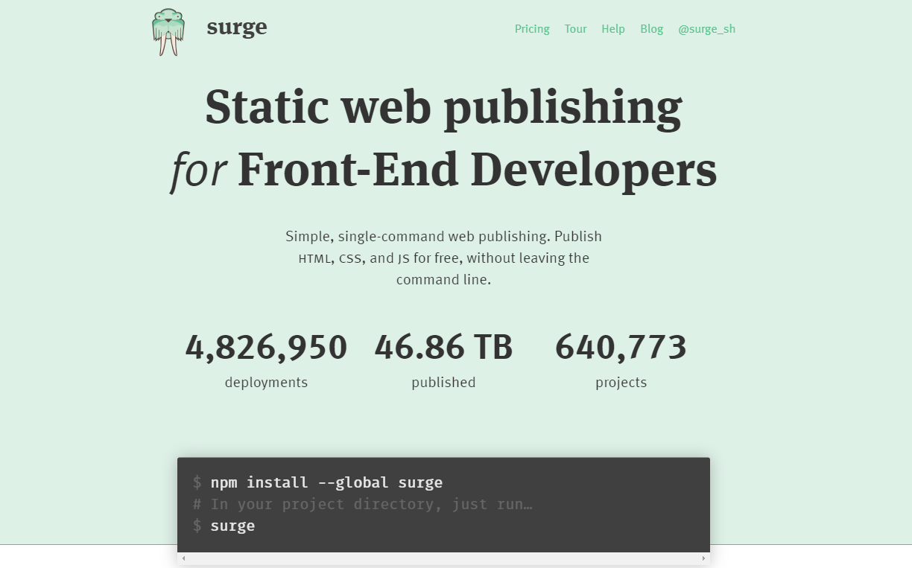

# top command line tools

## [surge](https://surge.sh/help/getting-started-with-surge)

Surge caters to front-end developers who need a quick method for publishing their HTML, CSS, and JavaScript content on the web. It takes a few seconds to type in the command and viola; your pages are up and running!

## [diff2html-cli](https://github.com/rtfpessoa/diff2html-cli)

Diff to Html generates pretty HTML diffs from unified and git diff output in your terminal. Diff2HTML supports GitLab, GitHub, Bitbucket, and merge/pull requests. The main reason developers use this over any other library is that diff2html provides a clear overview of the changes.
