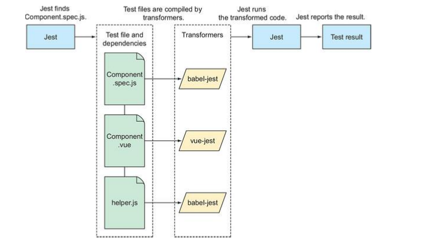

# Jest

```shell
npm install --save-dev jest
```

```json
// package.json

{
  "scripts": {
    "test: unit": "jest"
  }
}
```

if you're using windows, you should add `--no-cache` flag to the `jest` command to avoid potential errors.

```json
// package.json

{
  "scripts": {
    "test: unit": "jest --no-cache"
  }
}
```

当我们是在根目录下运行下面的命令：
```shell
npm run test:unit
```
我们发现出现下边的错误：
```shell
testMatch: **/__tests__/**/*.[jt]s?(x), **/?(*.)+(spec|test).[tj]s?(x) - 0 matches
```
没有匹配到任何测试文件。

jest使用glob来匹配它的测试文件，通常这些文件在`__tests__`文件夹下，并以`.spec.js`或者`.test.js`结尾。关于glob更多的内容查看[https://www.npmjs.com/package/glob#glob-primer](https://www.npmjs.com/package/glob#glob-primer)

我们在`/src/components`目录下创建`__test__`文件夹，尽量将单元测试的代码放在靠近需要测试的代码是一个比较好的习惯。

使用jest申明单元测试，需要用到`test`函数，这个函数接受两个参数，第一个是用来这个单元测试的名字的字符串，另一个是参数是一个包含测试代码的函数。

```js
test('sanity test', () => {
  return
})
```

非常基本的几个函数：
* test
* assert
* describe

# 在Vue项目中使用jest

## 第一步：引入vue组件

首先使用 `jest --init` 在根目录下边创建 `jest.config.js` 配置文件。

jest 默认不能识别.vue文件，所以我们需要用到`vue-jest`这个包来将vue的文件进行转换，在`jest.config.js`中进行下边配置。
```js
module.exports = {
  ...
   transform: {
    ".*\\.(vue)$": "<rootDir>/node_modules/vue-jest"
  }
  ...
}
```
另外还需要用babel处理一些es的新的语法，所以还需要`babel-jest`。
```js
module.exports = {
  ...
   transform: {
    "^.+\\.js$": "<rootDir>/node_modules/babel-jest",
    ".*\\.(vue)$": "<rootDir>/node_modules/vue-jest"
  }
  ...
}
```
在你使用`@babel@7`的时候你需要安装`babel-core@7.0.0-bridge.0`，我们知道babel在升级到7之后都是使用`@babel/*`这一类的包，但是`babel-jest`无法和这一类包起作用。除了刚才的一种解决办法，可已经使用`babel@6`的相关的包，并且将所有Babel的配置和相关包降级到6，这样`babel-jest`应该也能工作。



好的接下来让我们看看`jest.config.js`的基本配置:
```js
// 拿到默认的配置
const { defaults } = require('jest-config')
module.exports = {
  moduleFileExtensions: [
    "vue",
    ...defaults.moduleFileExtensions
  ],
  transform: {
    "^.+\\.js$": "<rootDir>/node_modules/babel-jest",
    ".*\\.(vue)$": "<rootDir>/node_modules/vue-jest"
  }
}
```
`moduleFileExtensions`主要用来配置查找模块的文件拓展名，比如`import content from './content'`，如果不写`.vue`后缀名，那么就需要配置上述的内容，否则会报错。另外，模块的查找是按照配置的顺序从左到右查找的，建议将比较常用的`.vue .js`这一类放到数组前面。

## 第二步：挂在vue组件

当我们引入vue组件之后，实际上我只是引入了一个包含render函数的一个对象。如果我们需要测试组件的行为是否正确，我们需要让组件渲染，换句话说我们需要挂载这个组件。

我们常用下边两种方式来挂在组件：

```js
import Alert from './Alert'
import Vue from 'vue'

const instance = new Vue({
  render: (h) => {
    return h(Alert, {})
  }
})

const vm = instance.$mount()
```

```js
import Alert from './Alert'
import Vue from 'vue'
const AlertConstructor = Vue.extend(Alert)
const instance = new AlertConstructor()

const vm = instance.$mount()
```

以上两种方式只是通过不同的方式获取组件的实例，最终都是通过`$mount`这个函数创建 DOM nodes。

vue组件最终都会使用到DOM的处理方法，生成真实的DOM树，也就是说vue的组件测试需要用到浏览器环境。

jest默认情况下使用了jsdom这个库来模拟浏览器环境，jsdom是一个可以在node环境下运行的完全用js编写的dom的实现，用jsdom代替浏览器环境来跑测试代码会比在真实浏览器环境更快。虽然jsdom实现了大部分的DOM的方法，但是任然有一些方法未实现，所以有的情况下会报错。

接下来我们看下Alert组件的单元测试代码：
```js
import Vue from 'vue'
import Alert from './Alert.vue'

test('sanity test', () => {
  // 1 利用Vue的render方法创建Alert组件实例
  const instance = new Vue({
    render: (h) => {
      return h(Alert, {})
    }
  })
  // 2 通过$mount方法创建DOM nodes
  const vm = instance.$mount()
  // 3. 检查预期结果
  expect(vm.$el.textContent).toContain('Alert')
  return
})
```

一个vue组件的单元测试大概就需要上边三个步骤。实际上，上边的1，2步骤对每个组件都是通用的，也就是所谓 boilerplate。这样一类代码已经有库帮助我们实现了--@vue/test-utils。

## @vue/test-utils

[@vue/test-utils官方文档](https://vue-test-utils.vuejs.org/zh/)

```shell
npm install @vue/test-utils --save-dev
```


