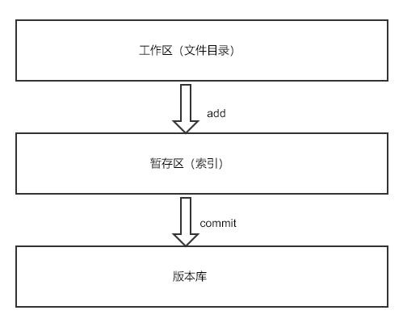

# 一些关于Git的内容(Something About Git)

最近，群里有的同学提到对git不太熟悉，所以我打算写一篇文章，帮助大家总结一些作为一个开发需要知道的git内容。

## 概述

文章分为两部分，第一部分是：**git的一些基本的概念**，第二部分主要是**git命令和一些使用场景**。

## 基本概念

如果你对这部分内容有所了解，那么你可以直接跳到第二部分的内容。对于初学者，使用之前我还是建议需要了解一些基本的概念内容。

接下来我们结合基本的使用来讲解一些概念。

### 基本使用：

    git init // 在当前目录下初始化一个git版本库，该命令会在当前目录下生成一个`.git`目录

    // 在当前目录中添加一些文件或者修改一些文件

    git add . // 讲当前工作区的所有内容进行暂存

    git commit -m 'update' // 讲暂存的内容提交到版本库，并添加描述信息

    git push origin branch-name // 将代码提交到远程的代码仓库

### 三个分区

git的三个分区别是：

* 工作区（Working Directory）

* 暂存区（Stage）

* 版本库（History）

工作区就是指我们的文件目录或者项目目录。

使用 `git add .` 命令之后，git会在`.git`目录中保存文件信息和生成索引，我们把通常称之为把文件提交到了暂存区。

使用 `git commit -m 'update'` 命令才能将暂存区的内容，提交到版本库。

在工作中，为了协作开发或者代码代码管理，通常我们还会使用`git push`命令将版本库提交到远程的仓库。

### git如果保存信息