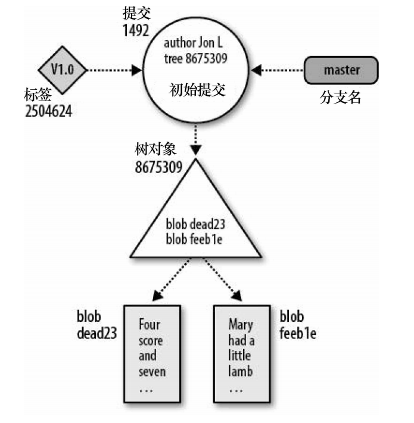
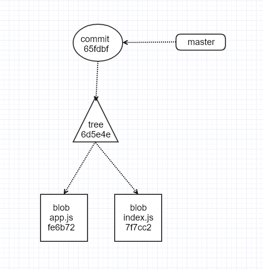

# 一些关于Git的内容(Something About Git)

最近，群里有的同学提到对git不太熟悉，所以我打算写一篇文章，总结一些git相关的内容，通过解答一些概念性和使用方面的问题，帮助大家快速掌握git的代码版本控制。

## 概述

这篇文章的目的是帮助大家快速掌握git的代码版本控制，内容篇幅较短，主要涉及以下三个方面的内容：

* 基本使用和三个分区概念

* git如何保存信息

* git的常用命令和使用场景

如果需要比较全面的了解git的内容可以查看官方提供的文档。

## 基本使用和三个分区概念

对于经常使用git的开发，在一天的工作中，至少会重复若干次下边的流程

    git init // 在当前目录下初始化一个git版本库，该命令会在当前目录下生成一个`.git`目录

    // 在当前目录中添加一些文件或者修改一些文件

    git add . // 讲当前工作区的所有内容进行暂存

    git commit -m 'update' // 讲暂存的内容提交到版本库，并添加描述信息

    git push origin branch-name // 将代码提交到远程的代码仓库


对于一些初学者想要不靠死记硬背记住上班的commit流程，你需要知道git的三个分区。

git的本地数据管理大概可以分为三个分区：

* 工作区（Working Directory）

  通常就是指我们的文件目录或者项目目录

* 暂存区（Stage）
  
  git在工作目录和版本库之间加设了一层索引（index），用 来暂存（stage）、收集或者修改

* 版本库（History）

  用来存放每一次提交的快照

在工作中，为了协作开发或者代码代码管理，通常我们还会使用`git push`命令将版本库的数据提交到远程的仓库。

以下图片来自网络


如果还想要更加深入的了解`git add`，`git commit`都发生了什么，那么你需要知道git大概是如何存储信息的。

## git如何存储信息

git版本库你可以认为是一个简单的数据库，git主要维护两个主要的数据结构：对象库和索引。

对象库包含你的原始数据文件和所 有日志消息、作者信息、日期，以及其他用来重建项目任意版本或分 支的信息。

索引描述整个版本库的目录结构。

我们初始化一个Git的版本库，然后创建两个文件，分别在文件中添加一些内容

```
git init 

echo "console.log('app')" > app.js
echo "console.log('app')" > index.js

tree

.
└── app.js
```

使用`git add .`命令将文件添加到暂存区，这个时候会创建索引。

我们可以通过`git status`和`git ls-files`命令来查看索引的状态和目录：

```
git status
On branch master

No commits yet

Changes to be committed:
  (use "git rm --cached <file>..." to unstage)

        new file:   app.js
        new file:   index.js

git ls-files --stage
100644 fe6b72dcf87d057d45129f5cf281c1cb6277a010 0       app.js
100644 7f7cc294ff052479b84bd1c13a510a616588af8e 0       index.js
```

那么为什么需要通过`git add`命令建立索引？

是因为当执行git commit命令的时候，Git会通过检查索引而不是工作 目录来找到提交的内容

如果你没有先使用`git add`添加索引，那么执行commit的时候你会收到下边的提示

```
nothing to commit, working tree clean
```

使用`git init`命令初始化版本库的时候，实际上会在工作目录中创建一个`.git`的文件目录

```
tree -L 1 .git

.git
├── COMMIT_EDITMSG
├── FETCH_HEAD
├── HEAD
├── ORIG_HEAD
├── config
├── description
├── hooks
├── index
├── info
├── logs
├── objects
├── packed-refs
└── refs
```

上边运行的`git add .`命令会在`.git/objects`目录下创建两个目录文件，用于保存文件的信息，通过`tree`命令可以查看到对应的文件

```
tree .git/objects

.git/objects
├── 7f
│   └── 7cc294ff052479b84bd1c13a510a616588af8e
├── fe
│   └── 6b72dcf87d057d45129f5cf281c1cb6277a010
├── info
└── pack
```

之前提到了对象库，这里说明一下git的对象的内容。

git提供了`cat-file`命令查看对象的类型对象内容，

git的对象库包含4种对象：

* 块 blob
* 目录树 tree
* 提交 commit
* 标签 tag

每个对象都会有一个40位的十六进制数组成的可寻址的内容名称，这个值是向对象的内容应用SHA1得到的散列值，这个散列值唯一有效且完全由对象内容决定。

`git add`会在`.git/objects`目录下创建`blob`对象，就是上面提到的两个目录文件。

使用`git cat-file`命令可以查看到对象的类型和内容

```
git caf-file -t fe6b72dcf87d057d45129f5cf281c1cb6277a010
blob
git caf-file -t 7f7cc294ff052479b84bd1c13a510a616588af8e
blob

git caf-file -p fe6b72dcf87d057d45129f5cf281c1cb6277a010
console.log('app')
git caf-file -p 7f7cc294ff052479b84bd1c13a510a616588af8e
console.log('index')
```

接下来，将暂存区的内容提交到版本库

```
git commit -m 'update'

[master (root-commit) 65fdbfb] update
 2 files changed, 2 insertions(+)
 create mode 100644 app.js
 create mode 100644 index.js

tree .git/objects/

.git/objects/
├── 65
│   └── fdbfbfd99f20a3d792fd2c5951324afde1b8f1
├── 6d
│   └── 5e4e2a71c52c661a19b8268384fd7093405f10
├── 7f
│   └── 7cc294ff052479b84bd1c13a510a616588af8e
├── fe
│   └── 6b72dcf87d057d45129f5cf281c1cb6277a010
├── info
└── pack
```

`git commit`命令会在`.git/objects`目录下创建`tree`对象和`commit`对象 

```
git cat-file -t 6d5e4e2a71c52c661a19b8268384fd7093405f10
tree

git cat-file -t 65fdbfbfd99f20a3d792fd2c5951324afde1b8f1
commit
```

我从《git版本管理》一书中截取了一张图，用来说明这些对象的关系：



下边是tree对象里边的内容：

```
git cat-file -p 6d5e4e2a71c52c661a19b8268384fd7093405f10
100644 blob fe6b72dcf87d057d45129f5cf281c1cb6277a010    app.js
100644 blob 7f7cc294ff052479b84bd1c13a510a616588af8e    index.js
```

* 100644 是文件的读写权限属性，熟悉chmod的人应该比较熟悉
* blob fe6b72dcf87d057d45129f5cf281c1cb6277a010 blob的对象名
* app.js 与改blob关联的文件名字

然后再来看看commit的内容

```
git cat-file -p 65fdbfbfd99f20a3d792fd2c5951324afde1b8f1
tree 6d5e4e2a71c52c661a19b8268384fd7093405f10
author zepang <ummlq4@gmail.com> 1577961062 +0800
committer zepang <ummlq4@gmail.com> 1577961062 +0800

update
```
* tree 6d5e4e2a71c52c661a19b8268384fd7093405f10 标识关联文件的树对象的名称 
* author zepang <ummlq4@gmail.com> 1577961062 +0800 作者的名字和创作的时间
* committer zepang <ummlq4@gmail.com> 1577961062 +0800 把新版本放到版本库的人（提交者）的名字和提交的时间
* update 对本次修订原因的说明（提交消息）

所以，案例中blob，tree，commit这几个对象的对应关系应该是




接下来我们修改一下app.js的内容，并作为一次提交

```
git count-objects
6 objects, 0 kilobytes

tree .git/objects/

.git/objects/
├── 39
│   └── d31dbcd1af5f62ea034bcf71ab15ff5db59eb7
├── 72
│   └── 913e959e5f7add13dbef442e9fd3f6a16da1f7
├── 95
│   └── 3407516503da2a7d17f8bd34d3b59a865d6ae9
├── d8
│   └── 483895aa00ff5699157662b55bc884ac9bb812
├── da
│   └── cbeb35be1214d73873eb3dc19b3d0dc466240b
├── f1
│   └── 5071def2948d47db4c4364ed38fbe5343c4b7b
├── info
└── pack
```

通过`git log`命令拿到最新的commit 名称为`dacbeb35be1214d73873eb3dc19b3d0dc466240b`

```
git cat-file -p dacbeb35be1214d73873eb3dc19b3d0dc466240b
tree f15071def2948d47db4c4364ed38fbe5343c4b7b
parent 953407516503da2a7d17f8bd34d3b59a865d6ae9
author zepang <zepang@gmail.com> 1577950617 +0800
committer zepang <zepang@gmail.com> 1577950617 +0800

git cat-file -p f15071def2948d47db4c4364ed38fbe5343c4b7b
100644 blob 39d31dbcd1af5f62ea034bcf71ab15ff5db59eb7    app.js

git cat-file -p 39d31dbcd1af5f62ea034bcf71ab15ff5db59eb7 
console.log('modify')
```
