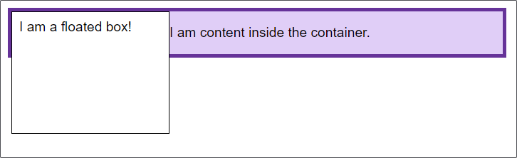
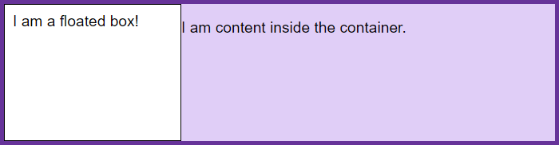

## BFC 介绍

块级格式化上下文（Block Formatting Context，BFC） 是 Web 页面的可视化 CSS 渲染的一部分，是块盒子的布局过程发生的区域，也是浮动元素与其他元素交互的区域，相当于一个独立的容器，里面的元素和外部的元素相互不影响。

## BFC 创建

创建 BFC 的方式有：

- 根元素(`<html>`)
- 浮动元素（元素的 float 不是 none）
- 绝对定位元素（元素的 position 为 absolute 或 fixed）
- 行内块元素（元素的 display 为 inline-block）
- 表格单元格（元素的 display 为 table-cell，HTML 表格单元格默认为该值）
- 表格标题（元素的 display 为 table-caption，HTML 表格标题默认为该值）
- 匿名表格单元格元素（元素的 display 为 table、table-row、 table-row-group、table-header-group、table-footer-group（分别是 HTML table、row、tbody、thead、tfoot 的默认属性）或 \* inline-table）
- overflow 值不为 visible 的块元素
- display 值为 flow-root 的元素（**一个新的 display 属性的值，它可以创建无副作用的BFC。在父级块中使用 display: flow-root 可以创建新的BFC。**）
- contain 值为 layout、content 或 paint 的元素
- 弹性元素（display 为 flex 或 inline-flex 元素的直接子元素）
- 网格元素（display 为 grid 或 inline-grid 元素的直接子元素）
- 多列容器（元素的 column-count 或 column-width 不为 auto，包括 column-count 为 1）
- column-span 为 all 的元素始终会创建一个新的 BFC，即使该元素没有包裹在一个多列

以上内容取自 [MDN 块级格式化上下文](https://developer.mozilla.org/zh-CN/docs/Web/Guide/CSS/Block_formatting_context)

## BFC 应用

### 让浮动内容和周围的内容等高（清除浮动）



```css
.box {
  background-color: rgb(224, 206, 247);
  border: 5px solid rebeccapurple;
}

.float {
  float: left;
  width: 200px;
  height: 150px;
  background-color: white;
  border: 1px solid black;
  padding: 10px;
}
```

```html
<div class="box">
  <div class="float">I am a floated box!</div>
  <p>I am content inside the container.</p>
</div>
```

创建一个会包含这个浮动的 BFC，通常的做法是设置父元素 overflow: auto 或者设置其他的非默认的 overflow: visible 的值。



```css
.box {
  background-color: rgb(224, 206, 247);
  border: 5px solid rebeccapurple;
  overflow: auto;
}

.float {
  float: left;
  width: 200px;
  height: 150px;
  background-color: white;
  border: 1px solid black;
  padding: 10px;
}
```

```html
<div class="box">
  <div class="float">I am a floated box!</div>
  <p>I am content inside the container.</p>
</div>
```

### 防止同一 BFC 容器中的相邻元素间的外边距重叠问题

这个问题网上一大堆 demo 这里就不举例了。

