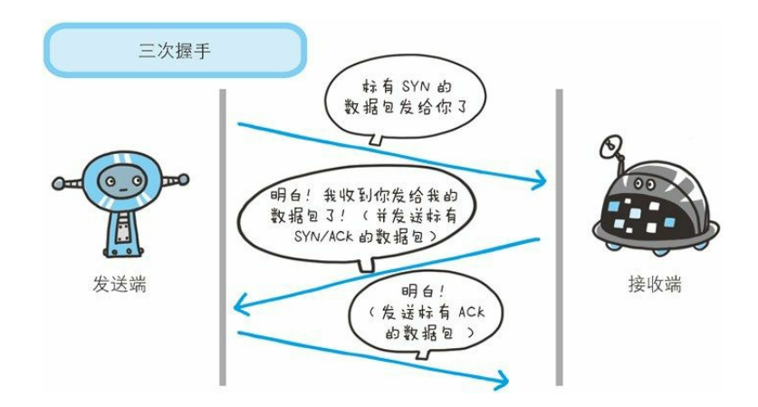
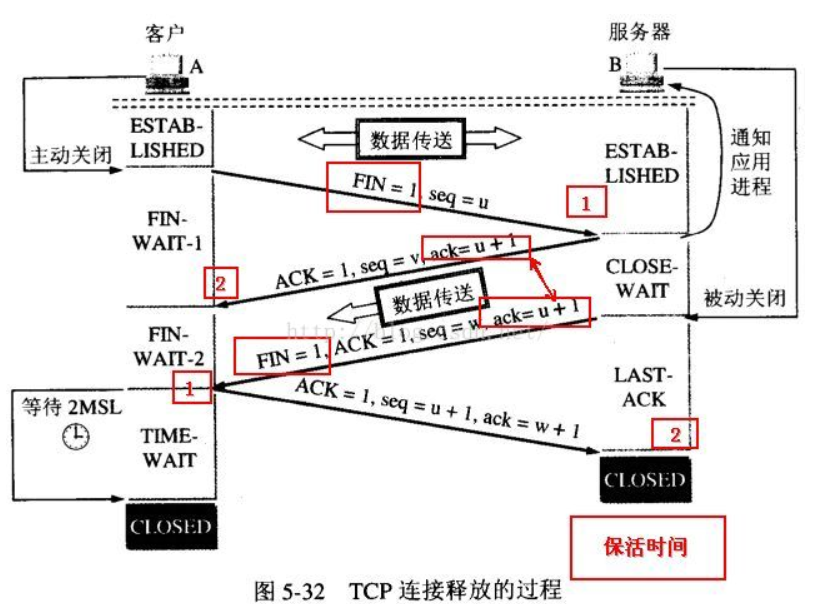

# http三次握手和四次挥手

一直以来作为前端网路相关的一个面试题，今天突然想仔细整理一下。

# 三次握手

所谓的"三次握手"实际就是客户端和服务端建立tcp连接的准备过程。

图片来自《图解http》

如图所示，发送端首先发送一个带 SYN 标志的数据包给对方。接收端收到后，回传一个带有 SYN/ACK 标志的数据包以示传达确认信息。最后，发送端再回传一个带 ACK 标志的数据包，代表“握手”结束。

* `SYN`: 发送方和接收方相互确认序号，表示连接
操作，也有同步的意思
* `ACK`: 表示接收数据序号字段有效，一般表示数
据已被接收方收到

### 为什么需要三次握手？

客户端或者说发送端，可以通过DNS解析的方式从我们的URL中获取服务端的IP地址，通信端口等信息，但是，服务端却不知道与他通信的客户端的IP地址和端口等信息，所以为了建立一个tcp会话，由客户端首先发起一次包含相互确认序号（SYN）的数据包，然后服务端接收到数据包，从数据包中解析出客户端的信息和序号，给客户端返回一次确认收到信息的数据包，所谓的确认就是将tcp的头部控制信息ACK值设为1，之后客户端收到服务端已经确认建立通话的信息，为了让服务端确定和他建立通话的对象是当前这个客户端无疑，发出了最后一次确认建立通话的数据包。

# 四次挥手

以上图片来自网络

* `FIN`: 表示断开连接

图片的内容是以客户端为首先发起结束tcp会话的请求。

客户端发出一个数据包，其他tcp头部信息FIN的值为1，告知服务端断开连接，服务端收到数据包之后，返回一个确认收到的数据包。然后等待数据传输完毕之后，再次给客户端发出一个关闭连接的请求，客户端返回服务端一个收到关闭连接的数据包。

### 为什么是连接是三次握手，而断开却要四次挥手？

我们可以看到多出的一次就是服务端多发的一次请求，因为，当服务端收到客户端断开连接的请求的时候，数据可能还没有传输完毕，这个时候，服务端只能先返回一个确认收到请求的数据包给客户端，等数据传输完毕之后，再次发送一个关闭连接的请求，告知客户端我这边断开连接了。

然后我们还看到图中客户端这边最后没有直接关闭连接，还有一个等待时间，这是为什么？

因为网络可能存在网路丢包情况，也就是说可能会有重传，比如客户端最后发出的确认收到服务端断开连接的请求中的ACK值丢失，服务端没有收到ACK值，就会再次发出一次结束连接的请求，如果客户端在发出最后一次请求就直接断开了连接，这个时候碰巧，又有了另外一个新建的连接客户端被分配了这个端口，那么这个服务端重发的FIN断开连接的请求就会被新建的客户端收到。所以为了防止这样的一个误操作，所以不会理解关闭当前客户端。