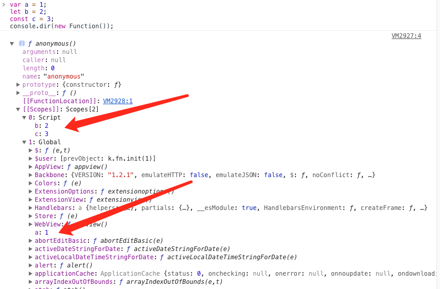

# 全局作用域中，用 const 和 let 声明的变量不在 window 上，那到底在哪里？如何去获取？

在ES5中，通过 `var` 定义的全局变量可以在顶层对象window中访问

```js
var a = 1
console.log(window.a) // 1
```

但是，在ES6中，通过`let`,`const`定义的全局变量缺无法在`window`中访问

```js
let b = 2
const c = 3
console.log(window.b) // undefined
console.log(window.c) // undefined
```

因为用`let`和`const`定义变量时会形成块级作用域，通过浏览器的debugger工具，我们可以看到：



b, c 已经在`script`这个下边，而没有在window下边。需要通过下面的方式访问：

```js
console.log(b) // 2
console.log(c) // 3
```