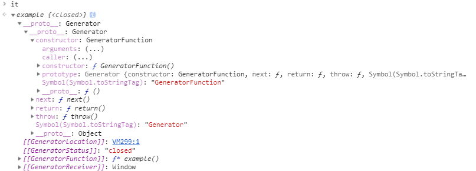
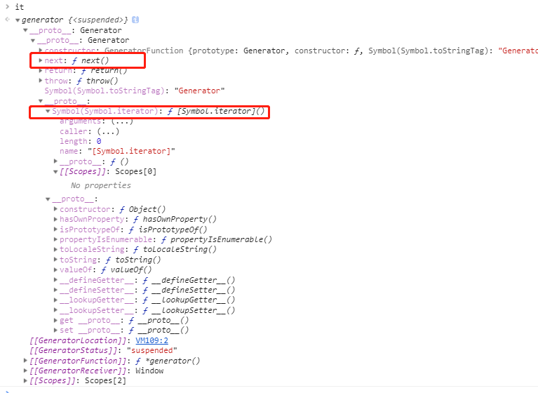

# 关于generator生成器

我们都知道一个普通给的函数，一旦开始运行就会一直运行知道结束。

ES6 新增了一种函数，在运行的过程中可以暂停和恢复运行，和普通函数的运行方式不一样。这类函数我们称之为生成器函数。

# 如何顶一个生成器函数？

```js
function *example () {
  ...
}
```
在函数名成之前添加一个`*`即可以顶一个生成器函数。另外还有以下几种种写法：

```js
function*example () {
  ...
}
function * example () {
  ...
}
function* example () {
  ...
}
```

### 如何使用生成器

生成器函数的使用方式是生成一个迭代器，然后调用迭代器的`next`方法来获取值。

```js
// 普通函数
function normal () {}
var normalResult = normal() // undefined

function *generator () {}
var it = generator() // 产生一个迭代器

it.next() // { value: undefined, done: true }
```

以下是`it`在控制台的输出：



我们来验证以下`it`是不是迭代器。我们都知道迭代器都需要一个`[Symbol.iterator]`这个方法来产生可迭代对象，并且有`next`方法来返回`{value: undefined, done: true}`这种对象值。

首先创建一个生成器函数并产生一系列的值：
```js
function *generator () {
  yield 1
  yield 2
  yield 3
  yield 4
}

var it = generator()
it[Symbol.iterator] // ƒ [Symbol.iterator]() { [native code] }
```

然后使用`for...of`循环来消耗这个迭代器：

```js
for (let i of it) {
  console.log(i)
}
// 1
// 2
// 3
// 4
```

我们接下来尝试以下`next()`调用，需要注意的是这个时候你得重新建立一个`迭代器`因为之前的`it`已经被`for ... of`消耗完了，调用`it.next()`只会返回`{value: undefined, done: true}`：

```js
var it = generator()
it.next() // {value: 1, done: false}
it.next() // {value: 2, done: false}
it.next() // {value: 3, done: false}
it.next() // {value: 4, done: false}
it.next() // {value: undefined, done: true} 全被的值都被消耗
```

通过以上的这些我们发现，`it`也即是生成器返回的是一个迭代器。并且这个迭代器的`[Symbol.iterator]`返回的可迭代对象是它本身。

```js
it[Symbol.iterator]() === it
```

下边是我们通过原型链的方式查找到的`next`方法和`Symbol.iterator`方法：



关于生成器和迭代器的内容我们先放着，等后面解释。

# yield

```js
function *generator () {
  var x = 0
  x++
  console.log(x)
  yield
  x++
  console.log(x)
}

var it = generator()
it.next()
```

以下的这些是我从mdn上边摘录下来的内容：

1. yield 关键字用来暂停和恢复一个生成器函数，yield关键字后面的表达式的值返回给生成器的调用者。它可以被认为是一个基于生成器的版本的return关键字。
2. yield关键字实际返回一个IteratorResult对象，它有两个属性，value和done。value属性是对yield表达式求值的结果，而done是false，表示生成器函数尚未完全完成。
3. 一旦遇到 yield 表达式，生成器的代码将被暂停运行，直到生成器的 next() 方法被调用。


