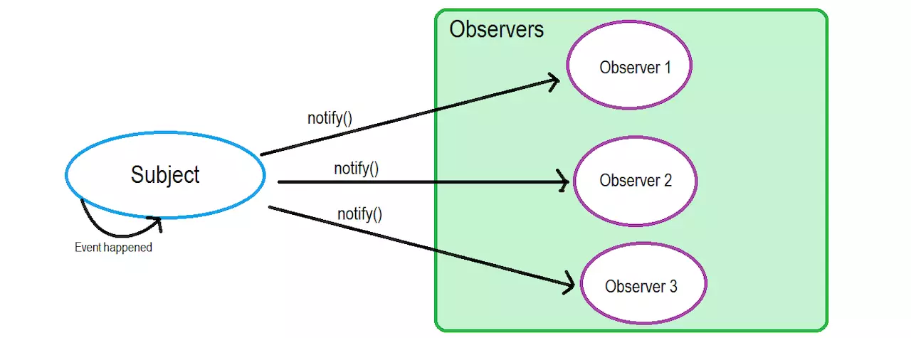
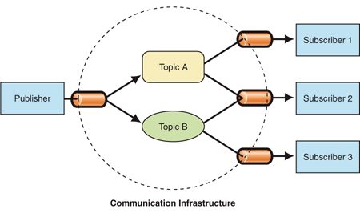
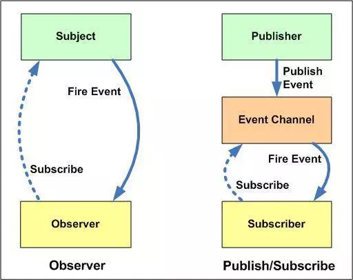

# 观察者模式和订阅-发布模式的区别

观察者模式和订阅-发布模式相似度很高，导致很多人容易混淆，其实他们还是有一些不同的地方。

### 观察者模式



观察者模式有两个对象，一个是Subject（被观察者），Observer（观察者），当Subject的状态发生变化的时候，会通知所有的订阅者

```js
function Subject () {
  // 观察者名单
  this.observers = []
}
Subject.prototype.addObserver = function (ob) {
  this.observers.push(ob)
}
Subject.prototype.notify = function () {
  for (let ob of this.observers) {
    ob.update()
  }
}

const obA = {
  update () {
    console.log(`update A`)
  }
}
const obB = {
  update () {
    console.log(`update B`)
  }
}

const subject = new Subject()
subject.addObserver(obA)
subject.addObserver(obB)
subject.notify()

// update A
// update B
```

### 发布-订阅者模式



发布-订阅模式简单来说有两个对象组成，消息发布者，消息接受者。

消息接受者，按照消息类型订阅自己感兴趣的消息，消息发布者按照消息类型通知订阅对应类型的消息接收者。

```js
const PubSub = (() => {
    const topics = {};  //保存订阅主题
    const subscribe = (type, fn) => {   //订阅某类型主题
        if (!topics[type]) {
            topics[type] = [];
        }
        topics[type].push(fn);
    };
    const publish = (type, ...args) => {    //发布某类型主题
        if (!topics[type]) {
            return;
        }
        for (let fn of topics[type]) {      //通知相关主题订阅者
            fn(args);
        }
    };
    return {subscribe, publish};
})();

let subA = {type: 'event1'},
    subB = {type: 'event2'},
    subC = {type: 'event1'};
PubSub.subscribe(subA.type, () => console.log(`update eventType: ${subA.type} subA`));   //订阅者A订阅topic1
PubSub.subscribe(subB.type, () => console.log(`update eventType: ${subB.type} subB`));   //订阅者B订阅topic2
PubSub.subscribe(subC.type, () => console.log(`update eventType: ${subC.type} subC`));   //订阅者C订阅topic1
PubSub.publish(subA.type);  //发布topic通知，通知订阅者A、C
// update eventType: event1 subA
// update eventType: event1 subC
```

### 对比



左边是观察者模式，右边是发布-订阅模式。

观察者模式中没有消息类型，一旦发出通知，所有的观察者都将会收到消息。

发布-订阅模式有一层，消息过滤的系统，按照消息的类型的通知订阅对应消息类型的消息接收者。
