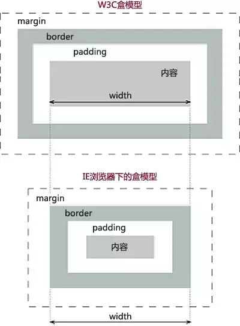
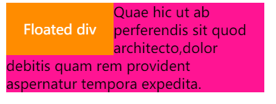
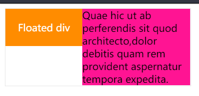
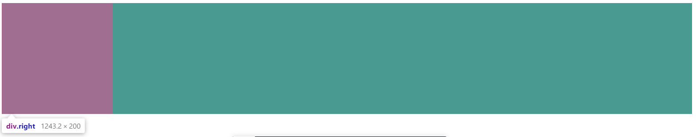
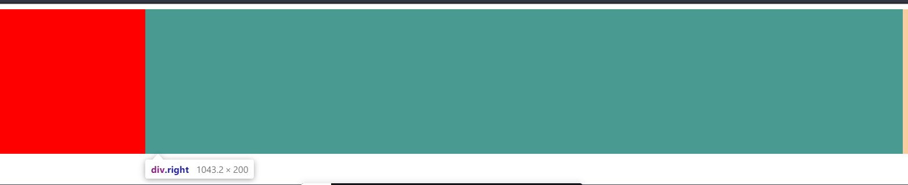
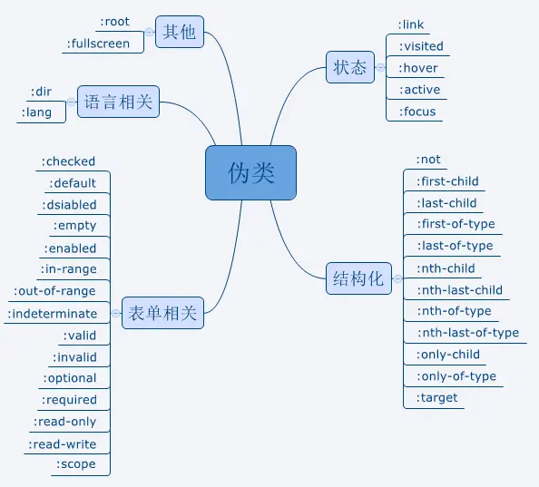
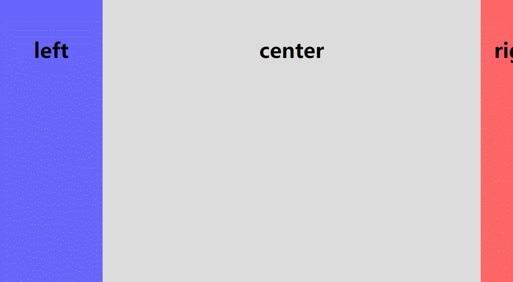
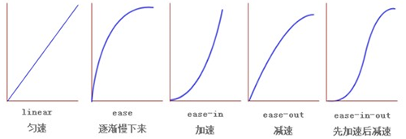
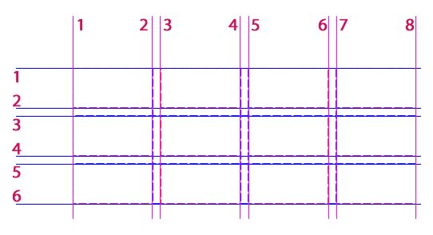

# 面试复习整理--css 篇

## 1. 盒模型

盒模型主要有以下几部分组成：

- 内容（content）
- 内边距（padding）
- 边框（border）
- 外边框（margin）

盒模型分为两种：

1. 标准盒模型(w3c 盒模型) 标准盒模型的 width = content
2. IE 盒模型 IE 盒模型的 width = padding + border + content



默认的情况下，盒子都是基于标准盒模型的盒子。在 css3 中出现了 `box-sizing` 属性，该属性会改变默认盒子的盒模型。

该属性的两个属性值分别表示为：content-box（标准盒模型）和 border-box（IE 盒模型）。

## 2. BFC

块级格式上下文，是一个独立的渲染区域，让处于 BFC 内部元素与外部元素相互隔离，使内外元素的定位不会相互影响。

创建 BFC 的方式：

- 跟元素（html）

- 浮动元素（float 值不为 none）

- 绝对定位元素（position 值为 absolute 或者 fixed）

- 行内块级元素（display: inline-block）

- 表格单元格元素（display: table|table-caption|table-header-group|table-row-group|table-footer-group|table-row|table-cell 分别是 HTML `<table> <caption> <thead> <tbody> <tfoot> <tr> <td>`的默认属性)

- overflow 属性值不为 visible 的块元素

- display 值为 flow-root 的元素（**一个新的 display 属性的值，它可以创建无副作用的 BFC。在父级块中使用 display: flow-root 可以创建新的 BFC。**）

- contain 值为 layout、content 或 paint 的元素

- 弹性元素（display 为 flex 或 inline-flex 元素的直接子元素）

- 网格元素（display 为 grid 或 inline-grid 元素的直接子元素）

BFC 的应用：

- 清浮动

- 防止 margin 重叠

- 防止字体环绕



```html
<div class="container">
  <div class="floated">Floated div</div>
  <p>
    Quae hic ut ab perferendis sit quod architecto,dolor debitis quam rem
    provident aspernatur tempora expedita.
  </p>
</div>

<style>
  .container {
    width: 300px;
    border: 1px solid #e5e5e5;
  }
  .floated {
    padding: 20px;
    background: darkorange;
    color: #fff;
    float: left;
  }
  p {
    background: deeppink;
    margin: 0;
  }
</style>
```



```css
p {
  background: deeppink;
  margin: 0;
  overflow: hidden;
}
```

- 自适应两栏布局



```html
<div class="box">
  <div class="left"></div>
  <div class="right"></div>
</div>

<style>
  .right,
  .left {
    height: 200px;
  }

  .left {
    width: 200px;
    float: left;
    background-color: red;
  }

  .right {
    background-color: green;
  }
</style>
```



```css
.right {
  background-color: green;
  overflow: hidden;
}
```

## 3. 层叠上下文 z-index

元素提升为一个比较特殊的图层，在三维空间中 (z 轴) 高出普通元素一等。


# 4. 页面导入样式时，使用 link 和@import 有什么区别？

1. 从语法层面来讲，link 属于 html 的语法，@import 属于 css 的语法

2. 从加载顺序的层面来讲，link 语法引入的样式将会和页面同时加载，而@import 引入的样式将会在页面加载之后加载

3. 从兼容性层面来讲，link 兼容所有的浏览器，@import 只有在 IE5 以才能被识别

4. 从功能层面来讲，link 功能大于@import，因为@import 只能用来加载 css

5. 另外，link 可以通过 js 操作，动态的进行加载样式，@import 不行

## 5. 选择器优先级

`!important` > 行内样式 > `#id` > `.class` > `tag` > \* > 继承 > 默认

> 选择器从右往左解析

## 6. 伪类和伪元素

**伪类** 存在的意义是为了通过选择器找到那些不存在 DOM 树中的信息以及不能被常规 CSS 选择器获取到的信息。



**伪元素** 用于创建一些不在文档树中的元素，并为其添加样式。

常见的伪元素有：`::before，::after，::first-line，::first-letter，::selection、::placeholder` 等。

`::after` 和 `:after` 的区别在于：css2 和 css3 的新旧标准不同，`:before/:after` 是 Css2 的写法，`::before/::after` 是 Css3 的写法

因此，伪类与伪元素的区别在于：**有没有创建一个文档树之外的元素**。

## 7. 选择器 nth-child 和 nth-of-type

```css
p:nth-child(n): /* 选择其父元素下的所有元素中的第二个p元素 */

p:nth-of-type(n) /* 选择其父元素下的所有p元素的第二个p元素 */
```

## 8. 盒子水平垂直居中

```html
<div class="parent">
  <div class="child"></div>
</div
```

1. flex

```css
div.parent {
  display: flex;
  justify-content: center;
  align-items: center;
}
```

2. flex + margin

```css
div.parent {
  display: flex;
}
div.child {
  margin: auto;
}
```

3. position + transform

```css
div.parent {
  position: relative;
}
div.child {
  position: absolute;
  top: 50%;
  left: 50%;
  transform: translate(-50%, -50%);
}
```

4. position + margin

```css
div.parent {
  position: relative;
}
div.child {
  position: absolute;
  left: 0;
  top: 0;
  right: 0;
  bottom: 0;
  margin: auto;
}
/* 已知子元素的宽高情况下 可以使用下面布局 */
div.child {
  width: 50px;
  height: 50px;
  position: absolute;
  left: 50%;
  top: 50%;
  margin-left: -25px;
  margin-top: -25px;
}
```

5. table-cell + inline-block

```css
div.parent {
  display: table-cell;
  text-align: center;
  vertical-align: middle;
}
div.child {
  display: inline-block;
}
```

5. vertical-align + inline-block

```css
div.parent {
  font-size: 0;
  text-align: center;
}
div.parent:before {
  content: "";
  display: inline-block;
  width: 0;
  height: 100%;
  vertical-align: middle;
}
div.child {
  display: inline-block;
  vertical-align: middle;
}
```

6. grid + margin

```css
div.parent {
  display: grid;
}
div.child {
  margin: auto;
}
```

## 9. 隐藏元素

- `opacity: 0` 不会影响页面结构，且能够触发该元素绑定的事件

- `visibility: hidden` 不会影响页面结构，不能触发该元素绑定的事件

- `display: none` 会影响页面结构

- `z-index: -1` `transform: translate(-9999px)` 隐藏在其他元素下边或者移除页面可视区之外

## 10. 圣杯布局和双飞翼布局

圣杯布局和双飞翼布局两者的功能相同，都是为了实现一个两侧宽度固定，中间宽度自适应的三栏布局。



圣杯布局：

```html
<style>
  body {
    min-width: 550px;
  }
  #container {
    padding-left: 200px;
    padding-right: 150px;
  }
  #container .column {
    float: left;
  }
  #center {
    width: 100%;
  }
  #left {
    width: 200px;

    margin-left: -100%;

    position: relative;
    left: -200px;
  }
  #right {
    width: 150px;
    margin-left: -200px;

    position: relative;
    left: 200px;
  }
</style>
<div id="container">
  <div id="center" class="column">center</div>
  <div id="left" class="column">left</div>
  <div id="right" class="column">right</div>
</div>
```

关键点：全部是 float 布局，使用 margin-left 位移，然后用 position 定位矫正

双飞翼布局：

```html
<style>
  body {
    min-width: 500px;
  }
  #container {
    width: 100%;
  }
  .column {
    float: left;
  }
  #center {
    margin-left: 200px;
    margin-right: 150px;
  }
  #left {
    width: 200px;
    margin-left: -100%;
  }
  #right {
    width: 150px;
    margin-left: -150px;
  }
</style>
<div id="container" class="column">
  <div id="center">center</div>
</div>
<div id="left" class="column">left</div>
<div id="right" class="column">right</div>
```

关键点：全部是 float 布局，使用 margin-left 位移

## 11. css动画

### transition

css的transition允许css的属性值在一定的时间内平滑过渡。

### 语法

```css
transition: width .25s ease .1s;
/* transiton: <transition-property> <transition-duration> <transition-time-function> <transition-delay>; */
```

* transition-property

有三种值：all || none || 具体的属性值，常用 all，选择多种属性值变化

* transition-duration

过渡时间，单位可以是`s`或者`ms`

* transition-time-function 

值有6种可能，`liner, ease, ease-in, ease-out, ease-in-out, cubic-bezier(x1,y1,x2,y2)`

前五种直接看下图：



cubic-bezier


cubic-bezier()中的四个值x1,y1,x2,y2代表p1(x1,y2)和p(x2,y2)的横纵坐标值

* transition-delay

表示过渡开始的时间，单位可以是`s`或者`ms`

钩子：`transitionend`

### animation

语法：

```css
animation: slide .25s ease .1s 1 normal forwards;
/* animation: animation-name animation-duration animation-time-function animation-delay animation-iteration-count  animation-direction animation-fill-mode; */
```

* animation-name

用来定义一个动画的名称，名称取自于`@keyframes name`定义的名称，

* animation-duration

动画时长，单位可以使`m`或`ms`

* animation-time-function 

同`transition`的`animation-time-function`一样

* animation-delay

动画的开始时间，单位可以使`m`或`ms`

* animation-iteration-count

动画播放的次数，值可以使 `infinite` 或者指定具体的数字

* animation-direction

有以下四个取值：

    1. normal

    每个循环内动画向前循环，换言之，每个动画循环结束，动画重置到起点重新开始，这是默认属性。
    
    2. alternate
    
    动画交替反向运行，反向运行时，动画按步后退，同时，带时间功能的函数也反向，比如，ease-in 在反向时成为ease-out。计数取决于开始时是奇数迭代还是偶数迭代
    
    3. reverse
     
    反向运行动画，每周期结束动画由尾到头运行。
    
    4. alternate-reverse

    反向交替， 反向开始交替
    动画第一次运行时是反向的，然后下一次是正向，后面依次循环。决定奇数次或偶数次的计数从1开始。


* animation-fill-mode

具体的取值可以查看[https://developer.mozilla.org/zh-CN/docs/Web/CSS/animation-fill-mode](https://developer.mozilla.org/zh-CN/docs/Web/CSS/animation-fill-mode)

钩子：`animationend`

## 12. flex布局

建议查看阮一峰的那一篇博文，文字配图介绍的很详细：

[http://www.ruanyifeng.com/blog/2015/07/flex-grammar.html](http://www.ruanyifeng.com/blog/2015/07/flex-grammar.html)

> flex与margin布局有奇效，具体内容可以自己搜索

## 13. grid布局



grid布局的内容比flex要多，建议查看阮一峰的一篇博文，也是文字配图讲解的很详细：

[http://www.ruanyifeng.com/blog/2019/03/grid-layout-tutorial.html](http://www.ruanyifeng.com/blog/2019/03/grid-layout-tutorial.html)


## css3的新特性

- 选择器

  + :nth-child

  + :nth-last-child

  + :not

  + :first-line

- 文本省略换行

  + text-overflow: ellipsis

  + text-wrap

- 字体

  + @font-face

- 渐变

  + linear-gradient

  + radial-gradient

- 阴影圆角边框背景

  + box=shadow

  + border-raduis

  + border-image

  + background

- 动画

  + transition

  + animation/@keyframes

- 媒体查询

  + @media 