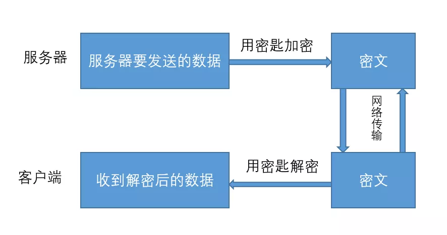
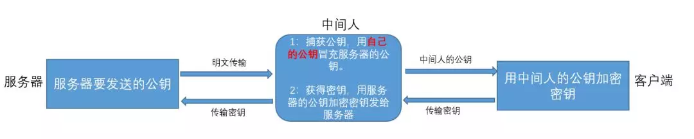
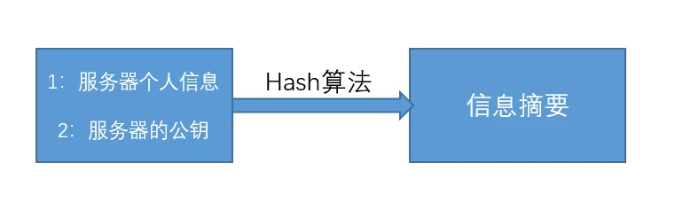
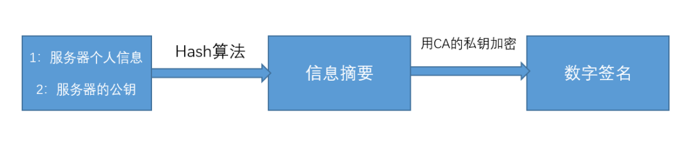
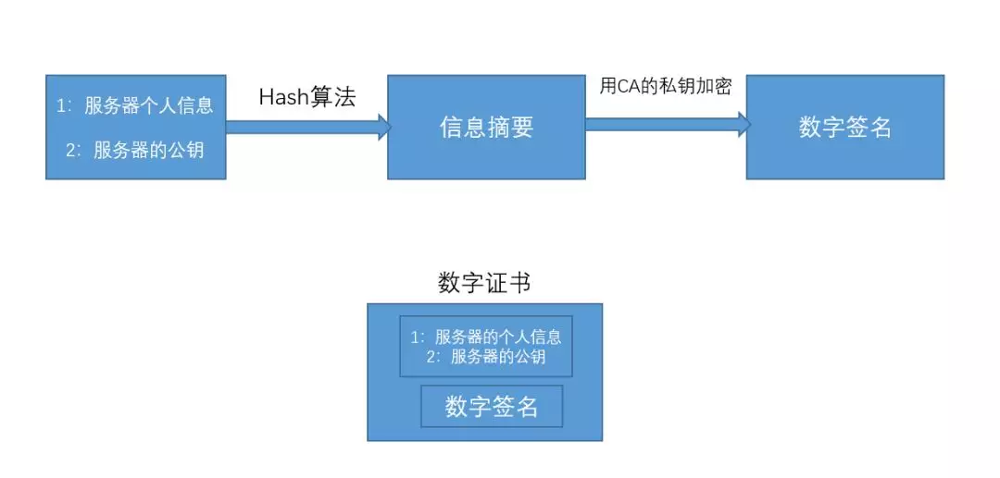
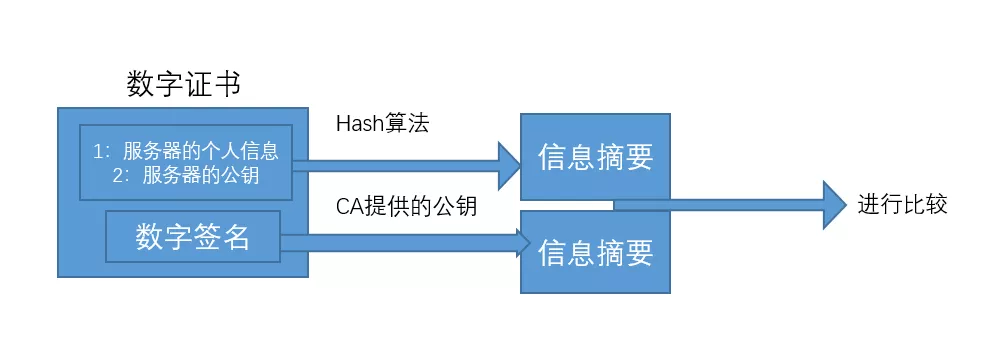
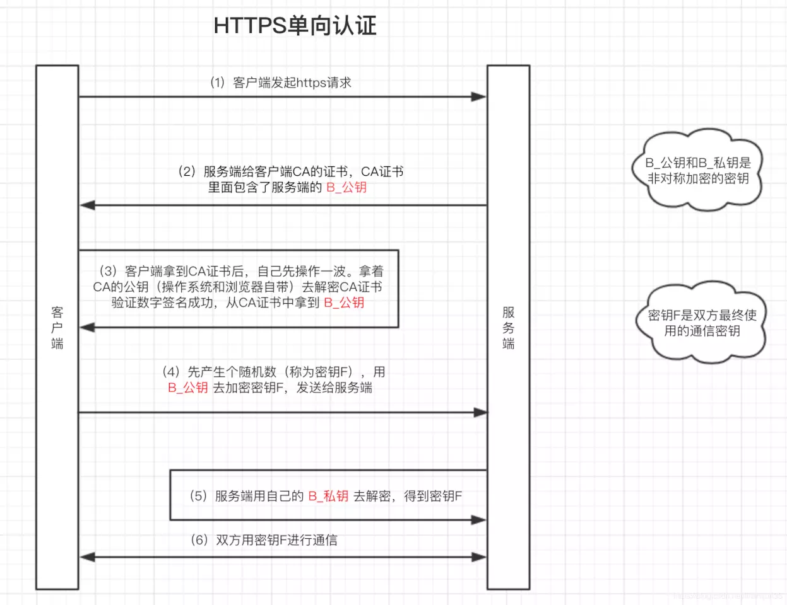
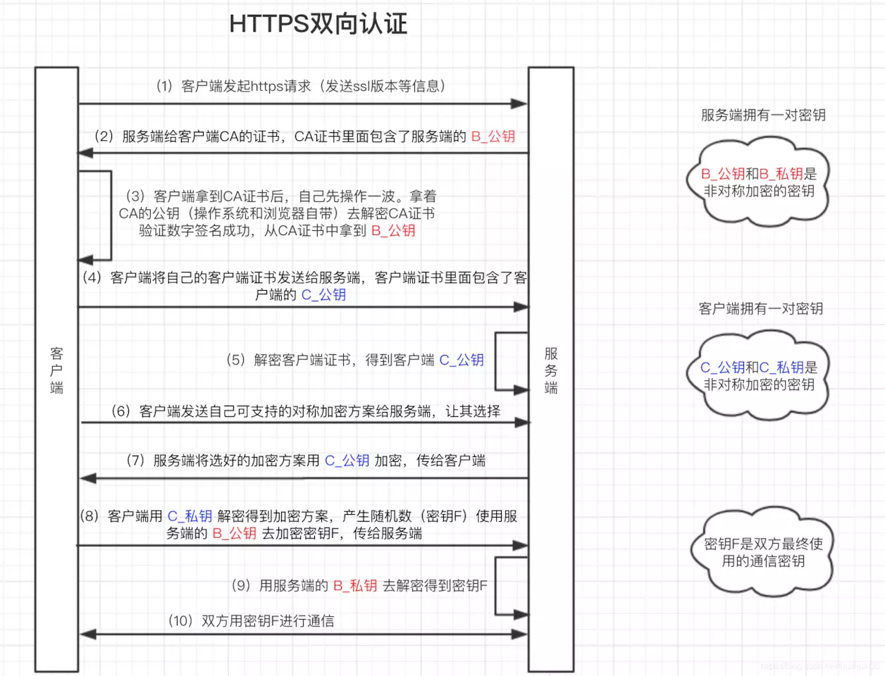

# HTTP相关

HTTP，全称超文本传输协议，用于传输超媒体文档（例如HTML）的应用层协议

为web浏览器和web服务器之间的通信而设计的

## HTTP常见的状态码

- 200 

请求成功

- 301

永久重定向。请求的资源已被永久的移动到新URI，返回信息会包括新的URI，浏览器会自动定向到新URI。今后任何新的请求都应使用新的URI代替

- 302

临时重定向。与301类似。但资源只是临时被移动。客户端应继续使用原有URI

- 304

未修改。所请求的资源未修改，服务器返回此状态码时，不会返回任何资源。客户端通常会缓存访问过的资源，通过提供一个头信息指出客户端希望只返回在指定日期之后修改的资源

- 307

临时重定向。与302类似，尽管302有规定临时重定向的时候不能将post请求改为get，但是大部分的客户端都会这样做。307会遵照浏览器标准，不会从post变为get。但是对于处理响应时的行为，各种浏览器有可能出现不同的情况

- 400

客户端请求的语法错误，服务器无法理解

- 401

未被授权，请求要求用户的身份认证

- 403

服务器理解请求客户端的请求，但是拒绝执行此请求

- 404

服务器无法根据客户端的请求找到资源（网页）。通过此代码，网站设计人员可设置"您所请求的资源无法找到"的个性页面

- 500

服务器内部错误，无法完成请求

- 502
  
充当网关或代理的服务器，从远端服务器接收到了一个无效的请求

- 503

服务器暂时无法处理用户请求，服务无法使用

## HTTP三次握手和四次挥手

查看本目录下，http三次握手和四次挥手

## 缓存

强缓存：

强制缓存的含义是，当客户端请求后，会先访问缓存数据库看缓存是否存在。如果存在则直接返回；不存在则请求真的服务器，响应后再写入缓存数据库（这里缓存数据库指service work, memory cache, disk cache这些地方）

强制缓存直接减少请求数，是提升最大的缓存策略

可以造成强制缓存的字段是 Cache-control 和 Expires

- Expires

Expires是HTTP/1.0的字段，表示缓存时间，是一个绝对的时间

```
Expires: Thu, 10 Nov 2017 08:45:11 GMT
```

在响应消息头中，设置这个字段之后，就可以告诉浏览器，在未过期之前不需要再次请求

但是这个字段有以下两个缺点：

1. 由于是绝对时间，用户可以修改客户端本地时间，导致浏览器的缓存失效，重新请求该资源。即使不考虑自行修改时间，时差因素也会导致缓存失效。
2. 值写法过于复杂。表示时间的字符串空格或者拼写错误都会导致失效。

- Cache-control

在HTTP/1.1中，增加了一个字段Cache-control，该字段表示资源缓存的最大有效时间，在该时间内，客户端不需要向服务器发送请求。

Cache-control 的优先级高于 Expires，为了兼容 HTTP/1.0 和 HTTP/1.1，实际项目中两个字段都可能设置。

该值为相对时间：

```
Cache-control: max-age=2592000
```

下边是列举一些常见的Cache-control的有效字段：

- `max-age=<seconds>` 设置缓存存储的最大周期，超过这个时间缓存被认为过期(单位秒)。与Expires相反，时间是相对于请求的时间。
- `must-revalidate` 一旦资源过期（比如已经超过max-age），在成功向原始服务器验证之前，缓存不能用该资源响应后续请求。
- `no-cache` 在发布缓存副本之前，强制要求缓存把请求提交给原始服务器进行验证。虽然中文意思是“不要缓存”，实际上是需要缓存，只不过需要服务器验证
- `no-store` 真正意义上的“不要缓存”。所有内容都不走缓存，包括强制和对比
- `public` 所有的内容都可以被缓存 (包括客户端和代理服务器， 如 CDN)
- `private` 所有的内容只有客户端才可以缓存，代理服务器不能缓存。默认值

协商缓存：

也叫对比缓存。当强制缓存失效(超过规定时间)时，就需要使用对比缓存，由服务器决定缓存内容是否失效。

**对比缓存在请求数上和没有缓存是一致的**，但如果是 304 的话，返回的仅仅是一个状态码而已，并没有实际的文件内容，因此 **在响应体体积上的节省是它的优化点**。

对比缓存是可以和强制缓存一起使用的，作为在强制缓存失效后的一种后备方案。

与对比缓存有关的两组字段（不是两个）:

- Last-Modified 和 If-Modify-Since

  1. 服务器通过 Last-Modified 字段告知客户端，资源最后一次被修改的时间，例如
Last-Modified: Mon, 10 Nov 2018 09:10:11 GMT
  2. 浏览器会将这个值和内容一起记录到缓存数据库中
  3. 下一次请求相同资源时，浏览器从自己的缓存中找出“不确定是否过期的”缓存。因此，请求头中会将上次的`Last-Modified`的值写入到`If-Modified-Since`字段
  4. 服务器会将`Last-Modified`和`If-Modified-Since`的值进行对比，如果没有过期，相应304；反之，则表示修改了，响应状态码200，并返回数据。

  但是他还是有一定缺陷的：

  - 如果资源更新的速度是秒以下单位，那么该缓存是不能被使用的，因为它的时间单位最低是秒。
  - 如果文件是通过服务器动态生成的，那么该方法的更新时间永远是生成的时间，尽管文件可能没有变化，所以起不到缓存的作用。

- Etag 和 If-None-Match
  
  为了解决上述提到的问题，出现的一组新的字段。

  Etag是文件存储的特殊标识（一般是hash生成），服务器存储着文件的Etag字段（If-None-Match）。之后的流程和 Last-Modified 一致，只是 Last-Modified 字段和它所表示的更新时间改变成了 Etag 字段和它所表示的文件 hash，把 If-Modified-Since 变成了 If-None-Match。服务器同样进行比较，命中返回 304, 不命中返回新资源和 200。

  Etag 的优先级高于 Last-Modified。

缓存小结：

当浏览器请求资源时：

1. 调用Service Worker的fetch事件响应
2. 查看memory cache
3. 查看disk cache
   1. 如果有强制缓存且未失效，则使用强制缓存，不请求服务器。这时的状态码全部是 200
   2. 如果有强制缓存但已失效，使用对比缓存，比较后确定 304 还是 200
4. 发起网络请求，等待响应
5. 如果HTTP头信息设置可以缓存，则将内容缓存到disk cache
6. 无视HTTP头部信息，直接缓存响应内容的引用到memory cache
7. 如果service work匹配到资源并且调用了cache.put()，会把响应内容缓存到Service Worker 的 Cache Storage

具体的内容参考本目录下 一文读懂前端缓存 - 知乎

## HTTPS

我们知道HTTP有以下明显的缺点：

1. 通信明文，内容可能会被窃取
2. 无法验证通信双发的身份，有可能遭遇伪装
3. 传输的报文有可能会被修改，无法保证报文的完整性

所以，我们第一个想到的就是加密内容，说到加密需要了解以下两种加密方式：

- 对称加密
- 非对称加密

对称加密：通信双方是用同一个密钥进行加密和解密。



特点就是速度快。缺点就是密钥在传输的时候可能会被窃取。假如服务器用明文的方式传输密钥给客户端，然后密钥被中间人给捕获了，那么在之后服务器和客户端的加密传输过程中，中间人也可以用他捕获的密钥进行解密。这样的话，加密的数据在中间人看来和明文没啥两样。

非对称加密：通信双发都有两把钥匙（公钥和密钥），用公钥加密的数据，只有对应的私钥才能解密；用私钥加密的数据，只有对应的公钥才能解密。


服务器在给客户端传输数据的过程中，可以用客户端明文给他的公钥进行加密，然后客户端收到后，再用自己的私钥进行解密。客户端给服务器发送数据的时候也一样采取这样的方式。这样就能保持数据的安全传输了。缺点就是慢，这个可以通过算法优化。

那么，是不是采用非对称加密就可以保证传输安全了呢？

答案肯定不是。

服务器以明文的方式给客户端传输公钥的时候，中间人截取了这把属于服务器的公钥，并且把中间人自己的公钥冒充服务器的公钥传输给了客户端。

之后客户端就会用中间人的公钥来加密自己生成的密钥。然后把被加密的密钥传输给服务器，这个时候中间人又把密钥给截取了，中间人用自己的私钥对这把被加密的密钥进行解密，解密后中间人就可以获得这把密钥了。

最后中间人再对这把密钥用刚才服务器的公钥进行加密，再发给服务器。



毫无疑问，在这个过程中，中间人获取了对称加密中的密钥，在之后服务器和客户端的对称加密传输中，这些加密的数据对中间人来说，和明文没啥区别。

所以，如何确定服务端的身份呢？**数字证书**

什么是数字证书？数字证书又是如何进行身份验证？

1. 假设我们用的证书是认证中心(CA)颁发的，服务器在给客户端传输公钥的过程中，会把**公钥**以及服务器的**个人信息**通过Hash算法生成**信息摘要**



2. 为了防止信息摘要被人调换，服务器还会用CA提供的**私钥**对信息摘要进行加密来形成**数字签名**



3. 并且，最后还会把原来没Hash算法之前的**个人信息以及公钥** 和 **数字签名**合并在一起，形成**数字证书**



4. 当客户端拿到这份数字证书之后，就会用CA提供的公钥来对数字证书里面的数字签名进行解密来得到信息摘要，然后对数字证书里服务器的公钥以及个人信息进行Hash得到另外一份信息摘要。最后把两份信息摘要进行对比，如果一样，则证明这个人是服务器，否则就不是。



那么，客户端是如何拿到CA的公钥的呢？

一般情况下，服务器一开始就向这些认证中心申请了证书，而客户端也内置了证书。如果没有，可以安装对应证书。

接下来回到重点HTTPS，什么是HTTPS？

HTTPS = HTTP + 加密（SSL）+ 认证（证书）+ 完整性保护

接下来看看HTTPS是如何进行认证的？

HTTPS认证方式通常有两种

- 单向认证（认证服务端）
- 双向认证（认证客户端和服务端）

双向认证只能允许服务端许可的客户端访问，安全性更高。一般情况，为什么所有的客户端都能访问服务端，会采用单向认证。

单向认证过程：



图中的过程已经比较详细，不多做介绍。单向认证，服务端拥有两把钥匙（B_公钥和B_私钥）。

双向认证过程：



双向认证，服务端拥有两把钥匙（B_公钥和B_私钥），客户端也拥有两把钥匙（C_公钥和C_私钥）。

## HTTP2

相对于HTTP/1.1的优势：

1. 二进制分帧层
2. 多路复用
3. 服务端推送（server push）优化
4. 头部压缩
5. 请求优先级设置

开启http2之后可以放弃的一些优化：

1. 合并文件
2. 雪碧图
3. 域名分片（担心浏览器请求同一域名的最大数限制）
