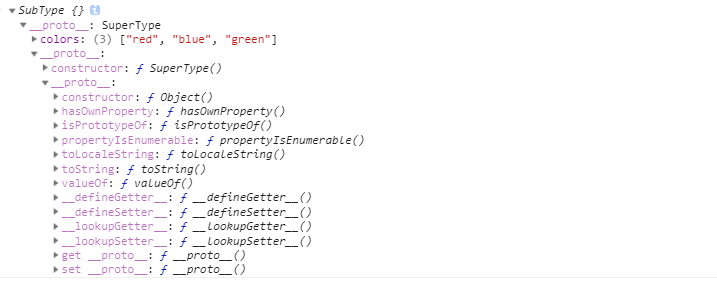
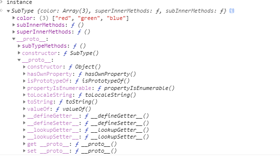

# Javascript常用八种继承方案

### 1. 原型链继承

构造函数、原型和实例之间的关系：每个构造函数都有一个原型对象，原型对象都包含一个指向构造函数的指针，而实例都包含一个原型对象的指针。

继承的本质就是**复制，即重写原型对象，代之以一个新类型的实例**

```js
function SuperType () {
  this.property = true
}

SuperType.prototype.getSuperValue = function () {
  return this.property()
}

function SubType () {
  this.subProperty = false
}

// 这里是关键，创建SuperType实例（原型），并将该实例赋值给SubType.prototype

SubType.prototype = new SuperType()

SubType.prototype.getSubValue = function () {
  return this.subProperty
}

let instance = new SubType()
console.log(instance.getSubValue()) // true
```



原型链方案存在的缺点：

1. `constructor`的指向问题

```js
console.log(SubType.prototype.constructor === SuperType) // true
console.log(instance.constructor === SuperType) //true
```

所以，通常我们使用原型链继承的方案都需要手动的更改正确的constructor的指向

```js
SubType.prototype = new SuperType()
SubType.prototype.constructor = SubType
```

2. 实列之间共享原型上的引用类型数值

```js
function SuperType () {
  this.colors = ['red','blue', 'green']
}
function SubType () {}

SubType.prototype = new SuperType()
SubType.prototype.constructor = SubType

let instance1 = new SubType()
instance1.colors.push('black')
console.log(instance1.colors)// ["red", "blue", "green", "black"]

let instance2 = new SubType()
console.log(instance2) // ["red", "blue", "green", "black"]
console.log(SubType.prototype.colors) // ["red", "blue", "green", "black"]
```

### 2. 借用构造函数继承

使用父类的构造函数来增强子类实例，等同于赋值父类的实列给子类（不使用原型）

```js
function SuperType () {
  this.colors = ['red', 'blue', 'green']
}
function SubType () {
  // 继承SuperType
  SuperType.call(this)
}

let instance1 = new SubType()
instance1.colors.push('black') 
console.log(instance1.colors) //  ["red", "green", "blue", "black"]

let instance2 = new SubType()
instance1.colors.push('yellow') 
console.log(instance2.colors) //  ["red", "green", "blue", "yellow"]
```

核心代码是`SuperType.call(this)`，创建子类实例时调用`SuperType`构造函数，于是`SubType`的每个实例都会将SuperType的属性复制一份

缺点：

1. 只能继承父类的属性和方法，不能继承原型属性和方法

```js
// 原型方法
function SuperType (){
    this.color=["red","green","blue"];
    this.superInnerMethods = function () {
      console.log('super inner methods')
    }
}
function SubType (){
    //继承自SuperType
    SuperType.call(this);
    this.subInnerMethods = function () {
      console.log('sub inner methods')
    }
}
SuperType.prototype.superMethods = function () {
  console.log('superType methods')
}
//父类方法
SuperType.superStaticMethods = function () {
  console.log('superType static methods')
}
// 子类原型方法
SubType.prototype.subTypeMethods = function () {
  console.log('subType methods')
}
// 子类方法
SubType.subTypeStaticMethods = function () {
  console.log('subType static methods')
}

let instance = new SubType()
instance
```


2. 本质是每个子类都复制一份父类实例的副本，无法复用，影响性能

### 3. 组合继承

上一个案例我们知道`instance`无法继承`SuperType`的原型属性和方法，但是却是可以继承`SubType`上的原型方法。那么我们是不是可以考虑加入原型链的继承方式，使得实例拥有原型的属性和方法。

组合继承就是结合上边两种方式的继承方式。用原型继承实现对原型属性和方法的继承，用借用构造函数技术来实现实例属性的继承。

```js
function SuperType (){
    this.color=["red","green","blue"];
    this.superInnerMethods = function () {
      console.log('super inner methods')
    }
}
function SubType (){
    //继承自SuperType
    SuperType.call(this);
    this.subInnerMethods = function () {
      console.log('sub inner methods')
    }
}
SuperType.prototype.superMethods = function () {
  console.log('superType methods')
}
//父类方法
SuperType.superStaticMethods = function () {
  console.log('superType static methods')
}

SubType.prototype = new SuperType()
SubType.prototype.constructor = SubType

// 子类原型方法
SubType.prototype.subTypeMethods = function () {
  console.log('subType methods')
}
// 子类方法
SubType.subTypeStaticMethods = function () {
  console.log('subType static methods')
}

let instance = new SubType()
instance
```


我们现在将这三种方式进行一个对比（请看上边三种方式实例（instance）的控制台输出截图）：

- 原型链的继承：实例本身没有原型的属性（案列中为colors）,`instance.colors`这种方式是通过原型链来访问原型的`colors`属性，所以如果对于`colors`这种引用类型的值，进行修改，可能会影响到原型的`colors`属性，进而可能影响到其他的实例。

- 借用构造函数继承：实例本身有原型的属性（`colors`），实际上是原型属性副本，原型上没有`colors`属性，所以你对 `colors` 的修改只能是影响到实例本身，无法影响到原型或者原型的其他实例。但是这种方式你没有办法继承父类原型链上的方法。

- 组合继承：实例本身和原型属性访问器上都能看到`colors`属性，因为属性遮蔽所以`instance.colors`访问到的是实例本身的属性，避免了对引用类型值的修改问题。另外从图中我们可以发现，原型链多了一层，上边已经有了`superMethods`方法，也就是挂载在`superType`原型上的方法，解决了借用构造函数继承方式无法继承原型属性和方法的问题。不过`constructor`指向问题还是得手动解决。

缺点：

实例`instance`和原型对象上有两份同名属性`colors`

### 4. 原型式继承

利用一个空对象作为中介，将某个对象直接赋值给空对象构造函数的原型。

```js
function object (obj) {
  function F () {}
  F.prototype = obj
  return new F()
}
```

```js
var person = {
  name: "Nicholas",
  friends: ["Shelby", "Court", "Van"]
};

var anotherPerson = object(person);
anotherPerson.name = "Greg";
anotherPerson.friends.push("Rob");

var yetAnotherPerson = object(person);
yetAnotherPerson.name = "Linda";
yetAnotherPerson.friends.push("Barbie");

alert(person.friends);   //"Shelby,Court,Van,Rob,Barbie"
```

缺点：

* 原型链继承多个实例的引用类型属性指向相同，存在篡改的可能。
* 无法传递参数

另外，ES5的`Object.create()`的方法，能够代替上边的object方法

### 5. 寄生继承

核心：在原型式继承的基础上，增强对象，返回构造函数

```js
function createAnother (original) {
  var clone = object(original)
  clone.sayHi = function () {
    alert('hi')
  }
  return clone
}
```

函数的主要作用是为构造函数新增属性和方法，以增强函数

```js
var person = {
  name: 'Nicholas',
  friends: ['Shelby', 'Court', 'Van']
}
var anotherPerson = createAnother(person)
anotherPerson.sayHi()
```

缺点：

* 原型链继承多个实例的引用类型属性指向相同，存在篡改的可能。
* 无法传递参数

### 6. 寄生组合式继承

结合构造函数传递参数和寄生模式实现继承

```js
function inheritPrototype (subType, superType) {
  var prototype = Object.create(superType.prototype, {
    constructor: {
      value: subType,
      enumerable: true,
      writable: true,
      configurable: true
    }
  })
  subType.prototype = prototype
}

function SuperType (name) {
  this.name = name 
  this.colors = ['red', 'blue', 'green']
}

SuperType.prototype.sayName = function () {
  console.log(this.name)
}

function SubType (name, age) {
  SuperType.call(this, name)
  this.age = age
}

inheritPrototype(SubType, SuperType)

SubType.prototype.sayAge = function () {
  console.log(this.sayAge)
}

var instance1 = new SubType("xyc", 23);
var instance2 = new SubType("lxy", 23);

instance1.colors.push("2"); // ["red", "blue", "green", "2"]
instance2.colors.push("3"); // ["red", "blue", "green", "3"]

```


和之前的组合继承相比，这种继承方式有了进一步改进，实例当中只有一份父类实例属性的副本（name, colors），原型链上不存在同名的属性。另外，之前的组合继承需要调用两次 SuperType，这里使用了 `Object.create`的方式来替代，稍微提高效率。

**这种继承方式是目前最成熟的方法，也是现在库实现的方法。**

### 7. 混入方式继承多个对象

```js
function MyClass() {
     SuperClass.call(this);
     OtherSuperClass.call(this);
}

// 继承一个类
MyClass.prototype = Object.create(SuperClass.prototype);
// 混合其它
Object.assign(MyClass.prototype, OtherSuperClass.prototype);
// 重新指定constructor
MyClass.prototype.constructor = MyClass;

MyClass.prototype.myMethod = function() {
     // do something
}
```

`Object.assign`会把 `OtherSuperClass` 原型上的函数拷贝到 `MyClass` 原型上，使 MyClass 的所有实例都可用 `OtherSuperClass` 的方法。

### 8. ES类继承extends

`extends`关键字主要用于类声明或者类表达式中，以创建一个类，该类是另一个类的子类。其中`constructor`表示构造函数，一个类中只能有一个构造函数，有多个会报出`SyntaxError`错误,如果没有显式指定构造方法，则会添加默认的 `constructor`方法，使用例子如下。

```js
class Rectangle {
    // constructor
    constructor(height, width) {
        this.height = height;
        this.width = width;
    }
    
    // Getter
    get area() {
        return this.calcArea()
    }
    
    // Method
    calcArea() {
        return this.height * this.width;
    }
}

const rectangle = new Rectangle(10, 20);
console.log(rectangle.area);
// 输出 200

-----------------------------------------------------------------
// 继承
class Square extends Rectangle {

  constructor(length) {
    // 相当于 Rectangle.call(this, length, length)
    super(length, length);
    
    // 如果子类中存在构造函数，则需要在使用“this”之前首先调用 super()。
    this.name = 'Square';
  }

  get area() {
    return this.height * this.width;
  }
}

const square = new Square(10);
console.log(square.area);
// 输出 100
```

`extends`继承的核心代码如下，其实现和上述的寄生组合式继承方式一样

```js
function _inherits(subType, superType) {
  
    // 创建对象，创建父类原型的一个副本
    // 增强对象，弥补因重写原型而失去的默认的constructor 属性
    // 指定对象，将新创建的对象赋值给子类的原型
    subType.prototype = Object.create(superType && superType.prototype, {
        constructor: {
            value: subType,
            enumerable: false,
            writable: true,
            configurable: true
        }
    });
    
    if (superType) {
        Object.setPrototypeOf 
            ? Object.setPrototypeOf(subType, superType) 
            : subType.__proto__ = superType;
    }
}
```

[这里有一篇class相关的文章](./class相关.md)
