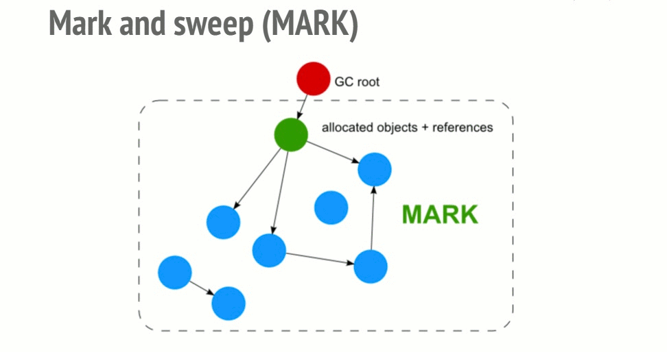

# JavaScript 基础知识

  - [JavaScript数据类型](#javascript%e6%95%b0%e6%8d%ae%e7%b1%bb%e5%9e%8b)
  - [判断输据类型的方法](#%e5%88%a4%e6%96%ad%e8%be%93%e6%8d%ae%e7%b1%bb%e5%9e%8b%e7%9a%84%e6%96%b9%e6%b3%95)
  - [执行上下文](#%e6%89%a7%e8%a1%8c%e4%b8%8a%e4%b8%8b%e6%96%87)
  - [执行栈（调用栈）](#%e6%89%a7%e8%a1%8c%e6%a0%88%e8%b0%83%e7%94%a8%e6%a0%88)
  - [创建上下文](#%e5%88%9b%e5%bb%ba%e4%b8%8a%e4%b8%8b%e6%96%87)
  - [作用域](#%e4%bd%9c%e7%94%a8%e5%9f%9f)
  - [词法作用域](#%e8%af%8d%e6%b3%95%e4%bd%9c%e7%94%a8%e5%9f%9f)
  - [闭包](#%e9%97%ad%e5%8c%85)
  - [this绑定](#this%e7%bb%91%e5%ae%9a)
  - [构造函数、原型和原型链](#%e6%9e%84%e9%80%a0%e5%87%bd%e6%95%b0%e5%8e%9f%e5%9e%8b%e5%92%8c%e5%8e%9f%e5%9e%8b%e9%93%be)
  - [继承](#%e7%bb%a7%e6%89%bf)
  - [ES6 Class](#es6-class)
  - [ES6 Iterator](#es6-iterator)
  - [ES6 Generator](#es6-generator)
  - [ES6 Promise](#es6-promise)
  - [ES6 Proxy](#es6-proxy)
  - [ES6 Reflect](#es6-reflect)
  - [ES7 Decorator](#es7-decorator)

## JavaScript数据类型

基本（原始）数据类型，也有叫值类型的说法：

- String

- Number

- Boolean

- Undefined

- null

- Symbol (ES6新增)

引用输据类型：

- Object

Object还分为 Array Function Null 这三种

值类型和引用类型的区别是：

1. 值类型保存在栈中，引用类型保存在队中

2. 值类型的复制是数据和值的复制，引用类型的复制是指针的复制

## 判断输据类型的方法

- typeof 

对于Array Object Null都返回 `object`

- instanceof

无法判断 String Number Boolean 类型输据

- constructor

容易被修改

- Object.prototype.toString.call()

目前最常用这种：

```js
function getType (obj) {
	return Object.prototype.toString.call(obj).replace(/\[object\s|\]/g,'');
}
```

## 执行上下文

执行上下文是评估和执行JavaScript代码的环境的抽象概念。

每当JavaScript代码运行的时候，都是在执行上下文中运行的。

JavaScript中，执行上下文分为三类：

- 全局执行上下文 任何不在函数内部的代码都会全局上下文中执行。它会执行两件事：创建一个全局的window对象（浏览器环境下），并设置this的值为这个全局对象，一个程序中只有一个全局执行上下文。

- 函数执行上下文 每当一个函数调用的时候都会为该函数创建一个新的上下文。

- Eval函数执行上下文 执行在eval函数内部的代码也会有属于它自己的上下文，由于eval函数很少用而且不推荐使用它，所以不做讨论。

## 执行栈（调用栈）

执行栈也叫调用栈，具有 LIFO（后进先出）结构，用于存储在代码执行期间创建的所有执行上下文。

当JavaScript第一次运行脚本时，它会创建一个全局的上下文并且压入当前执行栈，没当引擎遇到一个函数调用，它会为该函数创建一个新的执行上下文并压入执行栈顶部

引擎会执行那些处于栈顶的函数，当该函数结束之后，执行上下文会从栈顶弹出，控制流程到达当前栈中的下一个上下文

```js
let a = 'Hello World!';

function first() {
  console.log('Inside first function');
  second();
  console.log('Again inside first function');
}

function second() {
  console.log('Inside second function');
}

first();
console.log('Inside Global Execution Context');
```

1. 当上述代码在浏览器加载时，JavaScript 引擎创建了一个全局执行上下文并把它压入当前执行栈。当遇到 first() 函数调用时，JavaScript 引擎为该函数创建一个新的执行上下文并把它压入当前执行栈的顶部。

2. 当从 first() 函数内部调用 second() 函数时，JavaScript 引擎为 second() 函数创建了一个新的执行上下文并把它压入当前执行栈的顶部。当 second() 函数执行完毕，它的执行上下文会从当前栈弹出，并且控制流程到达下一个执行上下文，即 first() 函数的执行上下文。

3. 当 first() 执行完毕，它的执行上下文从栈弹出，控制流程到达全局执行上下文。一旦所有代码执行完毕，JavaScript 引擎从当前栈中移除全局执行上下文。

如下图所示：


## 创建上下文

创建上下文有两个阶段：

1. 创建阶段

2. 执行阶段

创建阶段会发生以下三件事：

- this的绑定

- 创建词法环境组件

- 创建变量环境组件

this绑定：

- 在全局执行上下文中，this指向全局对象

- 在函数执行上下文中，this的值取决于如何调用该函数。如果它被一个对象调用，则this指向该对象，否则this指向全局对象或者undefined（严格模式下）

词法环境组件：

词法环境是一种持有标识 -- 变量映射的结构，在词法内部有两个组件：环境记录器和一个外部环境的引用

- 环境记录器是存储变量和函数声明的实际位置。

- 外部环境的引用意味着它可以访问其父级词法环境（作用域）。

变量环境组件：

变量环境也是一个词法环境，所以它有着上面定义的词法环境的所有属性。

在 ES6 中，词法环境组件和变量环境的一个不同就是前者被用来存储函数声明和变量（let 和 const）绑定，而后者只用来存储 var 变量绑定。

## 作用域

作用域就是一套规则，用于确定在何处以及如何查找变量（标识符）的规则，简单的来说，作用域就是变量和函数的可访问范围

ES6之前没有块级作用域，只有全局作用域和局部作用域的概念

## 词法作用域

词法作用域是作用域的一种模式，作用域有两种工作模型，另一种叫动态作用域。

词法作用域就是在你写代码时将变量和块作用域写在哪里来决定，也就是词法作用域是静态的作用域，在你书写代码时就确定了。

## 闭包

闭包是指有权访问另外一个函数作用域中的变量的函数，关键在于下面两点：

- 是一个函数

- 能访问另外一个函数作用域中的变量

```js
function getOuter(){
  var date = '815';
  function getDate(str){
    console.log(str + date);  //访问外部的date
  }
  return getDate('今天是：'); //"今天是：815"
}
getOuter();
```

## this绑定

this的绑定可以分为以下几类：

- 默认绑定

- 隐式绑定

- 显式绑定

- new绑定

- 箭头函数绑定

这几种类型的优先级：

new绑定 > 显示绑定 > 隐式绑定 > 默认绑定

默认绑定：

独立函数调用（作为普通的函数调用），在非严格的模式下，this 指向全局对象。在严格模式下，this 是 undefined。
~~~js
function foo () {
  console.log(this.a)
}
var a = 2
foo()
~~~

隐式绑定：

通常就是我们所说的把函数当做对象的属性调用，因此隐式绑定规则会把 this 绑定到这个上下文对象。还需要注意的一点是：对象属性引用链中只有最顶层或者说最后一层会影响调用位置。
~~~js
function foo() {
  console.log( this.a );
}
var obj2 = {
  a: 42,
  foo: foo
};
var obj1 = {
  a: 2,
  obj2: obj2
};
obj1.obj2.foo(); // 42
~~~
最后一层是 obj2，所有输出 obj2 的 a 属性值。

this隐式丢失:

~~~js
function foo () {
  console.log(this.a)
}
var obj = {
  a: 2,
  foo: foo
}
var bar = obj.foo // 函数别名
var a = 'oops. global'
bar() // oops, global
~~~
虽然 bar 和 obj.foo 是同一个引用，但是实际上，它引用的是 foo 函数本身，因此 bar() 其实是一个不带任何修饰的函数调用，因此应用了默认绑定

一种更微妙、更常见的并且更加出乎意料的情况发生在传入回调函数时：
~~~js
function foo () {
  console.log(this.a)
}
function doFoo(fn) {
  // fn 其实引用的时 foo
  fn() // 调用位置
}
var obj = {
  a: 2,
  foo: foo
}
var a = 'oops, global'
doFoo(obj.foo) // oops global
~~~
参数传递的方式其实是一种隐式的赋值，因此，fn 其实还是对 foo 函数的引用，结果和上个例子一样。

如果把函数传入 JavaScript 内置函数会怎么样？

~~~js
function foo () {
  console.log(this.a)
}
var obj = {
  a: 2,
  foo: foo
}
var a = 'oops, global'
setTimeout(obj.foo, 100) // oops global
~~~
结果是一样的。因为传参数的方式是隐式的赋值，实际上就是执行了 var fn = obj.foo，然后执行了 fn()，显然又和上边的例子是一样的。

显示绑定：

通过call()，apply()或者一些api提供的上下文来直接指定this的值成为显示绑定：

```js
// 1. 硬绑定
function foo() {
    console.log( this.a );
}

var obj = {
    a: 2
};

foo.call( obj ); // 2  调用foo时强制把foo的this绑定到obj上

// 2. api调用上下文

function foo(el) {
	console.log( el, this.id );
}

var obj = {
    id: "awesome"
}

var myArray = [1, 2, 3]
// 调用foo(..)时把this绑定到obj
myArray.forEach( foo, obj );
// 1 awesome 2 awesome 3 awesome
```

箭头函数的this：

箭头函数中的this规则和上边的几种不同，箭头函数中的this是根据外层的作用域（词法作用域）来决定的。

对于箭头函数的this总结如下：

1. 箭头函数不绑定this，箭头函数中的this相当于普通变量

2. 箭头函数的this寻值行为与普通变量相同，在作用域中逐级寻找

3. 箭头函数的this无法通过bind，call，apply来直接修改（可以间接修改）

4. 改变作用域中this的指向可以改变箭头函数的this，比如 `function closure(){()=>{//code }}`，在此例中，我们通过改变封包环境closure.bind(another)()，可以改变箭头函数this的指向

```js
/**
 * 非严格模式
 */

var name = 'window'

var person1 = {
  name: 'person1',
  show1: function () {
    console.log(this.name)
  },
  show2: () => console.log(this.name),
  show3: function () {
    return function () {
      console.log(this.name)
    }
  },
  show4: function () {
    return () => console.log(this.name)
  }
}
var person2 = { name: 'person2' }


person1.show1() // person1，隐式绑定，this指向调用者 person1 
person1.show1.call(person2) // person2，显式绑定，this指向 person2

person1.show2() // window，箭头函数绑定，this指向外层作用域，即全局作用域
person1.show2.call(person2) // window，箭头函数绑定，this指向外层作用域，即全局作用域

person1.show3()() // window，默认绑定，这是一个高阶函数，调用者是window
				  // 类似于`var func = person1.show3()` 执行`func()`
person1.show3().call(person2) // person2，显式绑定，this指向 person2
person1.show3.call(person2)() // window，默认绑定，调用者是window

person1.show4()() // person1，箭头函数绑定，this指向外层作用域，即person1函数作用域
person1.show4().call(person2) // person1，箭头函数绑定，
							  // this指向外层作用域，即person1函数作用域
person1.show4.call(person2)() // person2

```
## 构造函数、原型和原型链

查看本目录下：重新认识构造函数、原型和原型链

## 继承

查看本目录下：Javascript常用八种继承方案

## ES6 Class

查看本目录下：Javascript常用八种继承方案/class相关

## ES6 Iterator

什么是迭代器？

ECMAScript 2015(ES6) 中 JavaScript 引入了迭代器接口（iterator）用来遍历数据，在 JavaScript 中，迭代器是一个对象，它知道如何每次访问集合中的每一项，并跟踪该序列中的当前位置。具体点说就是这个对象（迭代器）提供了一个 next 方法，用来返回序列中的下一项，返回的下一项对象中包含两个属性: value（当前值） 和 done（是否是最后一项，布尔值）

依据这个特性，我们可以创建一个函数来产生迭代器

~~~js
function makeIterator (array) {
  let index = 0
  return {
    next: function () {
      while (index < array.length) {
        return {
          value: array[index++],
          done: false
        }
      }
      return {done: true}
    }
  }
}
~~~

一旦初始化，next()方法可以一次访问对象中的键值。

```js
const it = makeIterator(['j', 'u', 's', 't']);
it.next().value;  // j
it.next().value;  // u
it.next().value;  // s
it.next().value;  // t
it.next().value;  // undefined
it.next().done;   // true
it.next().value;  // undefined
```

ES6给这个产生迭代器的函数规定了一个标准的命名：`Symbol.iterator`，Symbol.iterator是一个公开的符号

我们可以调用数组和字符串的[Symbol.iterator]方法可以生成迭代器，然后使用next来访问对象中的值

~~~js
var arr = [1,2,3];
var it = arr[Symbol.iterator]();
it.next(); // { value: 1, done: false }
it.next(); // { value: 2, done: false }
it.next(); // { value: 3, done: false }
it.next(); // { value: undefined, done: true }

var greeting = "hello world";
var it = greeting[Symbol.iterator]();
it.next(); // { value: "h", done: false }
it.next(); // { value: "e", done: false }
..
~~~

类似上边这种包含Symbol.iterator的属性并且值为迭代器的对象成为可迭代（iterable）对象，

我们可以自定义一个可以迭代的对象：

~~~js
var something = (function () {
  var nextVal

  return {
    //
    [Symbol.iterator]: function () { return this },
    //
    next: function () {
      if (nextVal === undefined) {
        nextVal = 1
      } else {
        nextVal = (3 * nextVal) + 6
      }

      return { done: false, value: nextVal }
    }
  }
})()

const it = something[Symbol.iterator]()
it.next()
// {done: false, value: 1}
it.next()
// {done: false, value: 9}
it.next()
// {done: false, value: 33}
it.next()
// {done: false, value: 105}
it.next()
// {done: false, value: 321}
~~~

除了手动调用next()方法来访问对象的值（或者称为消耗），ES6提供的for ... of可以直接消耗一个标准的可迭代对象

```js
for (var v of something) {
  console.log( v );
  // 不要死循环！
  if (v > 500) {
  break;
  }
}

// 1
// 9
// 33
// 105
// 321
// 969
```

异步迭代器：

ES9(ES2018)新增了异步迭代器，符号是Symbol.asyncIterator。所谓的异步迭代器就是它的 next 函数返回 {value, done} 的 Promise。

```js
const something = {
  [Symbol.asyncIterator]: () => {
    const arr = [1, 2, 3, 4, 5]
    return {
      next: () => Promise.resolve({
        done: arr.length === 0, 
        value: arr.unshift()
      })
    }
  }
}

(async function (){
  for await (const item of something) {
    console.log(item)
  }
})()
```

实际的应用比如： Node ReadableStreams 的例子：
~~~js
const http = require('http');
http.createServer((req, res) => {
  let body = '';
  req.setEncoding('utf8');
  req.on('data', (chunk) => {
    body += chunk;
  });
  req.on('end', () => {
    res.write(body);
    res.end();
  });
}).listen(1337);
~~~
之后用 for ... of 结合 await 简化成另一种写法：
~~~js
const http = require('http');
http.createServer(async (req, res) => {
  try {
    let body = '';
    req.setEncoding('utf8');
    for await (const chunk of req) {
      body += chunk;
    }
    res.write(body);
    res.end();
  } catch {
    res.statusCode = 500;
    res.end();
  }
}).listen(1337);
~~~

## ES6 Generator

查看本目录下：关于generator生成器

## ES6 Promise

Promise是一种异步的解决方案，比传统的解决方案--回调函数和事件更加合理，对开发人员更加友好。它最早由社区提出，我们现在说的Promise通常是指ES6提供的Promise对象。

特点：

- 对象的状态不受外界影响。Promise有三种状态：
  - pending
  - fullfiled
  - rejected

只有异步的结果可以决定Promise当前的状态

- Promise代表了一个异步操作的最终完成或者失败，它的状态一旦改变就不会再次被改变。

Promis除了是一个对象还是一个实例，我们使用的时候通常会通过new运算符来创建一个Promise的实例来使用它。

```js
function request () {
  return new Promise((resolve, reject) => {
    if (/* 异步操作成功 */) {
      resolve(value)
    } else {
      reject(error)
    }
  }
}

const p = request()
```

关于Promise实例常用的方法有以下几个：

- Promise.prototype.then

- Promise.prototype.cache

- Promise.prototype.all

- Promise.prototype.race

关于具体的用法可以查看相关的文档

## ES6 Proxy

先来看看ES5中defineProperty：

Object.defineProperty(obj, prop, descriptor)

```
obj: 要在其上定义属性的对象。

prop:  要定义或修改的属性的名称。

descriptor: 将被定义或修改的属性的描述符。
```

```js
var obj = {};
Object.defineProperty(obj, "num", {
    value : 1,
    writable : true, //是否可写
    enumerable : true, // 是否可枚举，比如for ... in
    configurable : true // 控制属性值是否可以被配置
});
//  对象 obj 拥有属性 num，值为 1
```

使用get和set存取描述符：

```js
var value = 1;
Object.defineProperty({}, "num", {
    get : function(){
      return value;
    },
    set : function(newValue){
      value = newValue;
    },
    enumerable : true,
    configurable : true
});

```

使用 defineProperty 只能重定义属性的读取（get）和设置（set）行为，到了 ES6，提供了 Proxy，可以重定义更多的行为，比如 in、delete、函数调用等更多行为。

基本语法为：

```js
var proxy = new Proxy(target, handler);
```

handler支持定义的拦截属性：

- get(target, propKey, receiver)：拦截对象属性的读取，比如proxy.foo和proxy['foo']。

- set(target, propKey, value, receiver)：拦截对象属性的设置，比如proxy.foo = v或proxy['foo'] = v，返回一个布尔值。

- has(target, propKey)：拦截propKey in proxy的操作，返回一个布尔值。需要注意只能拦截in，不能拦截 for ... in。

- deleteProperty(target, propKey)：拦截delete proxy[propKey]的操作，返回一个布尔值。

- ownKeys(target)：拦截Object.getOwnPropertyNames(proxy)、Object.getOwnPropertySymbols(proxy)、Object.keys(proxy)、for...in循环，返回一个数组。该方法返回目标对象所有自身的属性的属性名，而Object.keys()的返回结果仅包括目标对象自身的可遍历属性。

- getOwnPropertyDescriptor(target, propKey)：拦截Object.getOwnPropertyDescriptor(proxy, propKey)，返回属性的描述对象。

- defineProperty(target, propKey, propDesc)：拦截Object.defineProperty(proxy, propKey, propDesc）、Object.defineProperties(proxy, propDescs)，返回一个布尔值。

- preventExtensions(target)：拦截Object.preventExtensions(proxy)，返回一个布尔值。

- getPrototypeOf(target)：拦截Object.getPrototypeOf(proxy)，返回一个对象。

- isExtensible(target)：拦截Object.isExtensible(proxy)，返回一个布尔值。

- setPrototypeOf(target, proto)：拦截Object.setPrototypeOf(proxy, proto)，返回一个布尔值。如果目标对象是函数，那么还有两种额外操作可以拦截。

- apply(target, object, args)：拦截 Proxy 实例作为函数调用的操作，比如proxy(...args)、proxy.call(object, ...args)、proxy.apply(...)。

- construct(target, args)：拦截 Proxy 实例作为构造函数调用的操作，比如new proxy(...args)。

## ES6 Reflect

ES6新增Reflect对象有以下几个目的：

- 将Object对象的一些明显属于语言内部的方法（比如Object.defineProperty），放到Reflect对象上。现阶段，某些方法同时在Object和Reflect对象上部署，未来的新方法将只部署在Reflect对象上。

- 修改某些Object方法的返回结果，让其变得更合理。比如，Object.defineProperty(obj, name, desc)在无法定义属性时，会抛出一个错误，而Reflect.defineProperty(obj, name, desc)则会返回false。

- 让Object操作都变成函数行为。某些Object操作是命令式，比如name in obj和delete obj[name]，而Reflect.has(obj, name)和Reflect.deleteProperty(obj, name)让它们变成了函数行为。

Reflect对象一共有 13 个静态方法，具体用法需要自己去查文档：

- Reflect.apply(target, thisArg, args)

- Reflect.construct(target, args)

- Reflect.get(target, name, receiver)

- Reflect.set(target, name, value, receiver)

- Reflect.defineProperty(target, name, desc)

- Reflect.deleteProperty(target, name)

- Reflect.has(target, name)

- Reflect.ownKeys(target)

- Reflect.isExtensible(target)

- Reflect.preventExtensions(target)

- Reflect.getOwnPropertyDescriptor(target, name)

- Reflect.getPrototypeOf(target)

- Reflect.setPrototypeOf(target, prototype)

## ES7 Decorator

什么是装饰器？

装饰器是一种与类（class）相关的语法，用于注释或者修改类与类的方法。

装饰器的语法：写成@ + 函数名。它可以放在类和类方法的定义前面。

```js
@frozen
class Foo {
  @configurable(false)
  @enumerable(true)
  method() {}

  @throttle(500)
  expensiveMethod() {}
}
```

你可以认为装饰器是一种对类或者类方法进行处理的函数，它有三个参数

* target

* prop

* descriptor

类的装饰器：

```js
@decorator
class A {}

function decorator (target, prop, descriptor) {
  console.log(target, prop, descriptor)
  // class A {} undefined undefined
  console.log(target === A) // true
}
```
类的装饰器函数只有第一个参数有值，为类本身，所以基于类的修改都是类的本身

需要注意的是，就是target的constructor是不能修改的，如果需要对类的constructor函数进行修改，需要返回一个新的类：

```js
function decorator(target, key, descriptor) {
  return class extends target {
    constructor(...params) {
      super(...params)
      this.foo() // 你自定义的调用放在这里
    }

    foo () {
      console.log('foo')
    }
  }
}
```

推荐使用返回一个新的对象的方式来写类的装饰器。

类属性的装饰器：

```js
class A {
  @decorator
  method () {}
}

function decorator (target, prop, descriptor) {
  console.log(target, prop, descriptor)
}

let a = new A()
A.method1()
// ƒ A() {
//     _classCallCheck(this, A);
//   } 
// "method1" 
// {value: ƒ, writable: true, enumerable: false, configurable: true}
a.method2()
// {constructor: ƒ, method2: ƒ}constructor: ƒ A()method2: ƒ method2()__proto__: Object 
// "method2" 
// {value: ƒ, writable: true, enumerable: false, configurable: true}
```

类属性的装饰器函数接收三个参数：
- 当类的属性为静态成员的时候返回类的构造函数，为实例成员返回实例原型
- 属性名称
- 属性描述符

需要注意一下下边这种写法（class properties）：

```js
class A {
  @decorator
  method = () => {}
}
```

需要用到并配置`@babel/plugin-proposal-class-properties`插件，另外由于目前的目前decorator的兼容性，开发中常会使用`@babel/plugin-proposal-decorators`插件。配置这两个插件需要注意，`@babel/plugin-proposal-decorators`需放置在`@babel/plugin-proposal-class-properties`前边，否则babel将报错，如下配置：

```json
{
  "plugins": [["@babel/plugin-proposal-decorators", {
    "legacy": true
  }], "@babel/plugin-proposal-class-properties"]
}
```

网上有文章说有的属性装饰器没有返回descriptor，那么可以通过`Object.getOwnPropertyDescriptor(target, name)`来手动获取

对于需要额外接收参数的装饰器，可以在原本的装饰器函数外包一层函数，用于接收参数，比如dedounce装饰器：

```js
function _debounce(func, wait, immediate) {

  var timeout;

  return function () {
    var context = this;
    var args = arguments;

    if (timeout) clearTimeout(timeout);
    if (immediate) {
      var callNow = !timeout;
      timeout = setTimeout(function(){
        timeout = null;
      }, wait)
      if (callNow) func.apply(context, args)
    }
    else {
      timeout = setTimeout(function(){
          func.apply(context, args)
      }, wait);
    }
  }
}

function debounce(wait, immediate) {
  return function handleDescriptor(target, key, descriptor) {
    const callback = descriptor.value;

    if (typeof callback !== 'function') {
      throw new SyntaxError('Only functions can be debounced');
    }

    var fn = _debounce(callback, wait, immediate)

    return {
      ...descriptor,
      value() {
        fn()
      }
    };
  }
}
```

装饰器的原理：

```js
class A {
  hello (){
    console.log('hello');
  }
}
```

利用babel可以查看到类似下边的代码（经过整理）：
```js
Object.defineProperty(A.prototype, 'hello', {
  value: function hello() {
    console.log('hello');
  },
  enumerable:false,
  configurable:true,
  writable:true
})
```

使用装饰器之后：

```js
class A {
  @decorator
  hello (){
    console.log('hello');
  }
}
```

相当于：

```js
let descriptor = {
  value:specifiedFunction,
  enumerable:false,
  configurable:true,
  writeable:true
};

descriptor = readonly(A.prototype,'hello',descriptor)||descriptor;
Object.defineProperty(A.prototype,'hello',descriptor);
```

## JavaScript模块化开发

为什么需要模块？

*   解决命名冲突
*   提供复用性
*   提高代码可维护性

IIFE：

JavaScript最早用来是先模块化的方式就是立即执行函数，通过函数作用域解决了命名冲突、污染全局作用域的问题

```js
(function(globalVariable){
   globalVariable.test = function() {}
   // ... 声明各种变量、函数都不会污染全局作用域
})(globalVariable)
```

AMD：

异步模块定义，规范加载模块是异步的，并允许函数回调，不必等到所有模块都加载完成，后续操作可以正常执行

```js
//规范 API
define(id?, dependencies?, factory);
define.amd = {};

// 定义无依赖的模块
define({
  add: function(x,y){
    return x + y;
  }
});


// 定义有依赖的模块
define(["alpha"], function(alpha){
  return {
    verb: function(){
      return alpha.verb() + 1;
    }
  }
});
```
具体的用法可以参考require.js

CMD：

CMD规范和AMD类似，都主要运行于浏览器端，写法上看起来也很类似。主要是区别在于 模块初始化时机

- AMD中只要模块作为依赖时，就会加载并初始化
- CMD中，模块作为依赖且被引用时才会初始化，否则只会加载

```js
//AMD
define(['./a','./b'], function (a, b) {
  //依赖一开始就写好
  a.test();
  b.test();
});
 
//CMD
define(function (requie, exports, module) {
  //依赖可以就近书写
  var a = require('./a');
  a.test();
   
  ...
  //软依赖
  if (status) {
    var b = requie('./b');
    b.test();
  }
});
```
用法参考sea.js

Commonjs：

CommonJS是服务器模块的规范，Node.js采用了这个规范。

根据 CommonJS 规范，一个单独的文件就是一个模块，每一个模块都是一个单独的作用域，在一个文件定义的变量（还包括函数和类），都是私有的，对其他文件是不可见的。

CommonJS规范加载模块是同步的，也就是说，只有加载完成，才能执行后面的操作。

```js
var x = 5;
var addX = function(value) {
  return value + x;
};

module.exports.x = x;
module.exports.addX = addX;


// 也可以改写为如下
module.exports = {
  x: x,
  addX: addX,
};
```

```js
let math = require('./math.js');
console.log('math.x',math.x);
console.log('math.addX', math.addX(4));
```
UMD：

UMD = Universal Module Definition，即通用模块定义。UMD 是AMD 和 CommonJS的糅合

UMD 先判断是否支持 Node.js 的模块（exports）是否存在，存在则使用 Node.js 模块模式。再判断是否支持 AMD（define 是否存在），存在则使用 AMD 方式加载模块

```js
(function (window, factory) {
  if (typeof exports === 'object') {
    module.exports = factory();
  } else if (typeof define === 'function' && define.amd) {
    define(factory);
  } else {
    window.eventUtil = factory();
  }
})(this, function () {
  //module ...
});
```

目前很多库都是以这种模块化规范进行打包的，比如 Vue。

ES6模块化：

ES6模块和CommonJS区别：
- ES6 模块输出的是值的引用，输出接口动态绑定，而 CommonJS 输出的是值的拷贝。

- CommonJS 模块是运行时加载，ES6 模块是编译时输出接口。

剩下内容参考：本目录下 (29) JS模块化——CommonJS AMD CMD UMD ES6 Module 比较 - 掘金

## JavaScript垃圾机制

JavaScript没有类似C这种底层语言自带的内存管理接口。JavaScript在创建变量的时候会自动分配内容，并且在不使用它们的时候会自动释放。释放的过程就称为垃圾回收。

JavaScript这类高级通常会嵌入垃圾回收器，它的工作主要是内存跟踪和分配，垃圾回收工作就是由它完成。

那么，垃圾回收器是如何知道哪块内存不需要使用了呢？

这就需要了解垃圾回收的算法了，以下是常见的垃圾回收算法：

- 引用计数垃圾收集
- 标记-清除算法

不管是使用哪个算法，都需要依赖内存引用。

在内存管理的环境中，一个对象如果有访问另一个对象的权限（隐式或者显式），叫做一个对象引用另一个对象。

**引用计数垃圾收集**是最简单的垃圾收集算法，此算法把“对象是否不再需要”简化定义为“对象有没有其他对象引用到它”。如果没有引用指向该对象（零引用），对象将被垃圾回收机制回收。

但是，该算法有一个很大的限制，针对循环引用的对象，始终相互保持着最少一个引用，无法被引用计数垃圾收集算法判断为不需要的垃圾，无法被回收。

**标记-清除算法**把“对象是否不再需要”简化定义为“对象是否可以获得”或者说“对象是否可以访问”。

1. 假定有一个叫作根的对象（在浏览器环境中就是window，Node.js 中的全局对象被称为global）

2. 然后算法检查所有根节点和他们的子节点并且把他们标记为活跃的（意思是他们不是垃圾）。任何根节点不能访问的变量将被标记为垃圾。

3. 最后，垃圾收集器释放所有未被标记为活跃的内存块，并将这些内存返回给操作系统。



当然，垃圾回收器这种判定垃圾的方式只是一种近似程序员手动判断和释放的过程，因为是否仍然需要某块内存是无法通过算法判定，只能认为不引用就不需要了。

内存泄漏：

是程序不在需要且没有被释放的内存片段，它导致程序卡顿或者崩溃。

常见内存泄漏产生的方式：

- 全局变量

```js
function foo(arg) {
  bar = "some text";
  // window.bar = "some text";
}
```

- 被忘记的定时器或者回调函数

```js
var serverData = loadData();
setInterval(function() {
  var renderer = document.getElementById('renderer');
  if(renderer) {
      renderer.innerHTML = JSON.stringify(serverData);
  }
}, 5000); //每5秒执行一次.
```

- 闭包

- 递归

## 前端性能优化

https://alienzhou.github.io/fe-performance-journey/
