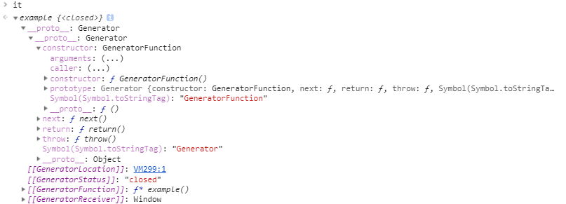
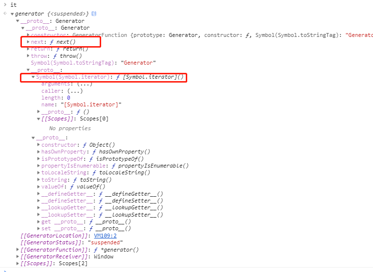
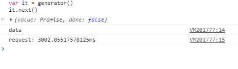

# 关于generator生成器

我们都知道一个普通给的函数，一旦开始运行就会一直运行知道结束。

ES6 新增了一种函数，在运行的过程中可以暂停和恢复运行，和普通函数的运行方式不一样。这类函数我们称之为生成器函数。

# 如何定义一个生成器函数？

```js
function *example () {
  ...
}
```
在函数名成之前添加一个`*`即可以顶一个生成器函数。另外还有以下几种种写法：

```js
function*example () {
  ...
}
function * example () {
  ...
}
function* example () {
  ...
}
```

### 如何使用生成器

生成器函数的使用方式是生成一个迭代器，然后调用迭代器的`next`方法来获取值。

```js
// 普通函数
function normal () {}
var normalResult = normal() // undefined

function *generator () {}
var it = generator() // 产生一个迭代器

it.next() // { value: undefined, done: true }
```

以下是`it`在控制台的输出：



我们来验证以下`it`是不是迭代器。我们都知道迭代器都需要一个`[Symbol.iterator]`这个方法来产生可迭代对象，并且有`next`方法来返回`{value: undefined, done: true}`这种对象值。

首先创建一个生成器函数并产生一系列的值：
```js
function *generator () {
  yield 1
  yield 2
  yield 3
  yield 4
}

var it = generator()
it[Symbol.iterator] // ƒ [Symbol.iterator]() { [native code] }
```

然后使用`for...of`循环来消耗这个迭代器：

```js
for (let i of it) {
  console.log(i)
}
// 1
// 2
// 3
// 4
```

我们接下来尝试以下`next()`调用，需要注意的是这个时候你得重新建立一个`迭代器`因为之前的`it`已经被`for ... of`消耗完了，调用`it.next()`只会返回`{value: undefined, done: true}`：

```js
var it = generator()
it.next() // {value: 1, done: false}
it.next() // {value: 2, done: false}
it.next() // {value: 3, done: false}
it.next() // {value: 4, done: false}
it.next() // {value: undefined, done: true} 全被的值都被消耗
```

通过以上的这些我们发现，`it`也即是生成器返回的是一个迭代器。并且这个迭代器的`[Symbol.iterator]`返回的可迭代对象是它本身。

```js
it[Symbol.iterator]() === it
```

下边是我们通过原型链的方式查找到的`next`方法和`Symbol.iterator`方法：



# yield

```js
function *generator () {
  var x = 0
  x++
  console.log(x)
  yield '暂停'
  x++
  console.log(x)
  x = (yield `第二次站厅`) || 10
  console.log(x)
  console.log('运行完毕')
}

var it = generator()
it.next()
// 1
// {value: '暂停', done: false}
it.next()
// 2
// {value: '第二次暂停', done: false}
it.next()
// 10
// {value: undefined, done: true}
// 运行完毕
```

我们来看下上边的代码发生了什么？

1. 当我们第一次运行`it.next()`的时候，控制台输出了`x`累加之后的数值1，并输出`{value: '暂停', done: false}`，也就是说第一个`next()`让代码运行到了`yield`，并且将`yield`后面的值，作为`next`结果对象的`value`值返回。

2. 当我们第二次运行`it.next()`的时候，控制台输出`x`再次累加之后的数值2，并将`yield`后面的值，作为`next`结果对象的`value`值返回。

3. 当我们第三次运行`it.next()`的时候，控制台直接输出`x`值为10，并输出`{value: undefined, done: true}`和`运行完毕`表示函数已经运行完成。

我们看下第三次输出的`x`值为10的现象。`x = (yield '第二次暂停') || 10`，从得到的结果来来看，必定是 `(yield '第二次暂停')` 这部分满不足条件，所以x被赋值为10。这是为什么？

让我们按照下面的一种方式重新运行一次

```js
var it = generator()

it.next()
// 1
// {value: '暂停', done: false}
it.next()
// 2
// {value: '第二次暂停', done: false}
it.next(233)
// 233
// {value: undefined, done: true}
// 运行完毕
```

我们在第三次的时候将233作为参数传入`next`，然后输出的`x`值变成了233。也就是说传入的233变成了`x`的值。

那么如何来解释这两次运行的结果。

以下的这些是我从mdn上边摘录下来的关于`yield`关键字内容：

1. yield 关键字用来暂停和恢复一个生成器函数，yield关键字后面的表达式的值返回给生成器的调用者。它可以被认为是一个基于生成器的版本的return关键字。
2. yield关键字实际返回一个IteratorResult对象，它有两个属性，value和done。value属性是对yield表达式求值的结果，而done是false，表示生成器函数尚未完全完成。
3. 一旦遇到 yield 表达式，生成器的代码将被暂停运行，直到生成器的 next() 方法被调用。
   
     - yield，导致生成器再次暂停并返回生成器的新值。 下一次调用next()时，在yield之后紧接着的语句继续执行。
     - throw用于从生成器中抛出异常。这让生成器完全停止执行，并在调用者中继续执行，正如通常情况下抛出异常一样。
     - 到达生成器函数的结尾；在这种情况下，生成器的执行结束，并且IteratorResult给调用者返回undefined并且done为true。
     - 到达return 语句。在这种情况下，生成器的执行结束，并将IteratorResult返回给调用者，其值是由return语句指定的，并且done 为true。
  
4. 如果将参数传递给生成器的next()方法，则该值将成为生成器当前yield操作返回的值。

针对上边的说明，我们可以得到下边的解释：

对应到我们上边的案例，也就是`yield`返回`IteratorResult对象`给了调用者`it`，然后通过`it.next()`返回这些值。给next()方法传递了参数，则该值将成为生成器当前yield操作返回的值。也就是我们看到为什么传递了233，之后 `x` 被赋值为 233，也就是如果我们不传参数，`x = (yield '第二次暂停') || 10` yield的返回值会为`undefined`，所以`x`被赋值 10。

另外我们从上边的案例也不难发下`it.next()`与`yield`的对应关系。一个`next()`对应一个`yield`的返回结果。如果调用`next()`之后没有对应一个`yield`来返回对结果，且没有return 来返回值的情况下，则会默认返回`{value: undefined, done: true}`。

# 生成器与异步

说到异步大家可能会想到的几点：

* 回调
* Promise
* async/await

1. 回调是最早用来处理异步的一种方式。为了正确的拿到异步的结果，将之后的逻辑写一个函数，然后等异步处理结束的时候触发回调。

2. Promise是ES6新增的一种异步的处理方式。支持`Promise.resolve().then().then()...catch()`这种链式调用，书写方式和异步有所区别，但是我们还是需要写一个函数来得到正确的结果和添加之后的逻辑。

3. async/await是ES7的一种异步处理方式。会在需要耗时的代码处等待结果返回，再执行之后的逻辑，让程序代码看起来像是同步的方式运行，总之开发者只需要从上往下的顺序书写代码，就可以得到正确的结果。

实际上在 Promise 到 async/await 这段期间，generator也给异步处理提供了很大的帮助，最有名的应该就是 generator和Promise结合写的co模块了，co模块实现的效果基本和async/await，async/await可以说是co模块的语法糖。非常可惜的是，很多人是不知道的co模块的，如果不去了解这一块，我想我也不会知道，一方面是因为这最近两年才开始的前端生涯，另一方面就是co模块原来是给nodejs使用的，前端的初学者并不会去关注这一块，加上后面很快出来的 async/await co就更少人关注了。

我们先来看看 generator 与 Promise 的结合使用：

```js
function request () {
  return new Promise((resolve, reject) => {
    setTimeout(() => {
      var data = 'data'
      it.next(data)
      resolve(data)
    }, 3000)
  })
}

function *generator () {
  console.time('request')
  var data = yield request()
  console.log(data) // data
  console.timeEnd('request')
}

var it = generator()
it.next()
```
下边是输出的结果：



3秒之后获取到了正确的一个结果

需要注意的是我上边案列的这个代码

```js
it.next(data)
resolve(data)
```
其实不能这样写，我这样写就是为了让你们清除generator和promise结合使用的一个思路：就是在获取数据之后将数据通过`next`方法，返回到生成器中，并重新启动生成器。

下边是正确的写法：

```js
function request () {
  return new Promise((resolve, reject) => {
    setTimeout(() => {
      var data = 'data'
      resolve(data)
    }, 3000)
  })
}

function *generator () {
  console.time('request')
  var data = yield request()
  console.log(data) // data
  console.timeEnd('request')
}

var it = generator()
var p = it.next().value // pending 状态的 promise
p.the(res => {
  it.next(res)
})
```
正确的做法是通过第一次调用`next`方法来启动生成器，并将代码暂停到yield位置，此时可以拿到yield返回的迭代结果对象，其value值是一个处于 `pending`状态的 `Promise`，然后再then()链中拿到返回的正确结果，再次通过`next`将值传递至生成器中，并且再次启动生成器，进行之后的逻辑。

大概就是以这样的做法保证了生成器函数内部的逻辑以一种同步的方式进行执行。

# co 与 generator

我们先来使用以下co模块

```js
function request (data) {
  return new Promise((resolve, reject) => {
    setTimeout(() => {
      resolve(data)
    }, 3000)
  })
}
co(function* (){
    let data = ''
    let begin = new Date()
    data = yield request('buySomething')
    console.log(data, new Date() - begin)

    data = yield request('clean')
    console.log(data, new Date() - begin)

    data = yield request('cook')
    console.log(data, new Date() - begin)

    data = yield request('eat')
    console.log(data, new Date() - begin)
})
```


co模块达到的效果基本和 `async/await`是一样的。

通过上一个案例我们知道使得generator和promise实现类似同步的效果关键在于，取得结果后继续启动生成器，也就是执行迭代器`it.next`方法。co函数就是这样一个可以使生成器函数能够自动启动的函数，也就是可以让迭代器`it`自动执行`next`方法。

咱们可以尝试的使用generator和promise来实现co的这么一个效果：

主要的思路上一个案例已经提供了，就是需要造一个promise链来调用`it.next`。

首先我们创建一个函数`myCo`，接收一个generator函数作为参数
```js
function myCo (generator) {
  
}
```
我们在上边也说了，yield后面返回值时一个 pending 状态的 promise，拿到这个promise并等决议之后调用`it.next`，就达到了上一个案例的效果。
```js
function myCo (generator) {
  let it = generator()
  let p = it.next().value
  p.then(res => {
    it.next(res)
  }).catch(err => {
    it.throw(err)
  })
}
```
我们继续使用之前的案例：
```js
function *generator () {
  console.time('request')
  var data = yield request('data')
  console.log(data) // data
  console.timeEnd('request')
}

myCo(generator)

// request: 3002.031982421875ms
```

虽然我们达到了上一个案例的效果，但是我们发现`myCo`只能针对一个`yield`逻辑。但是一个generator函数里边有可能有多个yield，所以，当我们在promise决议之后，得判断当前的迭代器是否已经消耗完毕，若没有消耗完毕，我们将继续获取下一个yield的值，也就是通过`it.next(res).value`获取，然后继续等待决议，重复上述的逻辑直到迭代器消耗完毕。

```js
function myCo (generator) {
  let it = generator()
  let next = it.next()

  function getResult (next) {
    let p = next.value
    if (next.done) {
      return next.value
    } else {
      p.then(res => {
        next = it.next(res)
        getResult(next)
      }).catch(err => {
        it.throw(err)
      })
    }
  }

  getResult(next)
}
```

测试一下：

```js
function request (data) {
  return new Promise((resolve, reject) => {
    setTimeout(() => {
      resolve(data)
    }, 3000)
  })
}

function *generator () {
  console.time('request')
  var data1 = yield request('data1')
  var data2 = yield request('data2')
  console.log(data1, data2) // data1 data2
  console.timeEnd('request') // request: 6001.008056640625ms
}

myCo(generator)
```

这样基本就完成了多个yield的时候，迭代器自动消耗，知道迭代器消耗完毕。
