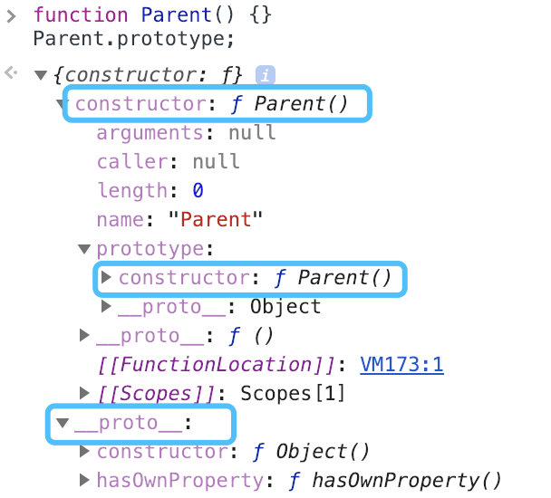
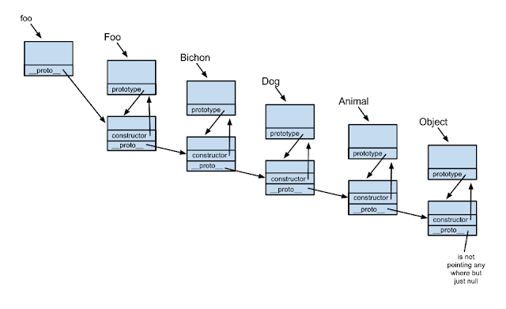
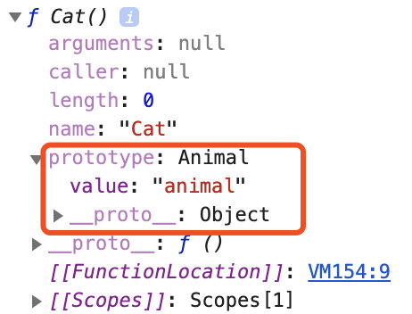
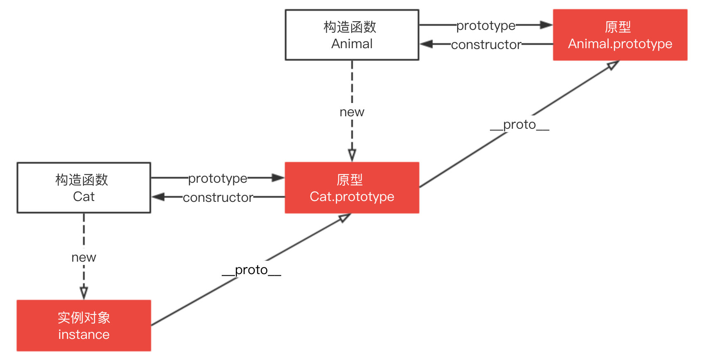

# 构造函数

## 什么是构造函数？

构造函数本身就是一个函数，与普通函数没有任何区别，不过为了规范会将其名称首字母大写。构造函数和普通函数的区别在于，用`new`运算符调用生成实列的函数就是构造函数，直接调用的函数就是普通函数。

使用构造函数创建的实例对象会从它的原型上继承一个`constructor`属性，`constructor`返回创建实例时的构造函数的引用。

```js
function Parent () {

}

let instance = new Parent()
instance.constructor === Parent // true
```

同样的，使用普通函数创建的对象也会有`constructor`属性，所有的对象都会从它的原型上继承一个`constructor`属性:

```js
function parent () {
  return {}
}
let instance = parent()
instance.constructor === Object // true
```

## Symbol是构造函数吗？

`Symbol()`会返回一个类型为基本类型`symbol`的值，你可以认为他和其他的内置对象类似，但是`Symbol`不支持 `new Symbol()` 语法，直接调用`Symbol()`就可以生成实例对象，
并且使用`Symbol()`生成的实例也是带有constructor属性，默认为`Symbol`函数。

```js
let symbol = Symbol(123)
symbol.constructor === Symbol // true
```

## constructor值只读吗？

这个得分情况，对于引用类型来说`constructor`属性值是可以修改的，但是对于基本类型来说是只读。

引用类型，比如原型链继承，就需要对`constructor`重新赋值进行修正

```js
function Parent () {}
function Child () {}

Child.prototype = new Parent()

Child.prototype.constructor = Parent
Parent.prototype.constructor === Child.prototype.constructor // true
```

对于基本类型来说，`constructor`是只读的。

```js
function Type () {}
var types = [1, 'abc', true, Symbol(123)]

for(var i = 0; i < types.length; i++) {
  types[i].constructor = Type
  types[i] = [types[i].constructor, types[i] instanceof Type, types[i].toString()]
}

console.log(types.join('\n'))
// function Number() { [native code] }, false, 1
// function String() { [native code] }, false, abc
// function Boolean() { [native code] }, false, true
// function Symbol() { [native code] }, false, Symbol(123)
```
因为创建他们的是原生构造函数（`native constructor`）

## 模拟实现 new 

我们来看一下 `new` 操作符到底干了什么？以下内容来自 mdn

The new operator lets developers create an instance of a user-defined object type or of one of the built-in object types that has a constructor function. The new keyword does the following things（`new`操作符允许开发者创建用户自定义对象类型或者带有构造函数的内置对象类型之一的实例，它干了以下几件事）:

1. Creates a blank, plain JavaScript object;（创建一个空白的普通对象）
2. Links (sets the constructor of) this object to another object;（将当前对象与目标对象关联（设置构造函数）起来// 执行原型链接）
3. Passes the newly created object from Step 1 as the this context;（将步骤1创建的新对象作为当前函数上下文）
4. Returns this if the function doesn't return its own object.（返回当前的函数如果函数没有返回对象）


```js
function Car (color) {
  this.color = color
}

Car.prototype.start = function () {
  console.log('start')
}

var car = new Car('red')

// 访问定义属性
car.color // 'red'
// 访问原型链上函数
car.start() // 'start'
// 访问未定义属性
car.name // undefined
```

#### 模拟一

```js
function create () {
  // 1. 创建一个空白对象
  var obj = new Object()
  var fn = Array.prototype.shift.call(arguments)
  // 2. 链接原型
  obj.__proto__ = fn.prototype
  // 3. 关联上下文
  var result = fn.apply(obj, arguments) // 在第一步已经使用shift抛出了第一个值，剩下的都是需要的参数
  // 4. 如果函数fn有返回对象就用函数原来的返回对象，如果没有返回步骤一创建的 obj
  return result instanceof Object ? result : obj
}
```
测试一：

```js
var car = create(Car, 'red')

// 访问定义属性
car.color // 'red'
// 访问原型链上函数
car.start() // 'start'
// 访问未定义属性
car.name // undefined
```

与案例的返回结果一样。

接下来我们看看如果 Car 返回对象的情况：

```js
function Car (color) {
  this.color = color

  return {
    name: 'red car'
  }
}

Car.prototype.start = function () {
  console.log('start')
}

var car = new Car('red')

// 访问定义属性
car.color // 'undefined'
// 访问原型链上函数
car.start() // 'Uncaught TypeError: car.start is not a function'
// 访问未定义属性
car.name // 'red car
```

测试二：

```js
var car = create(Car, 'red')

// 访问定义属性
car.color // 'undefined'
// 访问原型链上函数
car.start() // 'Uncaught TypeError: car.start is not a function'
// 访问未定义属性
car.name // 'red car
```

结果完全一致

# 原型（prototype）

每个对象都拥有一个**原型对象**(并非代码层面的指对象都有这个属性，就是抽象说明每个对象都是对应有一个原型对象)，对象以原型为模板，从原型继承方法和属性，这些属性和方法定在对象构造器函数的`prototype`属性上，而非实例本身。



从这张图可以发现，`parent`对象有一个原型对象`Parent.prototype`，其上有两个属性，分别是`constructor`和`__proto__`

构造函数`Parent`有一个指向原型的指针，原型`Parent.prototype`有一个指向构造函数的指针`Parent.prototype.constructor`，如上图所示，其实就是一个循环引用。


`__proto__`可以认为是一个访问器属性，通过它可以访问到对象内部的`[[Prototype]]`(一个对象或者`null`)

`[[Prototype]]` 是对象的一个内部属性，外部代码无法直接访问


`p.__proto__`可以获取对象的原型，`__proto__`是每一个实例上都有的属性，`prototype`是构造函数或者说函数才有的属性。`p.__proto__`和`Parent.prototype`指向的是同一个对象

```js
function Parent() {}
var p = new Parent();
p.__proto__ === Parent.prototype // true
```

所以构造函数 Parent、Parent.prototype 和 p 的关系如下图。


### 注意点

`__proto__` 属性在 ES6 时才被标准化，以确保 Web 浏览器的兼容性，但是不推荐使用，除了标准化的原因之外还有性能问题。为了更好的支持，推荐使用 `Object.getPrototypeOf()`

> 通过改变一个对象的 [[Prototype]] 属性来改变和继承属性会对性能造成非常严重的影响，并且性能消耗的时间也不是简单的花费在 obj.__proto__ = ... 语句上, 它还会影响到所有继承自该 [[Prototype]] 的对象，如果你关心性能，你就不应该修改一个对象的 [[Prototype]]。

如果要读取或修改对象的 [[Prototype]] 属性，建议使用如下方案，但是此时设置对象的 [[Prototype]] 依旧是一个缓慢的操作，如果性能是一个问题，就要避免这种操作。

```js
Object.getPrototypeOf()
Reflect.getPrototypeOf()

// 修改
Object.setPrototypeOf()
Reflect.setPrototypeOf()
```

如果要创建一个新对象，同时继承另一个对象的 [[Prototype]] ，推荐使用 Object.create()。

```js
function Parent() {
    age: 50
};
var p = new Parent();
var child = Object.create(p);
```

这里 child 是一个新的空对象，有一个指向对象 p 的指针 __proto__。

### 优化实现 new

```js
function create () {
  var fn = Array.prototype.shift.call(arguments)
  // 1. 创建一个空白对象并链接原型
  var obj = Object.create(fn.prototype)
  // 2. 关联上下文
  var result = fn.apply(obj, arguments) // 在第一步已经使用shift抛出了第一个值，剩下的都是需要的参数
  // 3. 如果函数fn有返回对象就用函数原来的返回对象，如果没有返回步骤一创建的 obj
  return result instanceof Object ? result : obj
}
```

# 原型链

每个对象都对应一个原型，对象的`__proto__`指向该对象的原型，并从中继承方法和属性，同时原型作为一个对象也可能有原型，这一样一层一层，最终会指向`null`。这种关系被称为`原型链（prototype chain）`，通过原型链一个对象可以访问到其他对象上的属性和方法。

```js
function Parent (age) {
  this.age = age
}

var p = new Parent(50)
p.constructor === Parent // true
```


p本身没有constructor属性，是通过原型链向上查找`__proto__`，最终找到`constructor`

```js
function Parent(age) {
    this.age = age;
}
var p = new Parent(50);

p;	// Parent {age: 50}
p.__proto__ === Parent.prototype; // true
p.__proto__.__proto__ === Object.prototype; // true
p.__proto__.__proto__.__proto__ === null; // true
```
下图展示了原型链的运作机制


# 原型链的构建是依赖于 prototype 还是 __proto__ ？

咱们直接看下下面的一张图：



`Foo.prototype === foo.__proto__`
`Bichon.prototype === foo.__proto__.__proto__`
`Dog.prototype === foo.__proto__.__proto__.__proto__`
...

`foo.__proto__.__proto__.__proto__` 这样一层接一层最终找到`null`

因此真正形成原型链以来的是`__proto__`

# instanceof 原理以及实现

`instanceof` 的语法为 `object instanceof constructor`，用来检测`constructor.prototype`是否存在于参数`object`的原型链上

instanceof 原理就是一层一层查找`__proto__`，如果和`constructor.prototype`相等则返回`true`，如果一直没有查找成功，则返回`false`

实现：

```js
function instance_of (L, R) {
  let isTrue = false
  // 取R的原型
  let O = R.prototype
  // 通过属性访问器 __proto__取原型
  L = L.__proto__
  while (L !== null) {
    if (L === O) {
      isTrue = true
      break
    }
    L = L.__proto__
  }
  return isTrue
}
// 测试
function C(){} 
function D(){} 

var o = new C();

instance_of(o, C); // true
instance_of(o, D); // false
```

# 原型链继承

原型链继承的本质是**重新原型对象，用一个新类型的实例代替**

如下代码，新原型`Cat`不仅有`new Animal()`实例上的全部属性和方法，并且由于指向了`Animal`原型，所以还继承了`Animal`原型上的 属性和方法。

```js
function Animal () {
  this.value = 'animal'
}

Animal.prototype.run = function () {
  return this.value + 'is running'
}

function Cat () {}

// 这里是关键，创建 Animal 的实例，并将该实例赋值给 Cat.prototype
// 相当于 Cat.prototype.__proto__ = Animal.prototype

Cat.prototype = new Animal()

var instance = new Cat()

instance.value = 'cat' // 创建 instance 的自身属性 value
console.log(instance.run()) // cat is running
```

原型链继承方案有以下的缺点：

1. 多个实例对引用类型的操作会被篡改
2. 子类型的原型上的constructor属性会被重新
3. 给子类型原型添加属性和方法必须在替换原型之后
4. 创建子类实例时无法向父类型的构造函数传参
  
### 问题 1

原型继承方案之中，原型实际上会变成另一个类型的实例，如下代码，`Cat.prototype`变成了`Animal`的一个实例，所以`Animal`的实例属性`names`就变成了`Cat.prototype`的属性

而原型上的引用类型值会被所有实例共享，所以多个实例对引用类型的操作会被篡改

```js
function Animal () {
  this.names = ['cat', 'dog']
}
function Cat () {}

Cat.prototype = new Animal()

var instance1 = new Cat()
instance1.name.push('tiger')
console.log(instance1.names) // ['cat', 'dog', 'tiger']

var instance2 = new Cat()
console.log(instance2.names) // ['cat', 'dog', 'tiger']
```

### 问题2
子类原型上的`constructor`属性被重新了，执行`Cat.constructor = new Animal()`后原型被覆盖，`Cat.prototype`上丢失了`constructor`属性，`Cat.prototype`指向了`Animal.prototype`，而`Animal.prototype.constructor`指向了`Animal`，所以，`Cat.prototype.constructor`指向了`Animal`

```js
Cat.prototype = new Animal()
Cat.prototype.constructor === Animal // true
```



解决办法即使重写`Cat.prototype.constructor`属性，指向自己的构造函数`Cat`

```js
function Animal() {
    this.value = 'animal';
}

Animal.prototype.run = function() {
    return this.value + ' is runing';
}

function Cat() {}
Cat.prototype = new Animal(); 

// 新增，重写 Cat.prototype 的 constructor 属性，指向自己的构造函数 Cat
Cat.prototype.constructor = Cat; 
```



### 问题3

给子类型原型添加属性和方法必须在原型替换之后，原因在第二点已经解释了，因为子类型的原型会被覆盖。

### 属性遮蔽

改造上面的代码，在 Cat.prototype 上添加 run 方法，但是 Animal.prototype 上也有一个 run 方法，不过它不会被访问到，这种情况称为属性遮蔽 (property shadowing)。

```js
function Animal() {
    this.value = 'animal';
}

Animal.prototype.run = function() {
    return this.value + ' is running';
}

function Cat() {}
Cat.prototype = new Animal(); 
Cat.prototype.constructor = Cat; 

// 新增
Cat.prototype.run = function() {
  return 'cat cat cat';
}

var instance = new Cat();
instance.value = 'cat'; 
console.log(instance.run()); // cat cat cat
```

那如何访问被遮蔽的属性呢？通过 __proto__ 调用原型链上的属性即可
```js
console.log(instance.__proto__.__proto__.run()); // undefined is running
```