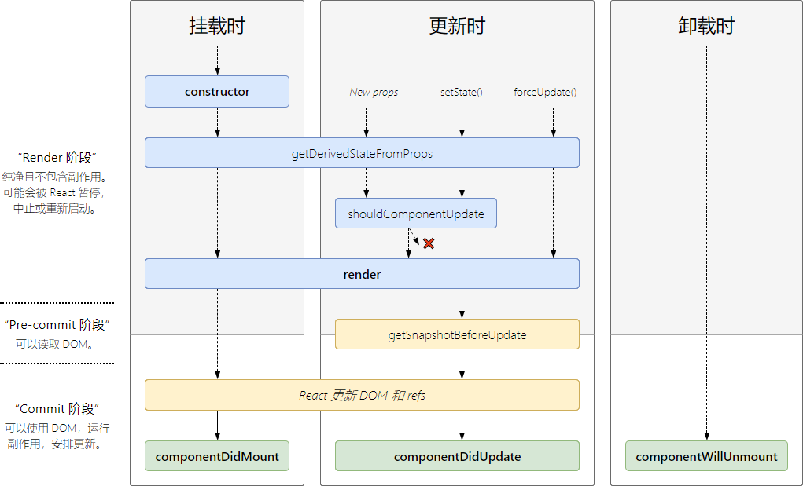
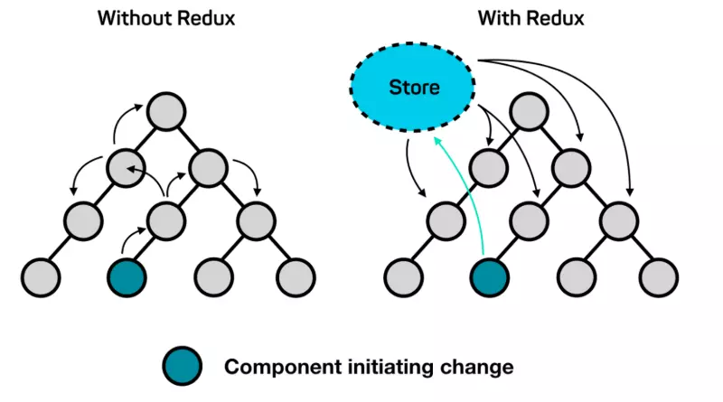

# React

## 为什么选择React？

- 组件化：react的组件化可以达到函数级别的原子组件，高度的组件化可以使工程易于维护和拓展
- 天然分成：react是一个基于MVVM设计模式的框架，有着明确的分层，相对于jQuery时代的面条代码，react代码解耦更加易读
- 生态：现代的框架都是自带生态，react不论是数据管理，还是UI框架都有着成熟的解决方案
- 效率：基于MVVM框架的一大特点就是实现了响应式，数据更改将自动更新对应的视图，能够提高开发的效率

## 虚拟dom的优劣

优点：

1. 保证性能下限：虚拟dom可以通过diff找出最小差异，然后进行批量更新。比粗暴的使用dom API直接操作dom性能要好
2. 跨平台：虚拟dom的本质是JavaScript对象，原生的dom和操作平台相关，对比之下虚拟dom可以方便的跨平台，比如服务端渲染

## 虚拟dom的原理

[https://github.com/Advanced-Interview-Question/front-end-interview/blob/master/docs/guide/virtualDom.md](https://github.com/Advanced-Interview-Question/front-end-interview/blob/master/docs/guide/virtualDom.md)

## React的生命周期

react16之后有三个生命周期被废弃（未被删除）

- componentWillMount
- componentWillReceiveProps
- componentWillUpdate

目前React 16.8 +的生命周期分为三个阶段,分别是挂载阶段、更新阶段、卸载阶段

> 查看react生命周期网站：[http://projects.wojtekmaj.pl/react-lifecycle-methods-diagram/](http://projects.wojtekmaj.pl/react-lifecycle-methods-diagram/)

挂载阶段：

- constructor：构造函数，最先被执行，我们通常在构造函数里初始化state对象或者给自定义方法绑定this

- getDerivedStateFromProps：`static getDerivedStateFromProps (nextProps, prevState)`，这是一个静态方法，当我们接收到一个props想去修改state的时候，可以使用这个生命周期

- render：render函数是纯函数，只返回需要渲染的东西，不应该包含其它的业务逻辑,可以返回原生的DOM、React组件、Fragment、Portals、字符串和数字、Boolean和null等内容

- componentDidMount：组件挂载之后调用，此时可以访问到dom

更新阶段：

- getDerivedStateFromProps：在组件更新的时候也会调用该生命周期钩子

- shouldComponentUpdate：`shouldComponentUpdate(nextProps, prevState)`返回一个布尔值，`true`表示触发重新渲染，`false`则不会触发重新渲染，默认返回`true`，通常我们利用这个生命周期来优化react的性能
- render: 更新阶段也会触发此生命周期

- getSnapshotBeforeUpdate：`getSnapshotBeforeUpdate(prevProps, prevState)`这个方法在render之后，componentDidUpdate之前调用，返回值将作为第三个参数传递给componentDidUpdate，没有返回值，可以返回null
  
- componentDidUpdate：`componentDidUpdate(prevProps, prevState, snapshot)`该方法在getSnapshotBeforeUpdate方法之后被调用，有三个参数prevProps，prevState，snapshot，表示之前的props，之前的state，和snapshot。第三个参数是getSnapshotBeforeUpdate返回的,如果触发某些回调函数时需要用到 DOM 元素的状态，则将对比或计算的过程迁移至 getSnapshotBeforeUpdate，然后在 componentDidUpdate 中统一触发回调或更新状态

卸载阶段：

- componentWillUnmount: 当我们的组件被卸载或者销毁了就会调用，我们可以在这个函数里去清除一些定时器，取消网络请求，清理无效的DOM元素等垃圾清理工作

## react的请求应该放在哪个生命周期中？

推荐`componentDidMount`

## setState是同步的还是异步的？

有时表现出异步,有时表现出同步：

- setState只在合成事件和钩子函数中是“异步”的，在原生事件和setTimeout 中都是同步的。

- setState 的“异步”并不是说内部由异步代码实现，其实本身执行的过程和代码都是同步的，只是合成事件和钩子函数的调用顺序在更新之前，导致在合成事件和钩子函数中没法立马拿到更新后的值，形成了所谓的“异步”，当然可以通过第二个参数 setState(partialState, callback) 中的callback拿到更新后的结果。

- setState 的批量更新优化也是建立在“异步”（合成事件、钩子函数）之上的，在原生事件和setTimeout 中不会批量更新，在“异步”中如果对同一个值进行多次setState，setState的批量更新策略会对其进行覆盖，取最后一次的执行，如果是同时setState多个不同的值，在更新时会对其进行合并批量更新。

## React组件通信

- 父组件向子组件通讯: 父组件可以向子组件通过传 props 的方式，向子组件进行通讯

- 子组件向父组件通讯: props+回调的方式,父组件向子组件传递props进行通讯，此props为作用域为父组件自身的函数，子组件调用该函数，将子组件想要传递的信息，作为参数，传递到父组件的作用域中

- 兄弟组件通信: 找到这两个兄弟节点共同的父节点,结合上面两种方式由父节点转发信息进行通信

- 跨层级通信: Context设计目的是为了共享那些对于一个组件树而言是“全局”的数据，例如当前认证的用户、主题或首选语言,对于跨越多层的全局数据通过Context通信再适合不过

- 发布订阅模式: 发布者发布事件，订阅者监听事件并做出反应,我们可以通过引入event模块进行通信

- 全局状态管理工具: 借助Redux或者Mobx等全局状态管理工具进行通信,这种工具会维护一个全局状态中心Store,并根据不同的事件产生新的状态

## react性能优化

## redux的原理
