# vue源码-虚拟DOM的diff过程

网上关于这块的内容比较多，我这里仅记录一下自己了解到的内容。

首先是diff的源码，主要关注vue项目的`src/core/vdom/patch.js`这个文件的内容。

这里仅展示部分主要代码，其他的代码内容可以根据函数名称去这个文件中查看。

主要的diff过程源码，当前版本是2.6:

```js
function updateChildren (parentElm, oldCh, newCh, insertedVnodeQueue, removeOnly) {
  let oldStartIdx = 0
  let newStartIdx = 0
  let oldEndIdx = oldCh.length - 1
  let oldStartVnode = oldCh[0]
  let oldEndVnode = oldCh[oldEndIdx]
  let newEndIdx = newCh.length - 1
  let newStartVnode = newCh[0]
  let newEndVnode = newCh[newEndIdx]
  let oldKeyToIdx, idxInOld, vnodeToMove, refElm

  // removeOnly is a special flag used only by <transition-group>
  // to ensure removed elements stay in correct relative positions
  // during leaving transitions
  const canMove = !removeOnly

  if (process.env.NODE_ENV !== 'production') {
    checkDuplicateKeys(newCh)
  }

  while (oldStartIdx <= oldEndIdx && newStartIdx <= newEndIdx) {
    if (isUndef(oldStartVnode)) {
      oldStartVnode = oldCh[++oldStartIdx] // Vnode has been moved left
    } else if (isUndef(oldEndVnode)) {
      oldEndVnode = oldCh[--oldEndIdx]
    } else if (sameVnode(oldStartVnode, newStartVnode)) {
      patchVnode(oldStartVnode, newStartVnode, insertedVnodeQueue, newCh, newStartIdx)
      oldStartVnode = oldCh[++oldStartIdx]
      newStartVnode = newCh[++newStartIdx]
    } else if (sameVnode(oldEndVnode, newEndVnode)) {
      patchVnode(oldEndVnode, newEndVnode, insertedVnodeQueue, newCh, newEndIdx)
      oldEndVnode = oldCh[--oldEndIdx]
      newEndVnode = newCh[--newEndIdx]
    } else if (sameVnode(oldStartVnode, newEndVnode)) { // Vnode moved right
      patchVnode(oldStartVnode, newEndVnode, insertedVnodeQueue, newCh, newEndIdx)
      canMove && nodeOps.insertBefore(parentElm, oldStartVnode.elm, nodeOps.nextSibling(oldEndVnode.elm))
      oldStartVnode = oldCh[++oldStartIdx]
      newEndVnode = newCh[--newEndIdx]
    } else if (sameVnode(oldEndVnode, newStartVnode)) { // Vnode moved left
      patchVnode(oldEndVnode, newStartVnode, insertedVnodeQueue, newCh, newStartIdx)
      canMove && nodeOps.insertBefore(parentElm, oldEndVnode.elm, oldStartVnode.elm)
      oldEndVnode = oldCh[--oldEndIdx]
      newStartVnode = newCh[++newStartIdx]
    } else {
      if (isUndef(oldKeyToIdx)) oldKeyToIdx = createKeyToOldIdx(oldCh, oldStartIdx, oldEndIdx)
      idxInOld = isDef(newStartVnode.key)
        ? oldKeyToIdx[newStartVnode.key]
        : findIdxInOld(newStartVnode, oldCh, oldStartIdx, oldEndIdx)
      if (isUndef(idxInOld)) { // New element
        createElm(newStartVnode, insertedVnodeQueue, parentElm, oldStartVnode.elm, false, newCh, newStartIdx)
      } else {
        vnodeToMove = oldCh[idxInOld]
        if (sameVnode(vnodeToMove, newStartVnode)) {
          patchVnode(vnodeToMove, newStartVnode, insertedVnodeQueue, newCh, newStartIdx)
          oldCh[idxInOld] = undefined
          canMove && nodeOps.insertBefore(parentElm, vnodeToMove.elm, oldStartVnode.elm)
        } else {
          // same key but different element. treat as new element
          createElm(newStartVnode, insertedVnodeQueue, parentElm, oldStartVnode.elm, false, newCh, newStartIdx)
        }
      }
      newStartVnode = newCh[++newStartIdx]
    }
  }
  if (oldStartIdx > oldEndIdx) {
    refElm = isUndef(newCh[newEndIdx + 1]) ? null : newCh[newEndIdx + 1].elm
    addVnodes(parentElm, refElm, newCh, newStartIdx, newEndIdx, insertedVnodeQueue)
  } else if (newStartIdx > newEndIdx) {
    removeVnodes(oldCh, oldStartIdx, oldEndIdx)
  }
}
```

**vue的diff是发生在同层树节点之间的diff**，如下图所示：


假设有以下两组虚拟dom:

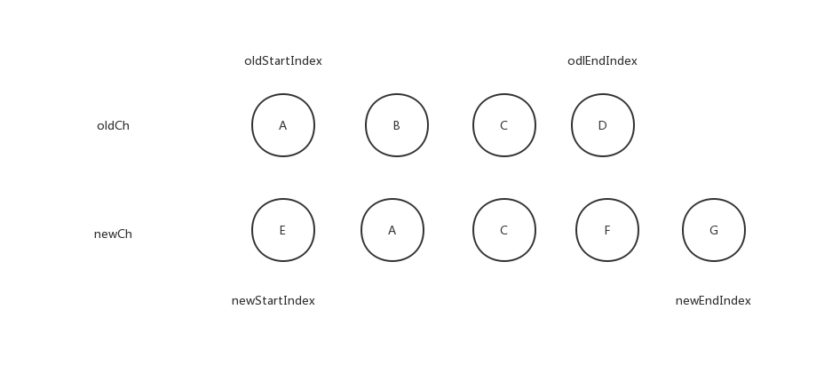

下面通过图示方式展示节点的diff过程，也就是上边 `updateChildren` 中的while循环中的逻辑

## 不带`key`的diff过程：

1. 第一轮：A 和 E肯定不是相同节点，直接走到第一层的else分支逻辑。`createKeyToOldIdx`函数会创建一个以`key`值为键，oldCh中的vnode的索引为值的对象，但是在没有key的情况下返回的就是一个空对象。所以，
`isUndef(idxInOld)`肯定为真，所以直接走到`createElm(newStartVnode, insertedVnodeQueue, parentElm, oldStartVnode.elm, false, newCh, newStartIdx)`，创建一个新的节点。

```js
function createElm (
  vnode,
  insertedVnodeQueue,
  parentElm,
  refElm,
  nested,
  ownerArray,
  index
) {
  // ...
  insert(parentElm, vnode.elm, refElm)
  // ...
}

function insert (parent, elm, ref) {
  if (isDef(parent)) {
    if (isDef(ref)) {
      if (nodeOps.parentNode(ref) === parent) {
        nodeOps.insertBefore(parent, elm, ref)
      }
    } else {
      nodeOps.appendChild(parent, elm)
    }
  }
}
```

createElm函数最终都要调用insert，那我们分析一下此次传入insert的参数，`parent`updateChildren接受的parentElm，追述到`patchVnode`函数

```js
patchVnode (
  oldVnode,
  vnode,
  insertedVnodeQueue,
  ownerArray,
  index,
  removeOnly
) {
  // ...
  const elm = vnode.elm = oldVnode.elm
  // ...
  if (oldCh !== ch) updateChildren(elm, oldCh, ch, insertedVnodeQueue, removeOnly)
  // ...
}
```

可以确认就是当前两组新旧节点集合的父节点，所以 insert 函数中`nodeOps.parentNode(ref) === parent`为真，另外一个 `ref` 参数值为 `oldStartVnode.elm` 所以 `isDef(reg)`亦为真，调用`nodeOps.insertBefore(parent, elm, ref)`，将`elm`插入到`ref`之前。结果如下图所示。

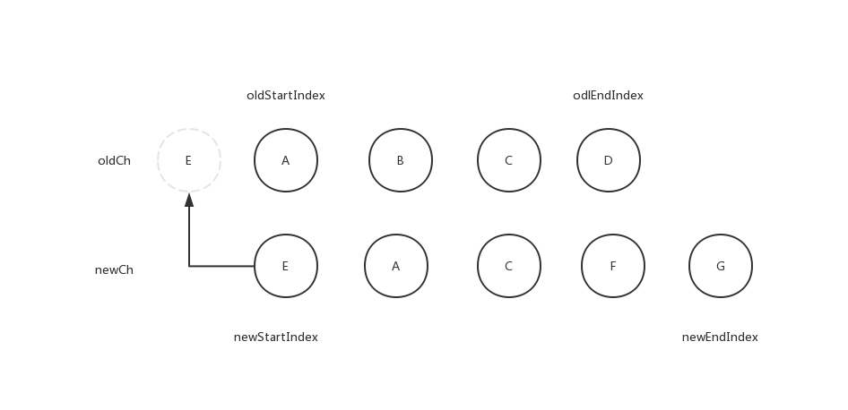

2. 第二轮：需要注意，newStartIndex在第一轮结束之前会+1，`newStartVnode = newCh[++newStartIdx]`，所以这次比较的两个节点为A和A，节点相同直接进入 `patchVnode`函数，下边该函数的部分代码：

```js
function patchVnode () {
  // ...
  // 完全相同直接return
  if (oldVnode === vnode) {
   return
 }
  // ...
 const elm = vnode.elm = oldVnode.elm
  // ...
  // 然后下边部分是子节点的对比
  const oldCh = oldVnode.children
  const ch = vnode.children
  if (isDef(data) && isPatchable(vnode)) {
    for (i = 0; i < cbs.update.length; ++i) cbs.update[i](oldVnode, vnode)
    if (isDef(i = data.hook) && isDef(i = i.update)) i(oldVnode, vnode)
  }
  if (isUndef(vnode.text)) {
    // 非文本节点
    if (isDef(oldCh) && isDef(ch)) {
      // 都存在子节点集合，交给updateChildren进行diff
      if (oldCh !== ch) updateChildren(elm, oldCh, ch, insertedVnodeQueue, removeOnly)
    } else if (isDef(ch)) {
      // 新节点存在子节点集合，旧节点没有
      if (process.env.NODE_ENV !== 'production') {
        checkDuplicateKeys(ch)
      }
      // 如果存在旧节点文本内容，直接清空
     if (isDef(oldVnode.text)) nodeOps.setTextContent(elm, '')
     // 直接在旧节点集合的尾部添加新节点的子节点集合
     addVnodes(elm, null, ch, 0, ch.length - 1, insertedVnodeQueue)
    } else if (isDef(oldCh)) {
      // 旧节点存在子节点集合，新节点没有，移除所有旧节点
      removeVnodes(oldCh, 0, oldCh.length - 1)
    } else if (isDef(oldVnode.text)) {
      // 只存在旧节点的子节点且问文本节点
      nodeOps.setTextContent(elm, '')
    }
  } else if (oldVnode.text !== vnode.text) {
    // 都为文本节点且不相同，直接复制新节点内容
    nodeOps.setTextContent(elm, vnode.text)
  }
}
```

所以此次diff，old 集合不会发生节点添加减少或者位移变化，结果如下图所示：

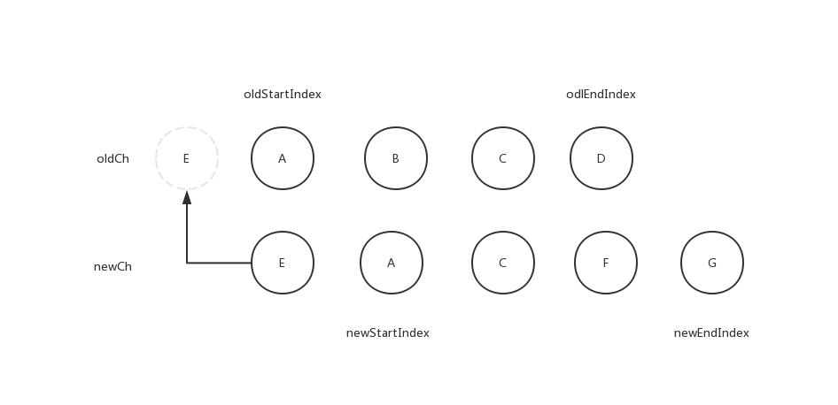

3. 第三轮：在上轮调用`patchVnode`之后，将新旧对比的节点分别后移一位

```js
oldStartVnode = oldCh[++oldStartIdx]
newStartVnode = newCh[++newStartIdx]
```

所以此次的开始状态为：

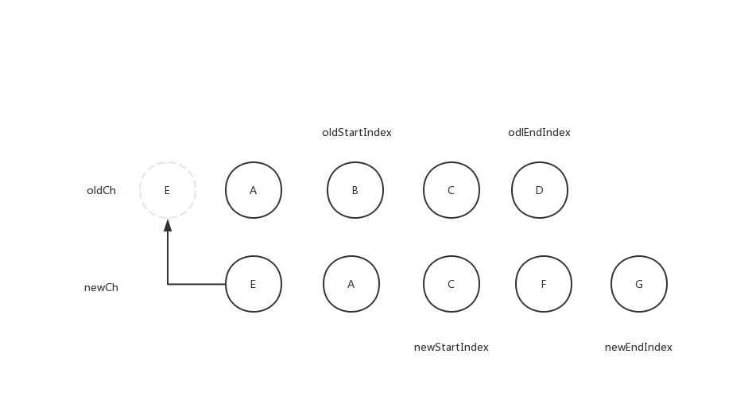

继续按照之前的逻辑来分析，那么肯定走到最后的else的分支，由于没有key，所以不考虑idxInOld，直接走`createElm(newStartVnode, insertedVnodeQueue, parentElm, oldStartVnode.elm, false, newCh, newStartIdx)`，创建新节点和第一轮是一样的。结果如下图所示：

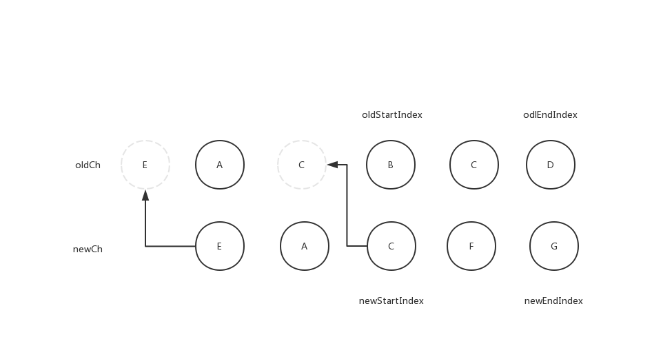

4. 第四轮的逻辑和第三轮是一样的，结果如下图所示：

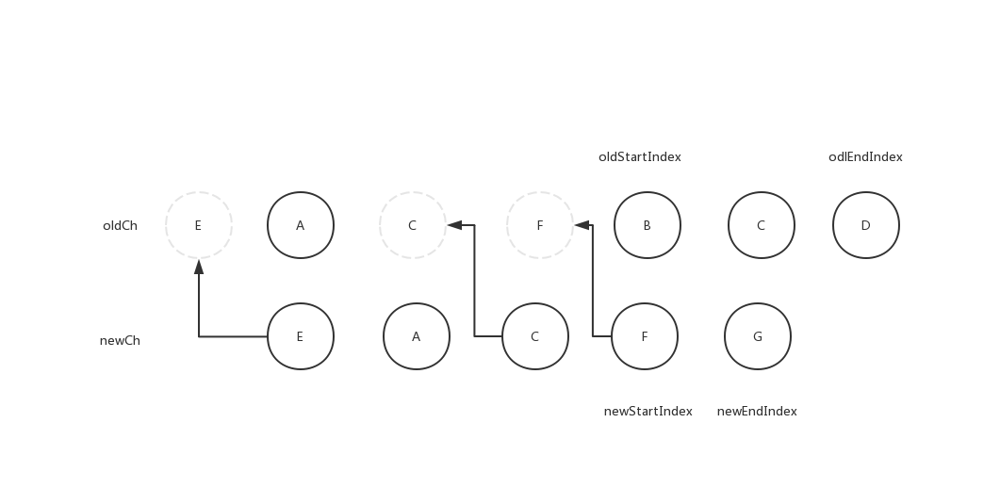

5. 第五轮的逻辑和第四轮是一样的，结果如下图所示：


需要注意的是第五轮这里diff结束之前，会执行`newStartVnode = newCh[++newStartIdx]`, 这个时候的 `newStartIdx = 5 newEndIdx = 4` ，所以会执行`removeVnodes(oldCh, oldStartIdx, oldEndIdx)`，移除多余的节点，下面是该处的代码片段

```js
// ...
newStartVnode = newCh[++newStartIdx]
// ...

if (oldStartIdx > oldEndIdx) {
  refElm = isUndef(newCh[newEndIdx + 1]) ? null : newCh[newEndIdx + 1].elm
  addVnodes(parentElm, refElm, newCh, newStartIdx, newEndIdx, insertedVnodeQueue)
} else if (newStartIdx > newEndIdx) {
  // 满足要求
  removeVnodes(oldCh, oldStartIdx, oldEndIdx)
}
```

结果如下图所示：

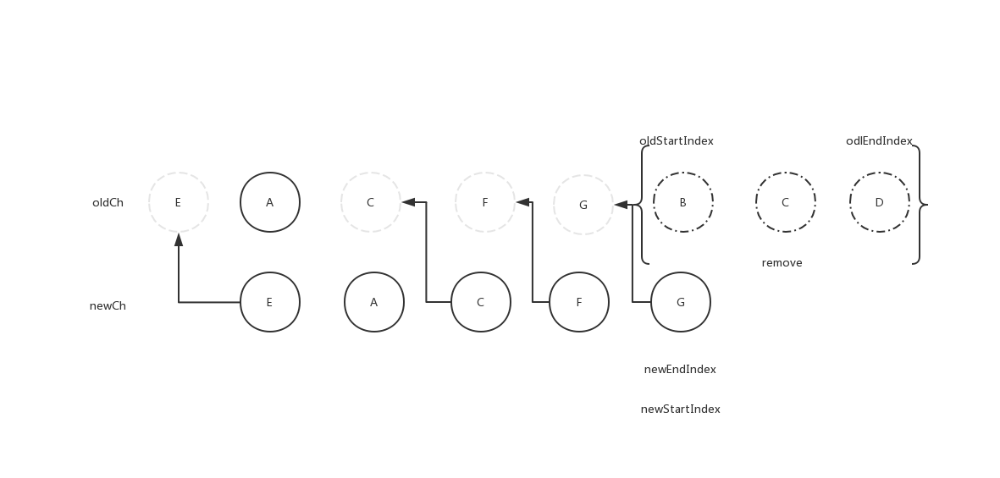

## 带`key`的diff过程：

1. 第一轮：结果和不带key的第一轮结果是一样的，但是需要注意的是，由于有`key`，`createKeyToOldIdx`会返回所有旧节点的key为键，索引为值的对象，如果此时在旧节点集合的其他位置找到了E，那么旧节点的E节点会被删除

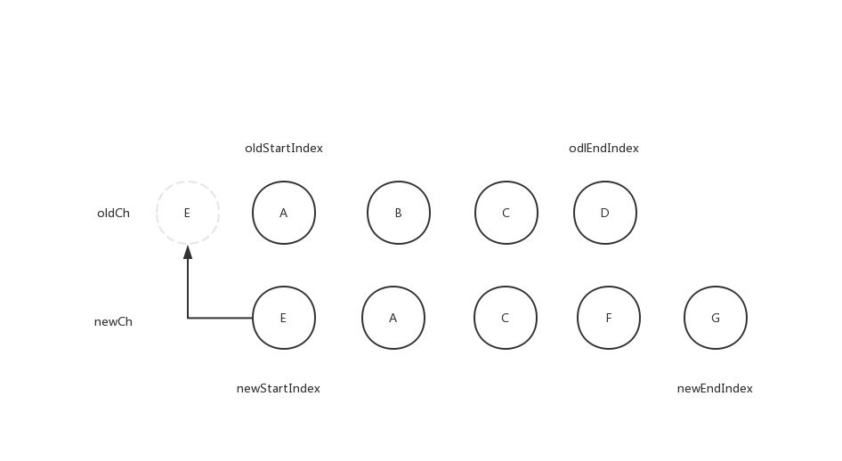

2. 第二轮：结果和和不带key的第二轮结果是一样的

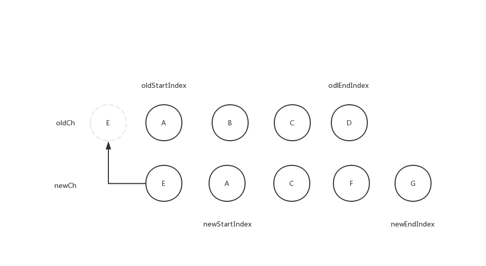

3. 第三轮：由于有key,且 C 在oldCh 中存在，会走下边这段逻辑：

```js
vnodeToMove = oldCh[idxInOld]
if (sameVnode(vnodeToMove, newStartVnode)) {
  patchVnode(vnodeToMove, newStartVnode, insertedVnodeQueue, newCh, newStartIdx)
  oldCh[idxInOld] = undefined
  canMove && nodeOps.insertBefore(parentElm, vnodeToMove.elm, oldStartVnode.elm)
}
```

总之就是会删除旧C节点,在B之前插入patchVnode之后的C节点，也就是先通过pathVnode将新节点的子节点内容更新到旧C节点，然后删除旧C节点，插入和旧节点保持一样引用的新C节点

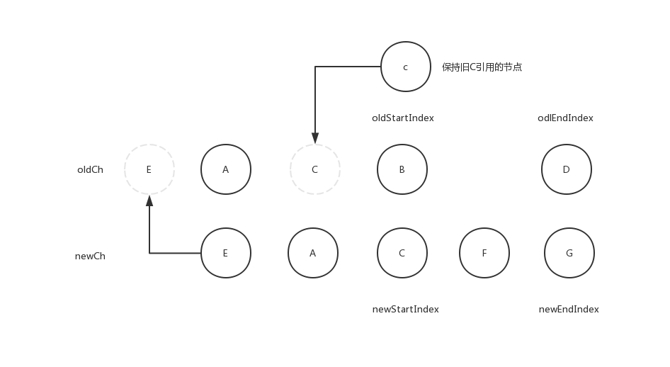

4. 第四轮：结果和第一轮一样

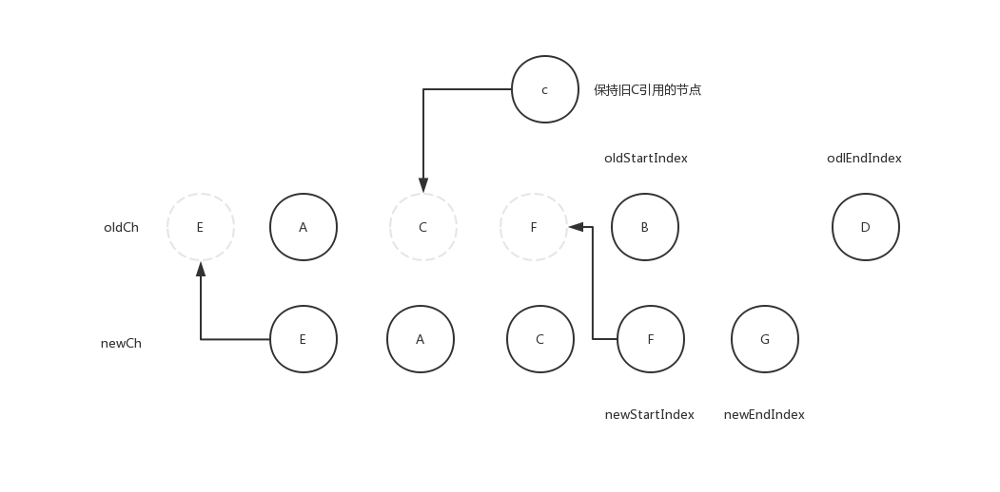

5. 第五轮：逻辑结果和无key流程大概一样


最后也是会删除多余节点

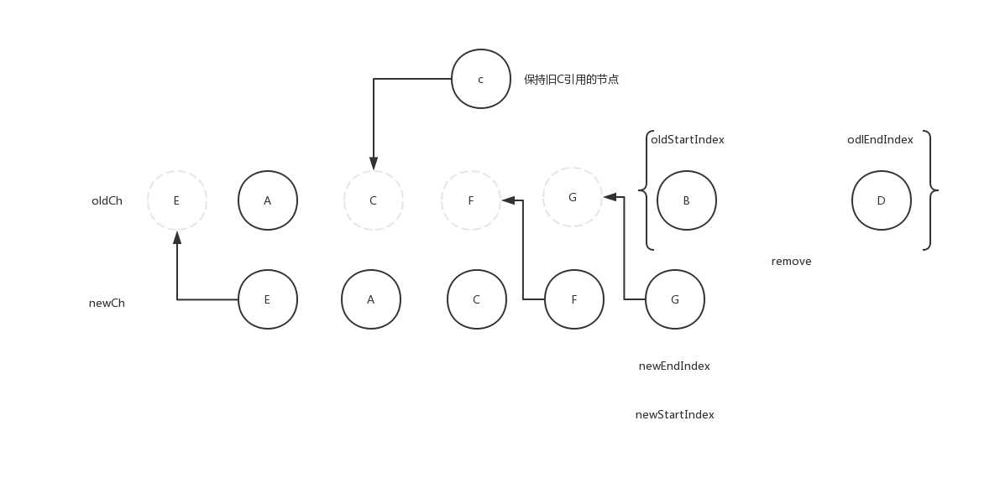

## 结语：

用的案例可能不太好，很多情况没有体现出来，不过仔细去读代码，也能了解其处理过程。
