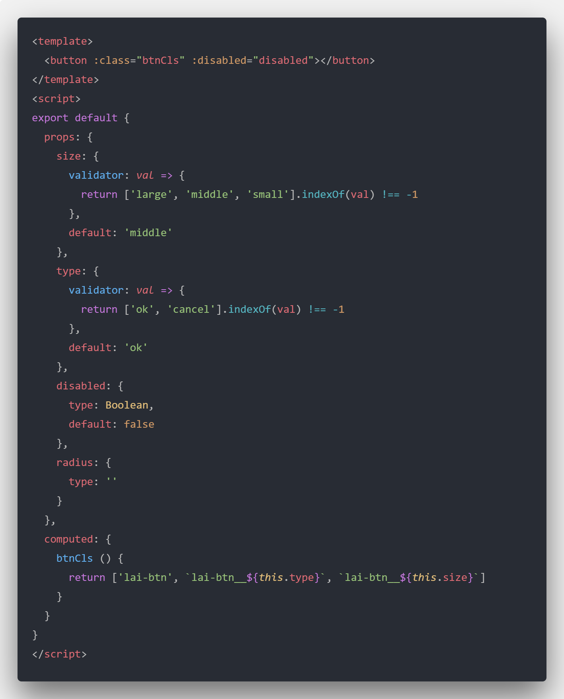

# Vue.js组件设计与实现（开发一个Vue.js组件你可能需要了解的东西？）

> 写作计划：利用元旦三天要写完，截止日期 2019-1-1

## 写在前面
组件化是Vue.js中一个非常重要的概念，其实不仅是在Vue项目包括React、Angular的项目，开发者大部分时间就是在写Vue组件。那么作为一个前端开发者，设计和实现一个组件就日常工作中必备的技能之一。

这次分享主要有以下的几个点：

* 组件的分类

* 组件的基础

* 组件的通信

# 组件的分类

1. 页面级别的组件

由 vue-router 产生得到每个页面实际上都是一个组件，主要承载当前页面的 HTML 结构，会包含数据获取、数据整理、数据可视化等常规业务。整个文件相对较大，但一般不会有 props 选项和 自定义事件，因为它作为路由的渲染，不会被复用，因此也不会对外提供接口。

在项目之中，我们写的大部分的组件就是这一类的组件，不同的开发者协同开发时，每个人负责维护自己的页面组件，基本上不会有任何的交集。因为页面级别的组件通常就是还原设计稿，不需要考虑太多的模块划分。

2. 基础组件

也称为通用性组件，不包含业务，独立的但是又包含基本功能的组件，比如日期组件。这一类组件通常会被大量的使用，就好比盖房子，你需要砖、水泥、沙子，但是，基础组件不是砖和沙子这么简单，基础组件是所有组件中开发难度最大的一类组件。因为开发这一类组件除了要保证它的通用性，还要保证兼容性和组件本身的复杂功能。

3. 业务级别组件

业务组件和基础组件的区别就是跨项目使用，业务组件只在当前的项目使用，通常是业务逻辑和基础相结合形成的组件，在项目多个页面中可以复用。

# 组件的基础

一个Vue的组件通常有三部分组成： prop、event、slot。它们是Vue.js提供的组件的API。比较复杂的组件开发还可能会用到 mixin、extend、provide和eject等，但是 prop event slot这三部分尤为重要，因为这是使用的组件的基本接口，通常组件在发布之后，组件的开发者更多的是去修复和添加功能，不会去大幅度修改基本的接口，基本上你改了这三部分整个组件的逻辑都会受到影响，所以一定要事先设计好这三部分。

* prop

属性prop定义组件的哪些属性可以被配置。比如一个button组件：

组件后续的逻辑基本就是取决于它的一个prop的配置。使用写法
~~~html
<lai-button size="large" :disabled="true"></lai-button>
~~~
除了我们配置的属性，还可以给组件传入 html 原生自带的 id，class这一类属性，都会被 <code>&lt;button&gt;</code> 元素继承。

* slot

我们都知道非闭合HTML标签的一个用法，就是在标签之间插入内容。比如我们的 <code>&lt;button&gt;</code> 标签的一个用法：
~~~html
<button> 确定 </button>
~~~
为了给组件实现这个功能我们就需要用到 slot:

~~~html
<button :class="btnCls" :disabled="disabled"><slot></slot></button>
~~~

~~~html
<lai-button size="large" :disabled="true">插入内容</lai-button>
~~~
js会将上边的代码渲染成下面的html片段
~~~html
<button :class="btnCls" :disabled="disabled">插入内容</button>
~~~
所谓的插槽就是在组件内部占个位置，然后将对应的内容在渲染的时候替换掉。

**具名插槽**

slot 组件提供一个name属性，用来区分不同的 slot。这样就可以实现多个不同插槽同时使用。

~~~html
<button :class="btnCls" :disabled="disabled">
  <slot></slot>
  <slot name="icon"></slot>
</button>
~~~

~~~html
<lai-button size="large" :disabled="true">
  插入内容
  <i slot="icon" class="iconfont iconfont-warn__icon"></i>
</lai-button>
~~~
页面上输出的html片段：
~~~html
<button :class="btnCls" :disabled="disabled">
  插入内容 <!-- <slot></slot> -->
  <i slot="icon" class="iconfont iconfont-warn__icon"></i> <!-- <slot name="icon"></slot> -->
</button>
~~~

* event(自定义事件)

Vue 允许我们通过下边的写法来自定义事件：

~~~html
<template>
  <button @click="handleClick" :class="btnCls" :disabled="disabled"><slot></slot></button>
</template>

~~~~
然后在使用组件的时候监听我们在组件内部触发的事件
~~~html
<lai-button v-on:on-click="handleBtnClick" size="large" :disabled="true">
  点击
</lai-button>
~~~
但是我们通常不会这样写 <code>&lt;button&gt;</code> 的点击事件。可以直接在组件上加上监听事件的修饰符.native:

~~~html
<lai-button v-on:click.native="handleBtnClick" size="large" :disabled="true">
  点击
</lai-button>
~~~

这样监听到的就是原生的 click 事件，如果不加 click 就是监听到组件内部 $emit('click') 事件。

# 组件通信

## 父子组件通信

关于父子组件之间的通信我们结合上边的 属性 prop 和 自定义事件 event，就可以完成。将 prop 当成是我们的输入，然后将我们需要的接口通过 event 产出，这样就达到了一个父子组件的通信。

除此之外我们还可以给组件添加 ref 属性:

~~~html
<lai-button ref="submitBtn" v-on:click.native="handleBtnClick" size="large" :disabled="true">
  点击
</lai-button>
~~~

然后我们可以通过 <code>this.$refs.submitBtn</code> 拿到 <code>&lt;lai-button&gt;</code>组件的实例，然后我们就可以访问组件内部的任何属性，比如 <code>this.$refs.submitBtn.size</code>，拿到组件的 size。

另外还有特殊的 $parent $children，可以拿到上下文的父组件和子组件的实例， 这些我们这里就不做详细介绍。

## 隔代通信

provide 和 inject

