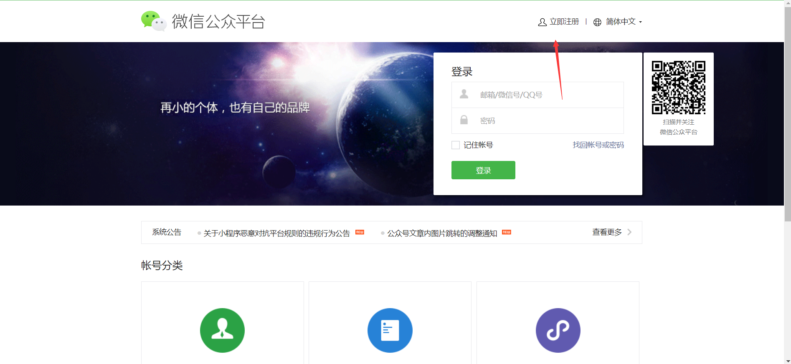
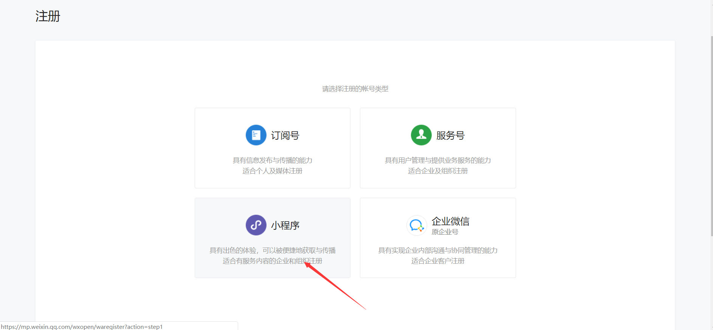

# 微信小程序出现的背景

当我们学习一门语言或者框架的时候，了解它出现的原因或者背景将有助于我们在实际场景中应用所学的语言或者框架。

那么微信小程序出现的原因主要有两个方面：

1. 对于用户来说，可以让用户拥有更好的体验

我们知道在微信小程序出现之后，通常使用网页的形式来浏览器微信之外的内容，经常会出现加载缓慢，短暂的白屏等问题。微信小程序的出现可以让我们快速的加载资源，拥有更好的原生体验。

2. 对于微信本身来说，可以更方便的接入和管理我们开发的小程序应用

在微信小程序之前，微信推出过一套相关的jssdk，让网页开发者可以调用微信的一些原生能力，比如微信支付，微信自定义分享等等，但是，网页开发者可以通过一些方式绕过微信的一些审核和管控。所以，微信推出了一套自定义的框架，也就是小程序应用。

# 什么是微信小程序？

小程序是一种不用下载安装既可以使用的应用。让用户扫一扫，搜一搜既可以打开应用，体现了一种“用完即走”的概念。

# 小程序开发前的准备

小程序开发其实分为两大步骤：

1. 需要申请一个微信小程序的账号

2. 需要下载微信小程序开发者工具

## 申请小程序账号

1. 注册小程序账号
2. 激活小程序账号绑定的邮箱
3. 登记小程序账号的主体信息
4. 登录微信小程序管理后台
5. 进入管理后台，对微信小程序进行相关的信息设置
6. 如果是多人协同开发，我们还需要在后台绑定开发者的信息

接下来我们一步一步来进行实际的操作：

1. 打开微信公众平台的官网：[https://mp.weixin.qq.com](https://mp.weixin.qq.com)，点击右上角的注册，并点击

2. 在注册页面选择小程序账号，点击进行注册

3. 

